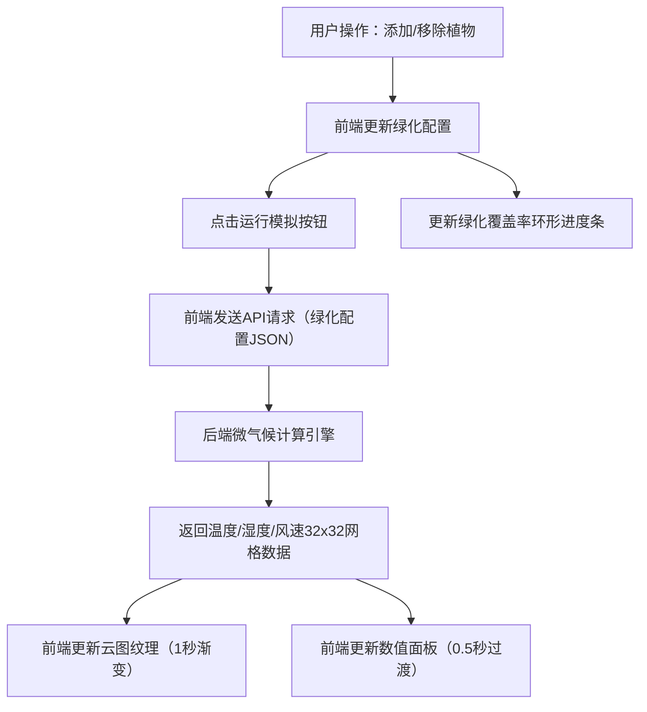

## 1. 产品概述

街区绿化与微气候仿真可视化应用，面向城市规划师和环保教育者，提供在3D街区场景中自由编辑绿化植被（树木、灌木、草坪），并实时查看温度、湿度、风速三个微气候指标变化的交互式工具，辅助决策和公众科普。

- 解决城市规划中绿化方案与微气候影响难以直观呈现的痛点
- 目标用户：城市规划师、环保教育者、公众科普参与者

## 2. 核心功能

### 2.1 用户角色

| 角色 | 使用方式 | 核心权限 |
|------|----------|----------|
| 规划师 | 直接访问 | 编辑绿化方案、运行模拟、查看云图 |
| 教育者 | 直接访问 | 编辑绿化方案、运行模拟、查看云图 |
| 公众用户 | 直接访问 | 浏览预设方案、查看科普数据 |

### 2.2 功能模块

1. **3D街区编辑场景**：50×50网格平面，约20栋随机建筑，可添加/移除树木和灌木
2. **微气候可视化面板**：32×32温度云图、温度/湿度/风速数值面板
3. **绿化比例统计**：环形进度条显示绿化覆盖率
4. **模拟触发与反馈**：运行模拟按钮，加载动画，结果平滑过渡
5. **视角控制与重置**：鼠标拖拽旋转、滚轮缩放、重置视角按钮

### 2.3 页面详情

| 页面名称 | 模块名称 | 功能描述 |
|----------|----------|----------|
| 主场景 | 3D街区编辑 | 在网格上添加/移除树木和灌木，植物带生长/枯萎缩放动画 |
| 主场景 | 微气候云图 | 32×32网格温度云图覆盖在场景上方，蓝→红渐变色，0.4透明度 |
| 主场景 | 数值面板 | 左下角显示温度/湿度/风速平均值，0.5秒渐变动画过渡 |
| 主场景 | 绿化统计 | 右下角环形进度条显示绿化覆盖率，弹性动画更新 |
| 主场景 | 模拟控制 | 右下角运行模拟按钮，加载旋转动画，失败抖动重试 |
| 主场景 | 视角重置 | 右上角重置视角按钮，1秒缓动回初始位置 |

## 3. 核心流程

用户在3D街区场景中通过左键点击添加植物、右键点击移除植物。编辑完成后点击"运行模拟"按钮，前端将绿化配置参数通过API发送至后端微气候计算引擎，后端返回32×32网格的温度/湿度/风速模拟数据。前端接收数据后平滑更新云图颜色和数值面板显示。

## 4. 用户界面设计

### 4.1 设计风格

- **主色调**：深灰蓝背景（#1a1a2e），亮白文字（#f0f0f0）
- **辅助色**：浅灰建筑（#d3d3d3），自然绿植物（#2e8b57 / #228b22）
- **按钮风格**：圆角矩形，深灰半透明背景（rgba(30,30,50,0.85)），悬停变亮紫（#4a4e6b）
- **字体**：无衬线字体，标题16px，数值14px，标注12px
- **布局风格**：全屏3D场景，底部固定UI控件栏，左下/右下/右上浮动面板
- **动效风格**：0.2-0.4秒平滑过渡动画，科幻风格半透明叠加

### 4.2 页面设计概览

| 页面名称 | 模块名称 | UI元素 |
|----------|----------|--------|
| 主场景 | 3D视口 | 全屏Three.js渲染，深灰蓝背景，半透明白色网格线 |
| 主场景 | 数值面板 | 左下角圆角矩形面板，温度/湿度/风速三行数值 |
| 主场景 | 绿化统计 | 右下角环形进度条，百分比数字，颜色随覆盖率变化 |
| 主场景 | 模拟按钮 | 右下角圆角按钮，默认"运行模拟"，加载中旋转，失败红色抖动 |
| 主场景 | 重置视角 | 右上角圆角按钮，相机缓动回初始45°俯角 |

### 4.3 响应式设计

- 桌面优先设计，全屏3D场景自适应窗口大小
- UI控件使用固定定位，窗口缩放时位置不变
- Three.js渲染器和相机在resize事件中自动适配
- 植物数量上限60个，确保1920×1080下不低于30FPS

### 4.4 3D场景指导

- **环境**：暗色科幻风格，深灰蓝天空，无HDRI
- **光照**：环境光（低强度暖白）+ 方向光（模拟日光），柔和阴影
- **相机**：透视相机，初始45°俯角，距离30单位，围绕场景中心旋转
- **构成元素**：50×50网格地面，20栋方块建筑，植物（树冠球体+树干圆柱/灌木半球体）
- **交互**：鼠标左键点击添加植物，右键移除，拖拽旋转，滚轮缩放
- **后处理**：云图半透明叠加层，建筑微弱倒角效果
- **性能预算**：60个植物时保持30FPS，API响应<300ms
