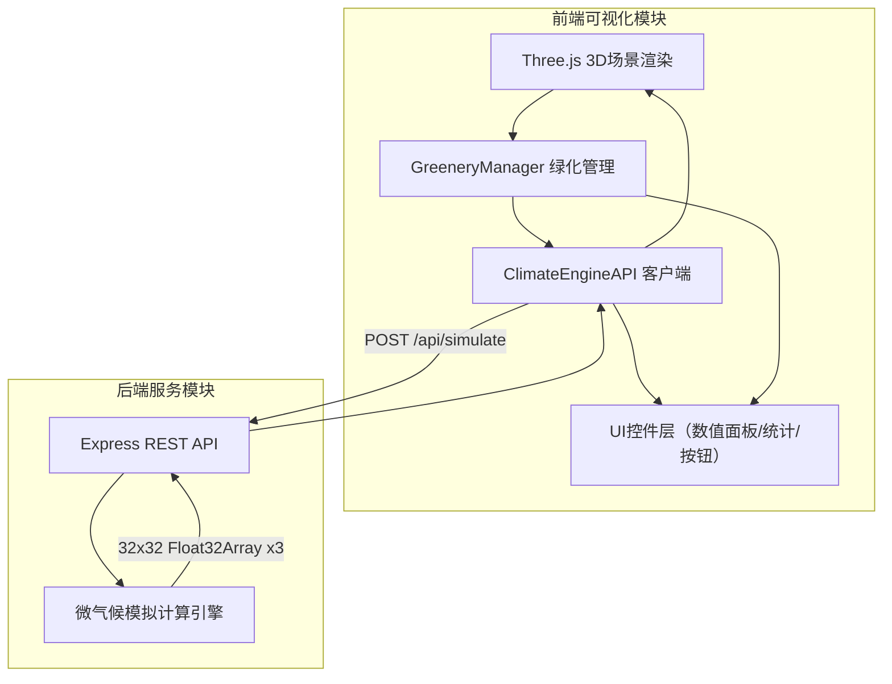
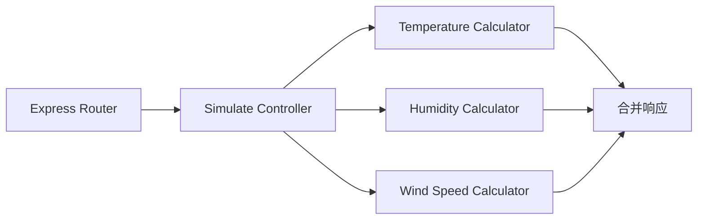

## 1. 架构设计



## 2. 技术说明

- **前端**：TypeScript + Three.js + Vite（纯Three.js，不使用React）
- **初始化工具**：Vite（vanilla-ts模板）
- **后端**：Node.js Express（JavaScript，server/目录独立运行）
- **数据库**：无（模拟计算实时返回）
- **通信**：RESTful API，前端通过fetch调用后端POST /api/simulate

## 3. 路由定义

| 路由 | 用途 |
|------|------|
| / | 主页面，全屏3D街区场景与UI控件 |

## 4. API定义

### POST /api/simulate

**请求体**：
```typescript
interface GreeneryItem {
  type: 'tree' | 'shrub';
  x: number;
  z: number;
}

interface SimulateRequest {
  greenery: GreeneryItem[];
  gridSize: 50;
  resolution: 32;
}
```

**响应体**：
```typescript
interface SimulateResponse {
  temperature: number[];  // 32x32 网格温度数据 (20-30°C)
  humidity: number[];     // 32x32 网格湿度数据 (30-80%)
  windSpeed: number[];    // 32x32 网格风速数据 (0-10 m/s)
}
```

### 后端模拟计算模型

- **温度**：基准温度25°C，每棵树降低0.3°C（3单位影响半径），每棵灌木降低0.15°C（2单位影响半径），距离衰减
- **湿度**：基准湿度40%，每棵树增加2%（3单位影响半径），每棵灌木增加1%（2单位影响半径），距离衰减
- **风速**：基准风速5 m/s，每棵树降低0.8 m/s（4单位影响半径），每棵灌木降低0.3 m/s（2单位影响半径），距离衰减

## 5. 服务器架构图



## 6. 文件结构

```
project/
├── package.json           # 根依赖和启动脚本
├── vite.config.ts         # Vite配置，代理/api
├── tsconfig.json          # TypeScript严格模式
├── index.html             # 入口HTML
├── server/
│   └── index.js           # Express后端服务
└── src/
    ├── main.ts            # 场景初始化、动画循环
    ├── ClimateEngineAPI.ts # API请求封装
    └── GreeneryManager.ts  # 绿化物体管理
```
