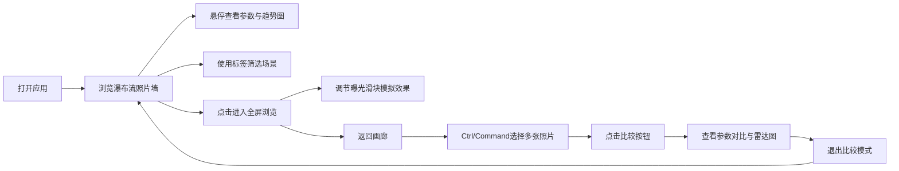

## 1. 产品概述

摄影记忆画廊是一款面向摄影爱好者的交互式照片管理与学习工具，通过直观的参数可视化和对比功能，帮助用户理解光圈、快门、ISO等拍摄参数对照片效果的影响，同时通过场景标签系统快速筛选和回顾拍摄灵感。

- 核心目标：解决传统相册无法直观对比拍摄参数、难以通过场景快速筛选灵感的痛点
- 目标用户：摄影爱好者、摄影学习者、摄影师
- 产品价值：让摄影学习从参数抽象理解走向视觉化、交互化的直观体验

## 2. 核心功能

### 2.1 用户角色

| 角色 | 注册方式 | 核心权限 |
|------|----------|----------|
| 普通用户 | 无需注册（本地应用） | 浏览照片、查看参数、使用筛选与比较功能 |

### 2.2 功能模块

1. **画廊主界面**：瀑布流照片展示、参数叠加显示、悬停交互
2. **全屏浏览**：照片全屏查看、参数面板、曝光模拟调节
3. **标签筛选**：场景标签系统、标签选择栏、筛选动画效果
4. **参数比较**：多图选择、对比模式、参数高亮、雷达图分析
5. **数据可视化**：曝光趋势折线图、雷达图评分

### 2.3 页面详情

| 页面名称 | 模块名称 | 功能描述 |
|----------|----------|----------|
| 画廊主页 | 瀑布流照片墙 | 横向瀑布流布局展示照片卡片，支持懒加载，最多显示50张 |
| 画廊主页 | 参数信息面板 | 卡片右下角竖排参数，悬停展开详细对比面板含d3折线图 |
| 画廊主页 | 构图辅助线 | 悬停时浮现三分法/对角线网格辅助线 |
| 画廊主页 | 场景标签 | 彩色胶囊标签悬浮照片上方，支持悬停动效 |
| 画廊主页 | 标签筛选栏 | 顶部可滚动标签栏，支持选中筛选与动画过渡 |
| 全屏浏览 | 照片展示 | 淡入动画呈现照片，支持曝光模拟调节 |
| 全屏浏览 | 参数面板 | 左下角常驻参数显示面板 |
| 全屏浏览 | 曝光滑块 | 右侧光圈/快门/ISO滑块，实时调节模拟曝光效果 |
| 比较模式 | 分栏展示 | 2-4张照片等宽分栏，飞入动画入场 |
| 比较模式 | 参数对比 | 完整参数列表，最高/最低值颜色高亮 |
| 比较模式 | 雷达图 | d3雷达图展示5维度评分，渐变填充，绘制动画 |

## 3. 核心流程

### 3.1 主要用户流程

用户打开应用 → 浏览瀑布流照片墙 → 悬停查看参数与趋势 → 通过标签筛选特定场景 → 点击进入全屏查看 → 调节曝光滑块理解参数影响 → 返回画廊 → Ctrl选择多张照片 → 进入比较模式 → 查看雷达图与参数对比

## 4. 用户界面设计

### 4.1 设计风格

- **主色调**：深色极简主题，背景从#0a0a0a到#1a1a1a渐变
- **文字颜色**：浅灰白色#e0e0e0
- **强调色**：橙色（最高ISO高亮）、绿色（最低光圈高亮）
- **标签色**：多色胶囊标签（人像粉、夜景蓝、街拍黄、微距绿等）
- **字体**：无衬线字体，现代简洁
- **卡片风格**：圆角8px，阴影12px（悬停20px），间距10px
- **动画风格**：cubic-bezier缓动，0.3-0.5秒过渡，流畅自然

### 4.2 页面设计概览

| 页面名称 | 模块名称 | UI元素 |
|----------|----------|--------|
| 画廊主页 | 瀑布流布局 | 5列桌面/3列平板/2列手机，交错排列，卡片悬浮效果 |
| 画廊主页 | 参数显示 | 右下角半透明悬浮，竖排文字，悬停左滑展开 |
| 画廊主页 | 标签胶囊 | 彩色圆角，悬停上浮放大，顶部筛选栏可横向滚动 |
| 全屏浏览 | 照片展示 | 淡入动画，居中显示，背景黑色 |
| 全屏浏览 | 滑块控制 | 右侧垂直滑块，实时数值显示，平滑过渡 |
| 比较模式 | 分栏布局 | 等宽分割，飞入动画，参数表格高亮 |
| 比较模式 | 雷达图 | 渐变填充，0.3秒绘制动画，5维度评分 |

### 4.3 响应式设计

- 桌面端（>1024px）：5列瀑布流，右侧滑块独立显示
- 平板端（768-1024px）：3列瀑布流
- 手机端（<768px）：2列瀑布流，滑块合并到左滑菜单
- 触摸优化：长按替代悬停，手势滑动支持

### 4.4 性能优化

- 照片最大加载尺寸800x600像素
- 懒加载滚动，最多同时显示50张
- Canvas滤镜实时更新，响应延迟<100ms
- 总加载+重绘延迟≤200ms
