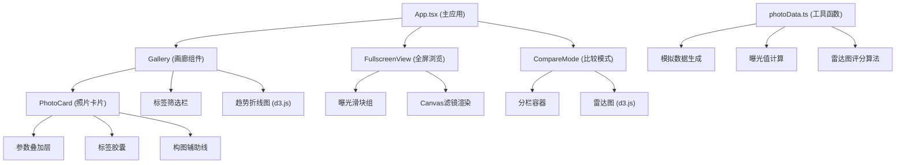

## 1. 架构设计



## 2. 技术栈说明

- **前端框架**：React 18 + TypeScript
- **构建工具**：Vite 5.x
- **可视化库**：d3.js v7（用于折线图和雷达图）
- **样式方案**：原生CSS + CSS Modules / 全局CSS变量
- **状态管理**：React useState / useReducer（轻量级，无需额外库）
- **无后端**：纯前端应用，使用模拟数据

## 3. 项目文件结构

```
src/
├── main.tsx              # 应用入口
├── App.tsx               # 主组件，状态管理
├── components/
│   ├── PhotoCard.tsx     # 照片卡片组件
│   ├── Gallery.tsx       # 画廊瀑布流组件
│   ├── FullscreenView.tsx # 全屏浏览组件
│   ├── CompareMode.tsx   # 比较模式组件
│   ├── TagFilter.tsx     # 标签筛选栏组件
│   ├── ExposureSlider.tsx # 曝光调节滑块组件
│   ├── TrendChart.tsx    # 曝光趋势图(d3)
│   └── RadarChart.tsx    # 雷达图(d3)
├── utils/
│   └── photoData.ts      # 数据工具函数
├── hooks/
│   ├── useCanvasFilter.ts # Canvas滤镜Hook
│   └── useLazyLoad.ts    # 懒加载Hook
└── styles/
    └── global.css        # 全局样式
```

## 4. 数据模型定义

### 4.1 照片数据类型

```typescript
interface PhotoParams {
  aperture: number;      // 光圈 f值
  shutterSpeed: string;  // 快门速度 如 "1/250"
  iso: number;           // ISO感光度
  focalLength: number;   // 焦距 mm
  ev: number;            // 曝光值 EV
}

interface PhotoData {
  id: string;
  imageUrl: string;
  width: number;
  height: number;
  aspectRatio: number;
  params: PhotoParams;
  tags: string[];        // 场景标签
  radarScores: RadarScores;
}

interface RadarScores {
  detail: number;        // 细节保留 1-10
  noise: number;         // 噪点控制 1-10
  depthOfField: number;  // 景深效果 1-10
  dynamicRange: number;  // 动态范围 1-10
  colorSaturation: number; // 色彩饱和度 1-10
}
```

### 4.2 应用状态类型

```typescript
interface AppState {
  photos: PhotoData[];
  selectedTags: string[];
  selectedPhotoIds: string[];  // 用于比较模式
  fullscreenPhoto: PhotoData | null;
  compareMode: boolean;
  exposureAdjustments: {
    aperture: number;
    shutterSpeed: number;
    iso: number;
  };
}
```

## 5. 核心算法

### 5.1 曝光值(EV)计算

```
EV = log2(aperture² / shutterSpeed) - log2(ISO/100)
```

### 5.2 雷达图评分算法

- **细节保留**：与光圈正相关，与ISO负相关
- **噪点控制**：与ISO负相关
- **景深效果**：与光圈值负相关（大光圈=浅景深=高分）
- **动态范围**：与ISO负相关，与快门速度适中相关
- **色彩饱和度**：与曝光适中相关，过曝/欠曝都降低

### 5.3 Canvas曝光模拟

通过调整Canvas滤镜的brightness和contrast实现曝光模拟：
- 光圈变化 ±3档 → brightness ±30%
- ISO变化 ±3档 → brightness ±20%, contrast ±10%
- 快门变化 ±3档 → brightness ±25%

## 6. 性能优化策略

1. **图片懒加载**：使用IntersectionObserver，视口外图片延迟加载
2. **瀑布流虚拟滚动**：只渲染视口内+缓冲区域的照片
3. **Canvas硬件加速**：使用CSS transform和will-change优化
4. **requestAnimationFrame**：滤镜更新与帧同步
5. **图片尺寸限制**：最大800x600像素，减少内存占用
6. **CSS transitions**：优先使用GPU加速属性（transform, opacity）
