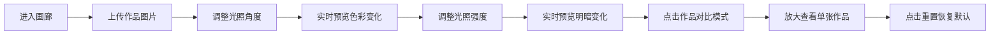

## 1. 产品概述

交互式光照艺术画廊应用，为数字艺术策展人和收藏家提供直观的光照模拟工具，用于对比不同艺术作品在多变光照条件下的色彩与质感表现，辅助布展决策和作品陈列方案设计。

- 核心用途：虚拟画廊空间中上传艺术作品，自由调整光照方向与强度，实时预览光照效果
- 目标用户：策展人、艺术收藏家、画廊设计师

## 2. 核心功能

### 2.1 用户角色
| 角色 | 说明 |
|------|------|
| 普通用户 | 上传图片、调整光照、对比作品效果 |

### 2.2 功能模块
1. **画廊主页面**：图片上传区、作品展示网格、光照控制面板、重置按钮

### 2.3 页面详情
| 页面名称 | 模块名称 | 功能描述 |
|---------|---------|---------|
| 画廊主页 | 图片上传 | 点击按钮上传最多6张图片（jpeg/png/webp），等比缩放填充至卡片 |
| 画廊主页 | 作品展示网格 | 3x2网格布局，CSS filter模拟光照效果，悬停上浮动画，点击对比模式放大 |
| 画廊主页 | 光照角度控制 | 圆形滑块控件（0-360度），拖拽旋转调整光源方向，数值实时显示 |
| 画廊主页 | 光照强度控制 | 水平滑块（0-100），渐变色轨道，数值实时显示 |
| 画廊主页 | 重置功能 | 圆形按钮，一键重置光照参数至默认值（45度/80强度） |

## 3. 核心流程

用户进入画廊 → 上传艺术作品图片 → 调整光照角度滑块 → 实时预览所有作品色彩变化 → 调整光照强度滑块 → 实时预览明暗变化 → 点击单张作品进入对比模式 → 点击重置恢复默认状态

## 4. 用户界面设计

### 4.1 设计风格
- 极简主义深色主题，画廊背景 #1e1e1e
- 主色调：深绿上传按钮 #2e7d32，红色重置按钮 #d32f2f
- 卡片：浅灰背景 #f5f5f5，圆角12px，边框 #e0e0e0
- 控制面板：半透明深色 #2a2a2a，带模糊效果
- 过渡动画：0.2-0.4秒，ease-out缓动
- 字体：现代无衬线字体，清晰易读

### 4.2 页面设计概览
| 页面名称 | 模块名称 | UI元素 |
|---------|---------|--------|
| 画廊主页 | 顶部操作栏 | 上传按钮（左上）、重置按钮（右上） |
| 画廊主页 | 作品网格 | 3x2居中布局，卡片200x200px，悬停上浮-8px |
| 画廊主页 | 底部控制面板 | 高度80px，圆形角度滑块+水平强度滑块，均匀间距 |

### 4.3 响应式设计
- 桌面端（≥768px）：3x2网格，控制面板水平布局
- 移动端（<768px）：1列布局，卡片300x300px，控制面板垂直排列，按钮置于右侧
