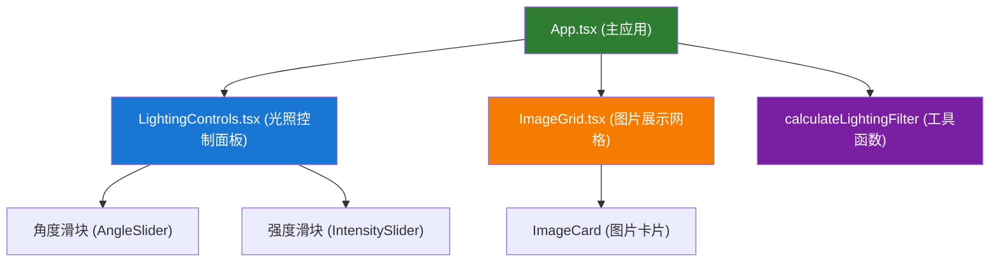

## 1. 架构设计



**调用关系与数据流：**
- App.tsx 管理全局状态（图片列表、光照角度、光照强度、对比模式选中项）
- LightingControls.tsx 接收 onChange 回调，滑块值变化时实时通知 App
- ImageGrid.tsx 接收光照参数和图片列表，渲染卡片网格
- imageFilters.ts 的 calculateLightingFilter 根据角度和强度计算 CSS filter 字符串
- 数据流：用户交互 → LightingControls → App state 更新 → ImageGrid 重新渲染 → CSS filter 应用

## 2. 技术描述
- 前端：React 18 + TypeScript + Vite
- 构建工具：Vite + @vitejs/plugin-react
- 状态管理：React useState (组件内部状态)
- 样式方案：原生 CSS（含 CSS 变量、过渡动画、响应式媒体查询）
- 图片处理：浏览器内置 FileReader API，CSS filter 实现光照效果
- 无后端，所有计算和渲染在浏览器本地完成

## 3. 路由定义
| 路由 | 用途 |
|-----|------|
| / | 画廊主页（单页应用，无路由切换） |

## 4. 文件结构与职责
| 文件路径 | 职责 |
|---------|------|
| package.json | 项目依赖与脚本配置 |
| vite.config.ts | Vite 构建配置 |
| tsconfig.json | TypeScript 严格模式配置 |
| index.html | 入口页面，挂载 #root |
| src/App.tsx | 主应用组件，管理画廊全局状态 |
| src/LightingControls.tsx | 光照控制面板（角度圆形滑块 + 强度水平滑块 + 重置按钮） |
| src/ImageGrid.tsx | 图片网格展示（3x2布局，单卡对比模式） |
| src/utils/imageFilters.ts | 光照计算工具函数 |
| src/index.css | 全局样式与 CSS 变量 |
| src/main.tsx | React 入口，渲染 App |

## 5. 核心数据模型
```typescript
// 图片项
interface ImageItem {
  id: string;
  url: string;
  name: string;
}

// 光照参数
interface LightingParams {
  angle: number;      // 0-360 度
  intensity: number;  // 0-100
}

// 画廊状态
interface GalleryState {
  images: ImageItem[];
  lighting: LightingParams;
  selectedImageId: string | null;  // 对比模式
}
```

## 6. 光照计算公式
- **brightness（亮度）**：由强度决定，范围 0.5-1.5
  - `brightness = 0.5 + (intensity / 100) * 1.0`
- **contrast（对比度）**：由角度决定，范围 1.0-1.8
  - 使用角度的正弦/余弦映射：`contrast = 1.0 + (|sin(angle°)| * 0.4) + (|cos(angle°)| * 0.4)`
- 输出 CSS filter 字符串：`brightness(x) contrast(y)`
