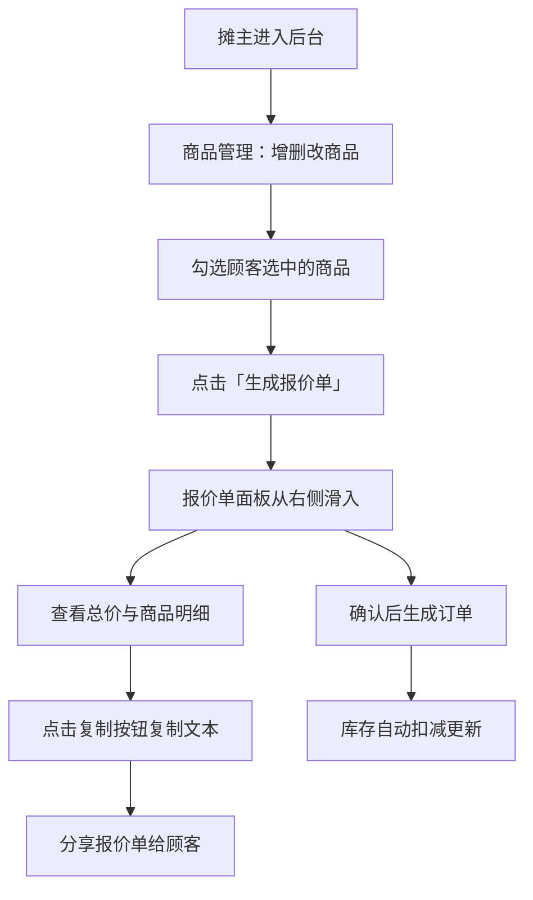

## 1. 产品概述

创意市集摊主助手是一款面向市集摊主的轻量化摊位管理工具，帮助摊主在电脑或平板上高效管理商品展示、处理顾客订单、监控库存状态，并快速生成可分享的商品报价单。

- 核心用途：一站式管理市集摊位的商品、订单与库存，降低手工记录成本
- 目标用户：创意市集摊主、手工艺品创作者、小型个体商户
- 产品价值：提升摊主经营效率，通过专业报价单增强顾客信任度

## 2. 核心功能

### 2.1 用户角色

| 角色 | 登录方式 | 核心权限 |
|------|----------|----------|
| 摊主 | 直接进入（本地应用） | 商品增删改查、订单管理、库存查看、报价单生成 |

### 2.2 功能模块

1. **商品管理页面**：卡片式商品网格、图片浮层、增删改模态框、分类筛选
2. **订单记录页面**：历史订单列表、订单详情查看
3. **库存查看页面**：Canvas 彩色柱状图、实时搜索过滤、低库存预警
4. **报价单面板**：商品勾选、报价单滑入展示、自动总价计算、一键复制文本

### 2.3 页面详情

| 页面名称 | 模块名称 | 功能描述 |
|----------|----------|----------|
| 商品管理 | 侧边栏导航 | 深灰磨砂背景，4个圆形图标，选中态亮蓝指示条 |
| 商品管理 | 商品卡片网格 | 响应式 2-4 列布局，图片悬停浮层，复选框勾选，编辑删除按钮 |
| 商品管理 | 商品编辑模态框 | 淡入缩放动画，名称/价格/分类/库存表单 |
| 库存查看 | Canvas 柱状图 | 绿色渐变填充，低库存红色渐变动画，彩色标签 |
| 库存查看 | 搜索过滤 | 实时搜索，清空按钮淡入淡出 |
| 报价单 | 右侧滑入面板 | 弹性动画滑入，商品列表，总价计算，复制按钮 |

## 3. 核心流程

摊主登录系统 → 在商品管理页面维护商品信息（增删改）→ 顾客挑选商品时勾选对应卡片 → 点击生成报价单 → 报价单从右侧滑入展示 → 复制报价单文本分享给顾客 → 顾客下单后库存自动扣减。

## 4. 用户界面设计

### 4.1 设计风格

- **主色调**：柔和米白 `#FAF7F2` 作为背景，浅灰绿 `#E8F0E8` 作为辅助色
- **强调色**：亮蓝色 `#3B82F6` 用于侧边栏选中指示，亮绿色 `#10B981` 用于重要操作按钮
- **危险色**：红色渐变用于低库存（<5件）预警
- **侧边栏/头部**：深灰色 `#2D3748` 磨砂质感（backdrop-blur）
- **卡片样式**：2px 偏移 + 4px 模糊的细微阴影，圆角 8px
- **按钮交互**：亮绿色按钮悬停时放大 1.05 倍 + 阴影加深
- **动画体系**：所有过渡使用 0.15s - 0.5s 缓动（cubic-bezier(0.4, 0, 0.2, 1)）
- **字体建议**：中文使用「思源黑体」或「PingFang SC」，英文使用「SF Pro Display」，避免通用字体

### 4.2 页面设计概览

| 页面名称 | 模块名称 | UI 元素细节 |
|----------|----------|-------------|
| 全局布局 | 侧边栏 | 180px 固定宽度，深灰磨砂，圆形图标（48px），左侧 3px 亮蓝指示条，0.3s 选中过渡 |
| 全局布局 | 内容面板 | 从右侧滑入，0.4s 缓出动画，米白背景 |
| 商品管理 | 商品卡片 | 方形图片缩略图，悬停时从底部向上浮出名称+价格标签（纯白半透明 80%、圆角），左上角圆形复选框（选中变绿填充 + 0.15s 弹跳） |
| 商品管理 | 编辑模态框 | 屏幕中心淡入+缩放（0.3s），半透明遮罩，表单字段标签左对齐 |
| 库存查看 | Canvas 柱状图 | 每个商品一个竖条，高度与库存成正比，绿色→红色渐变过渡（0.5s），底部商品名标签 |
| 库存查看 | 搜索框 | 浅灰绿背景，圆角 8px，右侧圆形清空按钮（x 图标），输入内容 0.2s 淡出清空 |
| 报价单 | 右侧面板 | 从右侧 -400px → 0 弹性动画（0.5s），卡片列表项，底部总价区域突出，复制按钮成功后 1.5s 显示「已复制」 |

### 4.3 响应式设计

- **桌面优先**，平板/桌面断点：>1200px 显示 4 列卡片，768-1200px 显示 3 列，<768px 显示 2 列
- 侧边栏在极窄屏幕（<480px）可收起为图标模式（60px 宽），隐藏文字
- 触控设备上复选框和按钮增大点击热区至 44x44px
- 报价单面板在移动端改为从底部滑入（抽屉式）

### 4.4 性能指标

- 搜索过滤响应时间 ≤ 50ms（使用 useMemo + 本地数组 filter）
- 页面初次加载 < 1s（启用 Vite 代码分割，组件懒加载可选）
- Canvas 柱状图重绘节流（RAF 单帧完成）
- 商品图片使用 object-fit: cover 避免布局抖动
