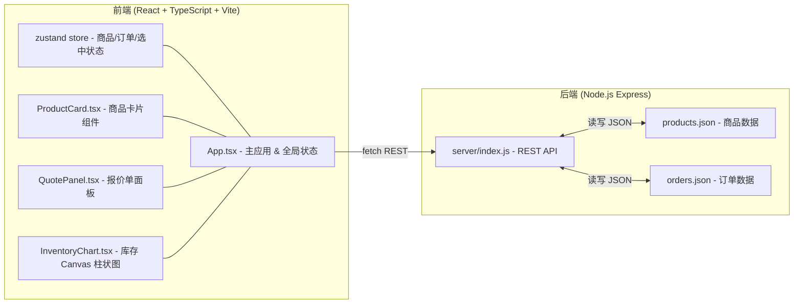
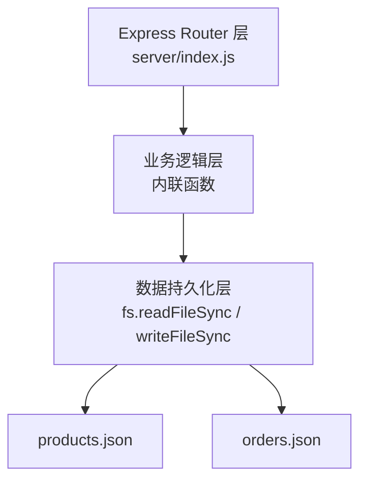
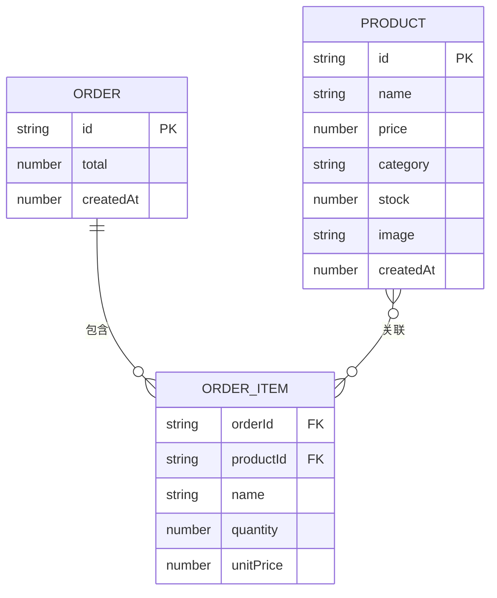

## 1. 架构设计



## 2. 技术栈说明

- **前端框架**：React 18 + TypeScript 5，严格模式（strict: true）
- **构建工具**：Vite 5，端口 5173，启用 React Fast Refresh
- **状态管理**：zustand（轻量 store，管理商品、订单、当前面板、选中商品）
- **样式方案**：原生 CSS Modules（不使用 Tailwind，满足磨砂玻璃、精细动画需求）+ CSS Variables 主题令牌
- **图标库**：lucide-react（侧边栏图标：Package、ClipboardList、BarChart3、FileText）
- **后端框架**：Express 4 + CORS 中间件，运行在独立进程（node server/index.js）
- **数据存储**：本地 JSON 文件（products.json / orders.json），使用 fs 同步读写 + uuid 生成主键
- **性能优化**：useMemo 缓存搜索过滤结果，useCallback 优化传递给子组件的事件处理器

## 3. 路由与面板定义

（单页应用，使用 zustand store 控制面板切换，非 react-router）

| 面板 ID | 面板名称 | 说明 |
|---------|----------|------|
| products | 商品管理 | 默认面板，卡片网格 + 新增按钮 |
| orders | 订单记录 | 历史订单列表（后端返回） |
| inventory | 库存查看 | Canvas 柱状图 + 搜索框 |
| quote | 报价单生成 | 叠加在当前面板上的右侧抽屉 |

## 4. API 接口定义

### 4.1 商品接口

```typescript
interface Product {
  id: string;           // uuid
  name: string;         // 商品名称
  price: number;        // 单价（元）
  category: string;     // 分类：手作饰品 / 文创文具 / 陶瓷器皿 / 布艺编织 / 原创插画
  stock: number;        // 库存数量
  image: string;        // 图片 URL（base64 或占位图）
  createdAt: number;    // 创建时间戳
}
```

| Method | Path | 说明 | Request Body | Response |
|--------|------|------|--------------|----------|
| GET | /api/products | 获取全部商品 | - | `Product[]` |
| POST | /api/products | 新增商品 | `Omit<Product, 'id' \| 'createdAt'>` | `Product` |
| PUT | /api/products/:id | 更新商品 | `Partial<Product>` | `Product` |
| DELETE | /api/products/:id | 删除商品 | - | `{ success: true }` |

### 4.2 订单接口

```typescript
interface OrderItem {
  productId: string;
  name: string;
  quantity: number;
  unitPrice: number;
}
interface Order {
  id: string;
  items: OrderItem[];
  total: number;
  createdAt: number;
}
```

| Method | Path | 说明 | Request Body | Response |
|--------|------|------|--------------|----------|
| GET | /api/orders | 获取全部订单 | - | `Order[]` |
| POST | /api/orders | 创建订单（扣减库存） | `{ items: OrderItem[] }` | `Order` |

### 4.3 报价单接口（纯前端计算，可选后端格式化）

报价单文本格式：每行 `商品名x数量 - ￥单价`，末尾追加 `总价：￥xxx.xx`

## 5. 后端分层（简化版）



说明：由于用户明确要求后端为简单的 JSON 存储，单文件 server/index.js 实现即可，不分层。创建订单时需在同一个事务内（JSON 重写前）校验并扣减库存。

## 6. 数据模型

### 6.1 ER 图



### 6.2 初始数据（products.json 示例）

后端首次启动时若 products.json 不存在，自动写入 6-8 条示例商品（涵盖 5 个分类，库存从 2 到 50，包含红色预警示例）。
