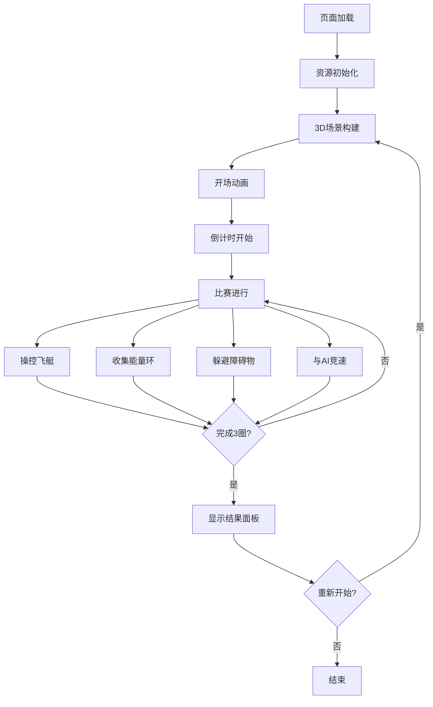

## 1. 产品概述

奇幻蒸汽朋克风格飞艇竞速游戏，玩家驾驶自定义飞艇在三维赛道上与AI对手竞速，躲避障碍物并收集能量道具。游戏完全在浏览器本地运行，无需后端服务。

- **核心玩法**：3圈竞速比赛，玩家与3个AI对手在环形3D赛道上竞速
- **目标用户**：休闲游戏玩家、3D游戏爱好者、蒸汽朋克风格爱好者
- **产品价值**：提供沉浸式的浏览器端3D竞速体验，无需安装任何软件

## 2. 核心特性

### 2.1 用户角色

| 角色 | 注册方式 | 核心权限 |
|------|----------|----------|
| 玩家 | 无需注册，直接进入 | 游戏操控、视角切换、重新开始 |

### 2.2 功能模块

1. **游戏主场景**：3D赛道渲染、飞艇控制、物理模拟
2. **竞速系统**：圈数计数、排名计算、计时器
3. **AI对手**：3艘AI飞船，自主导航与避障
4. **道具系统**：能量环收集、能量条管理
5. **UI界面**：HUD显示、开始动画、结束面板

### 2.3 页面详情

| 页面名称 | 模块名称 | 功能描述 |
|----------|----------|----------|
| 游戏主界面 | 3D渲染层 | 全屏Three.js渲染，包含赛道、飞艇、障碍物、道具 |
| 游戏主界面 | HUD层 | 速度表、排名、能量条、计时器、圈数显示 |
| 游戏主界面 | 开场动画 | 镜头高空俯冲环绕赛道3秒 |
| 游戏主界面 | 结束面板 | 胜利/失败结果展示、排名列表、重新开始按钮 |

## 3. 核心流程

玩家进入页面后，首先播放开场动画（镜头从高空俯冲下降并环绕赛道一周，持续3秒），然后进入比赛状态。玩家通过WASD/QE键控制飞船，在赛道上与3个AI对手竞速。收集能量环恢复能量，躲避岩石障碍物。完成3圈后显示比赛结果，可点击重新开始。

## 4. 界面设计

### 4.1 设计风格

- **主色调**：深褐色(#3E2723)、铜色(#DAA520)、深棕色(#8B4513)
- **点缀色**：青色(#00ffff)能量环、金色(#FFD700)第一名、银色(#C0C0C0)第二名、铜色(#CD7F32)第三名
- **按钮样式**：蒸汽朋克风格边框、金属质感、悬停发光效果
- **字体**：铜色数字字体、带阴影效果
- **布局**：HUD半透明覆盖层、深褐色80%不透明度边框
- **动效**：微交互缩放、发光过渡(0.2秒)、压力波涟漪效果

### 4.2 页面设计概览

| 页面名称 | 模块名称 | UI元素 |
|----------|----------|----------|
| 游戏主界面 | 顶部中央 | 蒸汽朋克主题计时器，铜色数字字体 |
| 游戏主界面 | 顶部右侧 | 排名列表，金银铜色区分名次 |
| 游戏主界面 | 顶部左侧 | 圈数计数器(当前/总圈数) |
| 游戏主界面 | 顶部能量条 | 渐变绿→红色能量条，填充动画 |
| 游戏主界面 | 底部中央 | 弧形速度表，0-200单位/秒，指针旋转 |
| 游戏主界面 | 结束面板 | 半透明背景，金色边框，从底部滑入 |
| 游戏主界面 | 开场动画 | 镜头俯冲环绕，3秒后进入游戏 |

### 4.3 响应式

- 桌面端优先设计，全屏体验
- HUD元素位置固定，自适应窗口大小
- 鼠标悬停效果仅桌面端

### 4.4 3D场景指引

- **环境**：深棕色背景，蒸汽云团漂浮，雾气效果
- **光照**：定向主光源+环境光+能量环自发光
- **摄像机**：第三人称跟随视角，开场动画为环绕轨道
- **构图**：赛道为视觉中心，飞船在赛道上方行驶
- **交互**：键盘WASD控制移动，QE控制翻滚
- **后期处理**：轻微泛光效果，增强蒸汽朋克氛围
- **资源**：所有几何模型程序生成，无外部资源依赖
- **性能预算**：三角形≤20000，粒子≤200，帧率≥55FPS
