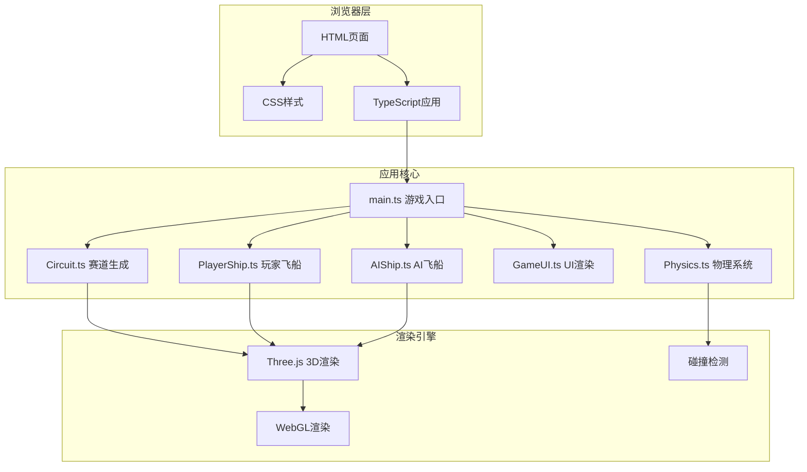

## 1. 架构设计



## 2. 技术栈说明

- **前端框架**：TypeScript + Vite (纯3D游戏，无需React/Vue)
- **3D引擎**：Three.js (three@latest, @types/three@latest)
- **构建工具**：Vite@latest
- **类型系统**：TypeScript 严格模式
- **物理系统**：自研轻量物理引擎（碰撞检测、速度计算）

## 3. 模块定义与文件结构

| 文件路径 | 模块职责 | 核心API |
|----------|----------|----------|
| src/main.ts | 游戏主入口，场景初始化，主循环控制 | init(), animate(), updateGameState() |
| src/Circuit.ts | 赛道生成，包括路面、围栏、障碍物、能量环、蒸汽云 | generate(), getTrackPoints(), getObstacles(), getEnergyRings() |
| src/PlayerShip.ts | 玩家飞船模型创建，键盘/鼠标控制，状态输出 | create(), update(dt), getPosition(), getVelocity(), getEnergy() |
| src/AIShip.ts | AI飞船模型，路径跟随，避障逻辑，动态速度 | create(), update(dt, playerPos, obstacles), getPosition() |
| src/GameUI.ts | HUD渲染，速度表、排名、能量条、计时器、结果面板 | init(), updateHUD(state), showResult(ranking), onLapComplete() |
| src/Physics.ts | 碰撞检测，加速/减速计算，能量道具拾取 | checkCollisions(), applyThrust(), applyFriction(), checkEnergyCollection() |

## 4. 核心数据结构

### 4.1 游戏状态类型

```typescript
type GameState = 'intro' | 'countdown' | 'racing' | 'finished';

interface ShipState {
  position: THREE.Vector3;
  velocity: THREE.Vector3;
  rotation: THREE.Euler;
  energy: number;
  speed: number;
  lap: number;
  lastLapTime: number;
  isStunned: boolean;
  stunTimer: number;
  outOfControl: boolean;
  outOfControlTimer: number;
}

interface RaceRanking {
  name: string;
  lap: number;
  progress: number;
  totalTime: number;
  isPlayer: boolean;
  color: string;
}

interface Obstacle {
  position: THREE.Vector3;
  boundingBox: THREE.Box3;
  mesh: THREE.Mesh;
}

interface EnergyRing {
  position: THREE.Vector3;
  rotation: number;
  collected: boolean;
  mesh: THREE.Mesh;
}
```

### 4.2 配置常量

```typescript
const CONFIG = {
  // 赛道配置
  TRACK_WIDTH: 20,
  TRACK_SEGMENTS: 16,
  TRACK_PERIMETER: 600,
  HEIGHT_VARIATION: 5,
  CURVATURE_VARIATION: 0.2618, // ±15度
  
  // 飞船配置
  MAX_THRUST: 120,
  BRAKE_FORCE: 60,
  TURN_SPEED: 1.2,
  ROLL_SPEED: 1.8,
  FRICTION: 0.15,
  GRAVITY: 10,
  MAX_ALTITUDE: 20,
  INITIAL_ENERGY: 100,
  
  // 碰撞配置
  BOUNCE_FORCE: 0.5,
  STUN_DURATION: 0.3,
  ENERGY_LOSS: 10,
  ENERGY_GAIN: 15,
  OUT_OF_CONTROL_DURATION: 2,
  
  // 比赛配置
  TOTAL_LAPS: 3,
  COUNTDOWN_TIME: 3,
  INTRO_DURATION: 3,
  
  // AI配置
  AI_COUNT: 3,
  AI_SPEED_MIN: 0.8,
  AI_SPEED_MAX: 1.1,
  AI_UPDATE_INTERVAL: 5, // 每5帧更新一次
  AI_AVOID_TIME: 1, // 提前1秒避障
  AI_AVOID_ANGLE: 0.5,
  AI_AVOID_DURATION: 0.2,
  
  // 性能配置
  MAX_PARTICLES: 200,
  MAX_TRIANGLES: 20000,
};
```

## 5. 性能优化策略

1. **碰撞检测优化**：使用AABB包围盒，每帧检测一次
2. **AI更新优化**：每5帧更新一次AI逻辑，降低计算量
3. **几何复用**：障碍物和能量环使用InstancedMesh减少Draw Call
4. **LOD策略**：远处物体使用低多边形模型
5. **粒子系统**：对象池复用粒子，限制最大数量200
6. **材质复用**：相同外观物体共享材质实例
7. **视锥体剔除**：Three.js内置自动剔除不可见物体

## 6. 输入控制映射

| 按键 | 动作 |
|------|------|
| W | 加速前进 |
| S | 减速/倒车 |
| A | 向左转向 |
| D | 向右转向 |
| Q | 向左翻滚 |
| E | 向右翻滚 |

## 7. 事件系统

```typescript
// 游戏事件
type GameEventType = 
  | 'lapComplete'
  | 'energyCollected'
  | 'collision'
  | 'raceComplete'
  | 'countdownTick'
  | 'gameStart';

interface GameEvent {
  type: GameEventType;
  data?: any;
}

// 事件订阅/发布
class EventEmitter {
  on(event: GameEventType, callback: (data?: any) => void): void;
  emit(event: GameEventType, data?: any): void;
}
```

## 8. 构建配置

- **Vite配置**：基础开发服务器配置，支持热更新
- **TypeScript配置**：严格模式，ES模块，目标ES2020
- **入口文件**：index.html → src/main.ts
- **开发命令**：npm run dev
- **构建命令**：npm run build
