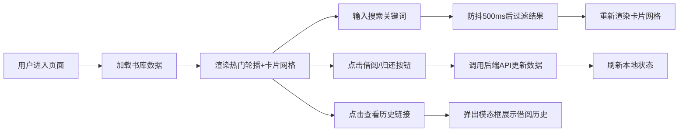

## 1. 产品概述

社区图书馆图书管理与借阅系统，面向社区居民和图书馆管理员，提供在线书库浏览、借阅预约、自助借还和借阅历史追踪功能，简化图书借阅流程，提升服务效率。

- 核心目标：简化纸质图书借阅流程，实现线上化管理
- 目标用户：社区居民（读者）、图书馆管理员
- 产品价值：24小时自助借阅服务，透明的借阅历史，便捷的图书搜索

## 2. 核心功能

### 2.1 用户角色

| 角色 | 注册方式 | 核心权限 |
|------|----------|----------|
| 普通读者 | 无需注册（游客模式） | 浏览书库、搜索图书、借阅/归还图书、查看借阅历史 |

### 2.2 功能模块

1. **首页（单页应用）**：固定顶部搜索栏、热门书籍轮播区、图书卡片网格展示区
2. **图书搜索模块**：关键词实时过滤、防抖处理、按书名/作者匹配
3. **借阅管理模块**：一键借阅、一键归还、状态实时更新
4. **历史记录模块**：借阅历史模态框、时间倒序展示、借阅者/借出/归还时间
5. **热门轮播模块**：借阅次数Top5、自动滚动、手动切换、悬停暂停

### 2.3 页面详情

| 页面名称 | 模块名称 | 功能描述 |
|-----------|-------------|---------------------|
| 首页 | 固定搜索栏 | 顶部悬浮深棕色背景，输入框圆角8px，聚焦橙黄色发光，实时搜索防抖500ms |
| 首页 | 热门轮播区 | 渐变棕色背景，借阅次数Top5书籍横向轮播，4秒自动切换，CSS transform translateX，0.5s缓出，左右半透明箭头，悬停暂停 |
| 首页 | 图书卡片网格 | 响应式网格（桌面3+列、平板2列、手机1列），卡片浅米色圆角12px，悬停加深阴影+上浮0.2s过渡 |
| 首页 | 借阅历史模态框 | 半透明黑色遮罩，圆角16px框体，弹性动画0.4s ease-out，从卡片位置向上展开，历史列表时间倒序 |

## 3. 核心流程

用户打开页面 → 浏览热门轮播推荐 → 在搜索栏输入关键词（防抖500ms后过滤）→ 浏览图书卡片网格 → 点击"借阅"按钮（调用后端API → 状态更新为已借出）→ 或点击"归还"按钮（调用后端API → 状态恢复为在架）→ 点击"查看历史"链接 → 弹出模态框展示该书所有借阅事件（倒序）

## 4. 用户界面设计

### 4.1 设计风格

- **主色调**：深棕色 #5D4037（导航栏、强调文字）
- **背景色**：米色 #F5F0E1（页面背景）、浅米色 #FFF8E7（卡片背景）
- **强调色**：橙黄色 #FFB300（边框发光、按钮hover、状态标签）
- **轮播渐变**：#4E342E → #5D4037
- **按钮风格**：圆角8px，点击时 scale(0.95) 0.15s过渡，悬停时轻微提亮
- **字体**：标题使用衬线体（Georgia/Noto Serif SC）增强图书馆人文气质，正文使用无衬线体（system-ui）保证可读性
- **布局**：卡片式网格布局，顶部固定导航
- **图标风格**：使用lucide-react线性图标，统一24px尺寸

### 4.2 页面设计概览

| 页面名称 | 模块名称 | UI元素 |
|-----------|-------------|-------------|
| 首页 | 固定搜索栏 | 深棕色背景#5D4037、白色文字、搜索图标、输入框圆角8px橙黄色聚焦发光、宽度自适应 |
| 首页 | 热门轮播区 | 渐变棕色背景、白色文字卡片、translateX动画0.5s ease-out、左右箭头半透明、4秒自动切换、悬停暂停 |
| 首页 | 图书卡片 | 浅米色背景#FFF8E7、圆角12px、阴影0 2px 8px rgba(93,64,55,0.1)、悬停阴影加深+translateY(-4px) 0.2s过渡、封面占位图、书名、作者、状态标签（绿/红）、操作按钮、查看历史链接 |
| 首页 | 历史模态框 | 遮罩rgba(0,0,0,0.5)、框体圆角16px白色背景、弹性进入动画0.4s ease-out(带轻微bounce)、标题栏关闭按钮、历史列表按时间倒序 |

### 4.3 响应式设计

- **桌面端（>768px）**：卡片3列布局，搜索栏内边距大
- **平板端（481px-768px）**：卡片2列布局，搜索栏宽度自适应100%
- **手机端（≤480px）**：卡片1列布局，轮播卡片缩小，字体微调

### 4.4 动效规范

- 轮播切换：transform: translateX(-100%) 0.5s cubic-bezier(0.4, 0, 0.2, 1)（GPU加速，60fps）
- 卡片悬停：box-shadow加深 + translateY(-4px) 0.2s ease-out
- 按钮点击：scale(0.95) 0.08s → scale(1) 0.07s（共0.15s）
- 模态框进入：opacity 0→1 + scale(0.9)→1 + translateY(20px)→0，0.4s cubic-bezier(0.34, 1.56, 0.64, 1)（弹性）
- 搜索结果过滤：列表项fade-in 0.2s stagger
