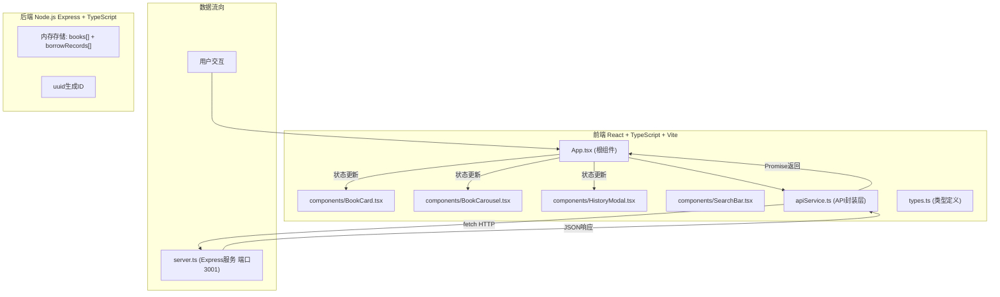
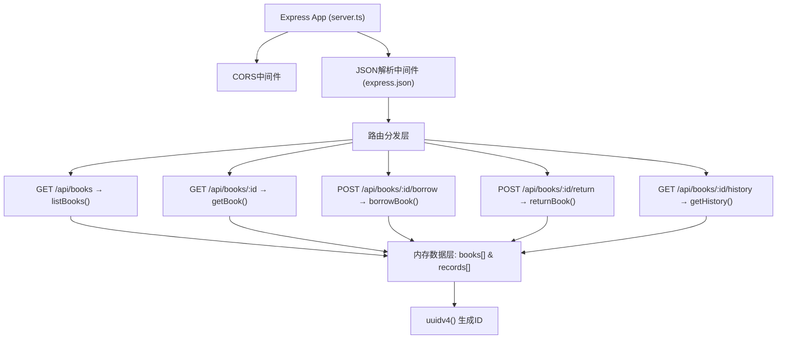
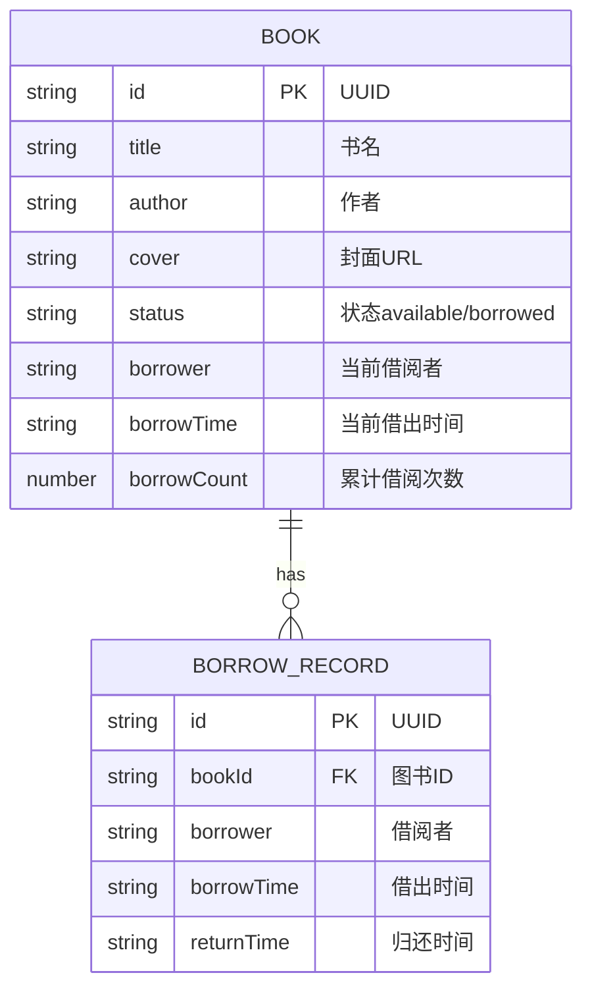

## 1. 架构设计



## 2. 技术说明

- **前端框架**：React@18 + TypeScript@5 + Vite@5（用户指定，不用tailwindcss，使用原生CSS-in-JS/全局CSS）
- **构建工具**：Vite + @vitejs/plugin-react
- **状态管理**：React useState/useEffect（单页应用，无需zustand，用户未指定）
- **后端框架**：Express@4 + TypeScript + ts-node
- **CORS处理**：cors@2 中间件
- **ID生成**：uuid@9
- **数据存储**：内存数组（不持久化，重启服务重置）
- **图标库**：lucide-react（按web-dev规范默认使用）

## 3. 路由定义

前端为单页应用（SPA），无前端路由，全部在首页展示。

| 后端API路由 | HTTP方法 | 用途 |
|-------|---------|---------|
| /api/books/search?keyword=xxx | GET | 搜索图书（关键词匹配书名/作者） |
| /api/books/:id | GET | 获取单本图书详情 |
| /api/books | GET | 获取全部图书列表 |
| /api/books/:id/borrow | POST | 借阅图书（body: { borrower }） |
| /api/books/:id/return | POST | 归还图书 |
| /api/books/:id/history | GET | 获取图书借阅历史 |

## 4. API定义

### 4.1 类型定义

```typescript
// 图书状态
type BookStatus = 'available' | 'borrowed';

// 图书对象
interface Book {
  id: string;           // uuid
  title: string;        // 书名
  author: string;       // 作者
  cover: string;        // 封面图片URL（或占位）
  status: BookStatus;   // 借阅状态
  borrower?: string;    // 当前借阅者
  borrowTime?: string;  // 当前借出时间 (ISO)
  borrowCount: number;  // 累计借阅次数（用于热门排行）
  description?: string; // 简介
}

// 借阅记录
interface BorrowRecord {
  id: string;           // uuid
  bookId: string;       // 图书ID
  borrower: string;     // 借阅者姓名
  borrowTime: string;   // 借出时间 (ISO)
  returnTime?: string;  // 归还时间 (ISO)，未归还则undefined
}

// 通用响应
interface ApiResponse<T> {
  success: boolean;
  data?: T;
  message?: string;
}
```

### 4.2 请求/响应示例

#### GET /api/books?keyword=百年
请求：无body，query参数keyword可选
响应：
```json
{
  "success": true,
  "data": [
    {
      "id": "550e8400-e29b-41d4-a716-446655440000",
      "title": "百年孤独",
      "author": "加西亚·马尔克斯",
      "cover": "https://via.placeholder.com/180x240/5D4037/FFB300?text=百年孤独",
      "status": "available",
      "borrowCount": 12
    }
  ]
}
```

#### POST /api/books/:id/borrow
请求Body：
```json
{ "borrower": "张三" }
```
响应：
```json
{
  "success": true,
  "data": {
    "id": "...",
    "status": "borrowed",
    "borrower": "张三",
    "borrowTime": "2026-06-15T10:30:00.000Z",
    "borrowCount": 13
  }
}
```

## 5. 服务端架构图



## 6. 数据模型

### 6.1 数据模型ER图



### 6.2 初始数据（Server启动时注入）

15本预置图书（涵盖文学、科技、历史、哲学等类别），其中3本设置为已借出状态，每条借阅历史3-5条。

示例初始数据结构：
```typescript
const initialBooks: Book[] = [
  { id: uuid(), title: "百年孤独", author: "加西亚·马尔克斯", cover: "...", status: "available", borrowCount: 8 },
  { id: uuid(), title: "三体", author: "刘慈欣", cover: "...", status: "borrowed", borrower: "李华", borrowTime: "2026-06-10T...", borrowCount: 15 },
  // ... 更多图书
];
```

## 7. 文件结构与调用关系

```
auto88/
├── package.json                    # 依赖与启动脚本
├── vite.config.ts                  # Vite配置 + 代理3001端口
├── tsconfig.json                   # TS严格模式配置
├── index.html                      # 入口HTML (米色全屏背景)
├── src/
│   ├── App.tsx                     # 根组件，状态管理中枢，调用apiService
│   ├── apiService.ts               # 所有fetch API封装 (Promise)
│   ├── server.ts                   # Express后端，REST API，内存存储
│   ├── types.ts                    # Book/BorrowRecord等类型定义
│   ├── styles/
│   │   └── global.css              # 全局CSS变量、动画、响应式断点
│   └── components/
│       ├── BookCard.tsx            # 单本书卡片，onBorrow/onReturn回调
│       ├── BookCarousel.tsx        # 热门书籍横向轮播组件
│       ├── HistoryModal.tsx        # 借阅历史模态框组件
│       └── SearchBar.tsx           # 顶部搜索栏（防抖500ms）
```

**调用关系数据流**：
1. 用户输入 → `SearchBar` → `onChange` → 防抖 → `App.searchKeyword` state更新
2. `App` `useEffect` 监听 keyword → 前端过滤 `books` 数组 → 渲染 `BookCard` 网格
3. 用户点击 `BookCard` 借阅按钮 → `onBorrow(bookId)` → `App.handleBorrow` → `apiService.borrowBook()` → `fetch POST /api/books/:id/borrow` → 后端 `server.ts borrowBook` 更新 `books[]` + `records[]` → 返回JSON → `App` 更新本地 `books` state → 重新渲染
4. 用户点击"查看历史" → `App.setHistoryModalBook(book)` → 渲染 `HistoryModal` → `apiService.getHistory(bookId)` → `fetch GET /api/books/:id/history` → 返回倒序records列表 → 模态框渲染
5. `App` 初始化时 → `useEffect` → `apiService.searchBooks('')` 获取全部图书 → 计算Top5热门（按borrowCount降序）→ 传递给 `BookCarousel`
