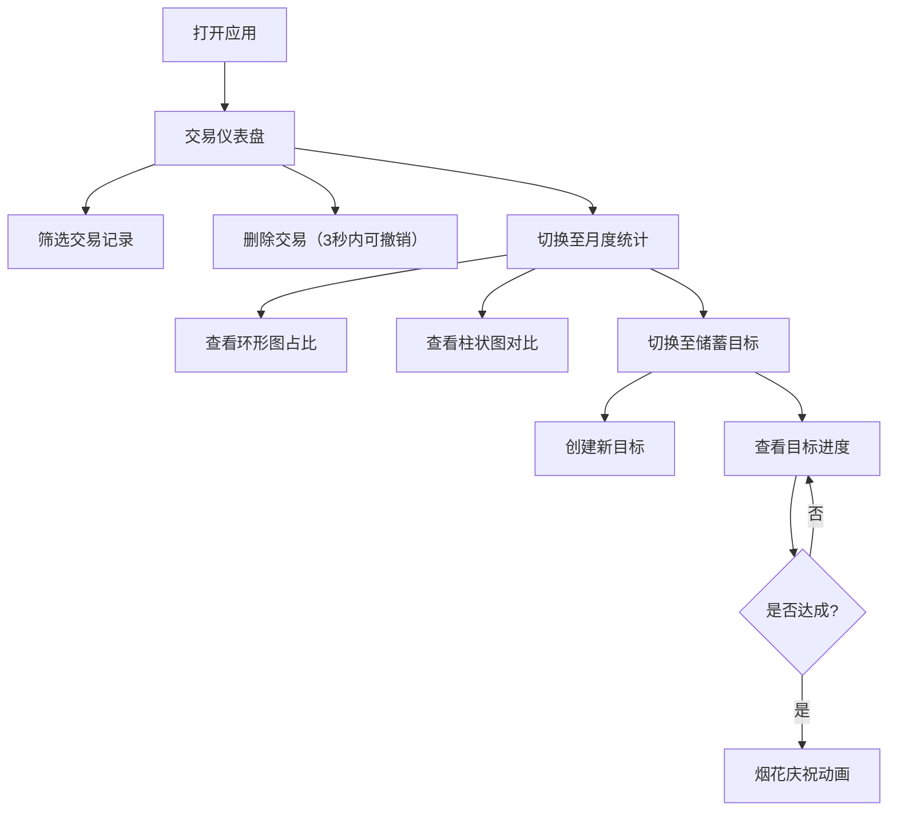

## 1. 产品概述
个人理财追踪应用，帮助理财爱好者追踪日常消费趋势、识别不必要开支并设定储蓄目标。
- 主要解决：记账混乱、缺乏可视化洞察、长期规划难的问题
- 目标用户：个人理财爱好者、需要掌控消费习惯的年轻人
- 产品价值：通过可视化数据和智能分析，帮助用户建立健康的财务习惯

## 2. 核心功能

### 2.1 用户角色
| 角色 | 注册方式 | 核心权限 |
|------|---------|---------|
| 普通用户 | 无需注册，本地使用 | 查看交易记录、统计分析、设定储蓄目标 |

### 2.2 功能模块
1. **交易仪表盘**：时间轴交易列表、分类/日期筛选、删除与撤销
2. **月度统计面板**：环形图支出占比、柱状图月度对比、骨架屏加载
3. **储蓄目标模块**：目标创建、进度展示、预估达成日期、庆祝动画

### 2.3 页面详情
| 页面名称 | 模块名称 | 功能描述 |
|---------|---------|---------|
| 交易仪表盘 | 交易时间轴 | 展示最近30笔交易，含金额、分类、日期、支付方式 |
| 交易仪表盘 | 筛选器 | 按分类（餐饮/交通/购物/娱乐等）和日期区间筛选 |
| 交易仪表盘 | 删除撤销 | 删除动画，3秒内可撤销删除操作 |
| 月度统计 | 环形图 | 各分类支出占比，悬停放大+数值标签动画 |
| 月度统计 | 柱状图 | 当月与上月各分类金额变化对比 |
| 月度统计 | 骨架屏 | 数据加载时展示定制骨架屏动画 |
| 储蓄目标 | 目标列表 | 展示所有储蓄目标及进度 |
| 储蓄目标 | 目标创建 | 创建目标（名称、金额、截止日期） |
| 储蓄目标 | 进度展示 | 缓入缓出进度条动画、预估达成日期 |
| 储蓄目标 | 庆祝效果 | 目标达成时烟花粒子庆祝动画 |

## 3. 核心流程
用户打开应用 → 浏览交易仪表盘查看消费记录 → 使用筛选器分析特定类别消费 → 查看月度统计面板了解支出结构 → 创建储蓄目标 → 追踪进度直至达成

## 4. 用户界面设计

### 4.1 设计风格
- 主色调：薄荷绿（#3EB489）和深蓝色（#1E3A5F）
- 背景色：浅灰色（#F5F7FA）营造清新冷静氛围
- 设计元素：毛玻璃效果、圆角卡片、柔和阴影
- 按钮风格：圆角按钮，明确的悬停和点击状态变化
- 字体：现代无衬线字体，清晰易读
- 动画：平滑过渡、悬停高亮、按压缩放反馈

### 4.2 页面设计概述
| 页面名称 | 模块名称 | UI元素 |
|---------|---------|-------|
| 交易仪表盘 | 交易时间轴 | 卡片式列表、悬停高亮、按压缩放、删除动画、撤销按钮 |
| 月度统计 | 图表区域 | Recharts环形图+柱状图、悬停放大动画、骨架屏占位 |
| 储蓄目标 | 目标卡片 | 进度条动画、倒计时、达成烟花粒子效果 |
| 全局导航 | 导航栏 | 桌面端侧边栏、手机端底部导航栏、平滑切页动画 |

### 4.3 响应式布局
- 桌面端（≥1024px）：左侧侧边栏导航，主内容区三栏布局
- 平板端（768-1023px）：顶部导航栏，主内容区双栏布局
- 手机端（<768px）：底部导航栏，单列布局，虚拟滚动优化
- 所有交互元素支持触摸操作，最小点击区域44x44px

### 4.4 动效规范
- 交易列表：每行悬停高亮+轻微缩放，删除时滑出渐隐
- 图表加载：骨架屏脉冲动画，数据显示时数值从0缓动到目标值
- 储蓄进度：进度条使用ease-in-out缓动，预估日期淡入显示
- 页面切换：水平滑动过渡动画，300ms时长
- 庆祝效果：Canvas烟花粒子动画，3-5秒持续时间
