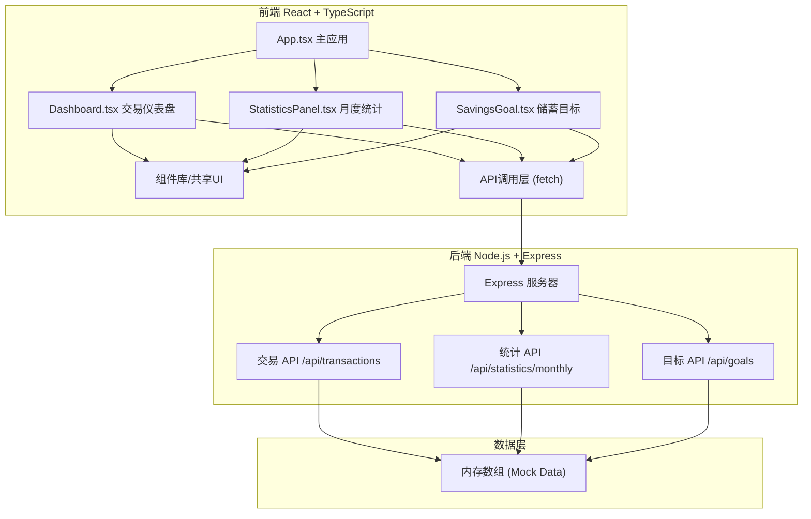
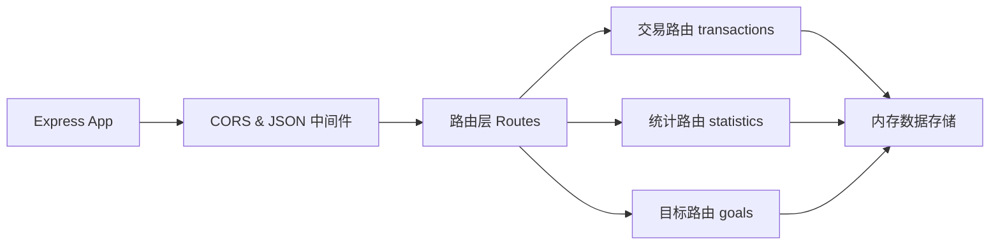
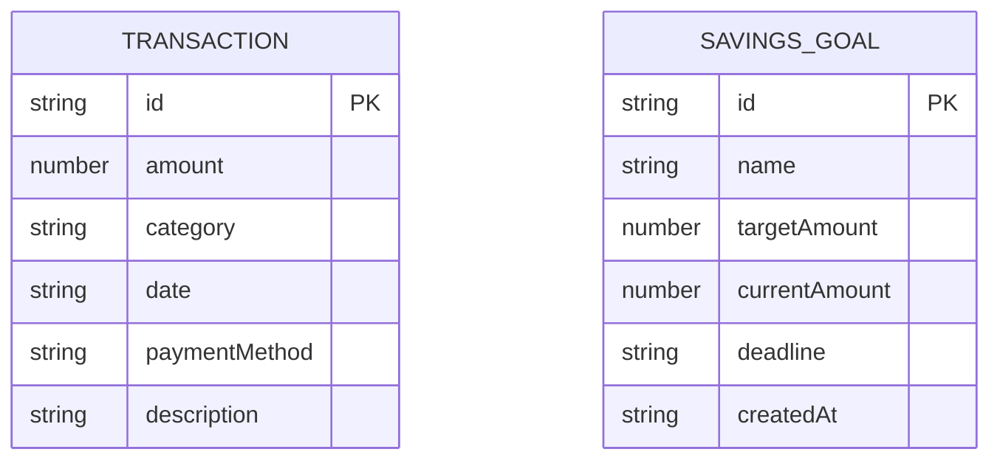

## 1. 架构设计



## 2. 技术描述
- **前端**：React 18 + TypeScript + Vite + Recharts + Zustand
- **样式方案**：TailwindCSS 3 + CSS Modules / 内联样式
- **初始化工具**：Vite (react-ts模板)
- **后端**：Express 4 + Node.js
- **数据存储**：内存数组模拟（含UUID生成唯一ID）
- **状态管理**：Zustand（轻量级状态管理）
- **图表库**：Recharts

## 3. 路由定义
| 路由 | 页面/组件 | 用途 |
|-----|----------|-----|
| / | Dashboard | 交易仪表盘（首页） |
| /statistics | StatisticsPanel | 月度统计面板 |
| /goals | SavingsGoal | 储蓄目标模块 |

## 4. API 定义

### 4.1 TypeScript 类型定义
```typescript
interface Transaction {
  id: string;
  amount: number;
  category: '餐饮' | '交通' | '购物' | '娱乐' | '医疗' | '教育' | '其他';
  date: string;
  paymentMethod: '现金' | '微信' | '支付宝' | '银行卡' | '信用卡';
  description?: string;
}

interface MonthlyStats {
  month: string;
  totalAmount: number;
  categoryBreakdown: { category: string; amount: number }[];
  previousMonthComparison: { category: string; current: number; previous: number }[];
}

interface SavingsGoal {
  id: string;
  name: string;
  targetAmount: number;
  currentAmount: number;
  deadline: string;
  createdAt: string;
}

interface GoalProgress {
  goalId: string;
  progress: number;
  estimatedCompletionDate: string | null;
  historicalSavingsRate: number;
}
```

### 4.2 API 端点
| 方法 | 路径 | 描述 | 请求参数 | 响应结构 |
|-----|------|-----|---------|---------|
| GET | /api/transactions | 获取交易列表 | category?, startDate?, endDate?, page?, limit? | { data: Transaction[], total: number } |
| POST | /api/transactions/delete | 删除交易 | { id: string } | { success: boolean } |
| GET | /api/statistics/monthly | 获取月度统计 | month? | MonthlyStats |
| GET | /api/goals | 获取所有储蓄目标 | - | SavingsGoal[] |
| POST | /api/goals | 创建储蓄目标 | { name, targetAmount, deadline } | SavingsGoal |
| GET | /api/goals/:id/progress | 获取目标进度 | id | GoalProgress |

## 5. 服务端架构



## 6. 数据模型

### 6.1 实体关系


### 6.2 初始 Mock 数据
- 交易数据：生成1000条模拟交易记录，覆盖6个月周期
- 分类：餐饮(30%)、交通(15%)、购物(25%)、娱乐(15%)、其他(15%)
- 储蓄目标：预置2-3个示例目标（如"攒钱换电脑"、"旅行基金"）

## 7. 项目文件结构
```
auto9/
├── package.json          # 主项目脚本 (concurrently)
├── client/
│   ├── package.json
│   ├── vite.config.ts
│   ├── tsconfig.json
│   ├── index.html
│   └── src/
│       ├── main.tsx
│       ├── App.tsx
│       ├── components/
│       │   ├── Dashboard.tsx
│       │   ├── StatisticsPanel.tsx
│       │   ├── SavingsGoal.tsx
│       │   ├── TransactionItem.tsx
│       │   ├── VirtualList.tsx
│       │   ├── Skeleton.tsx
│       │   ├── Fireworks.tsx
│       │   └── Sidebar.tsx
│       ├── hooks/
│       │   └── useVirtualScroll.ts
│       ├── store/
│       │   └── useStore.ts
│       ├── utils/
│       │   └── api.ts
│       ├── types/
│       │   └── index.ts
│       └── styles/
│           └── globals.css
└── server/
    ├── package.json
    └── index.js
```

## 8. 性能优化策略
- **虚拟滚动**：交易列表使用虚拟滚动，仅渲染可视区域DOM
- **骨架屏**：数据加载期间展示骨架屏，提升感知速度
- **节流/防抖**：筛选器输入使用防抖，避免频繁API请求
- **CSS动画**：优先使用transform和opacity属性，保持60fps
- **内存优化**：及时清理动画定时器和事件监听器
- **懒加载**：图表组件按需渲染，非首屏内容延迟加载
