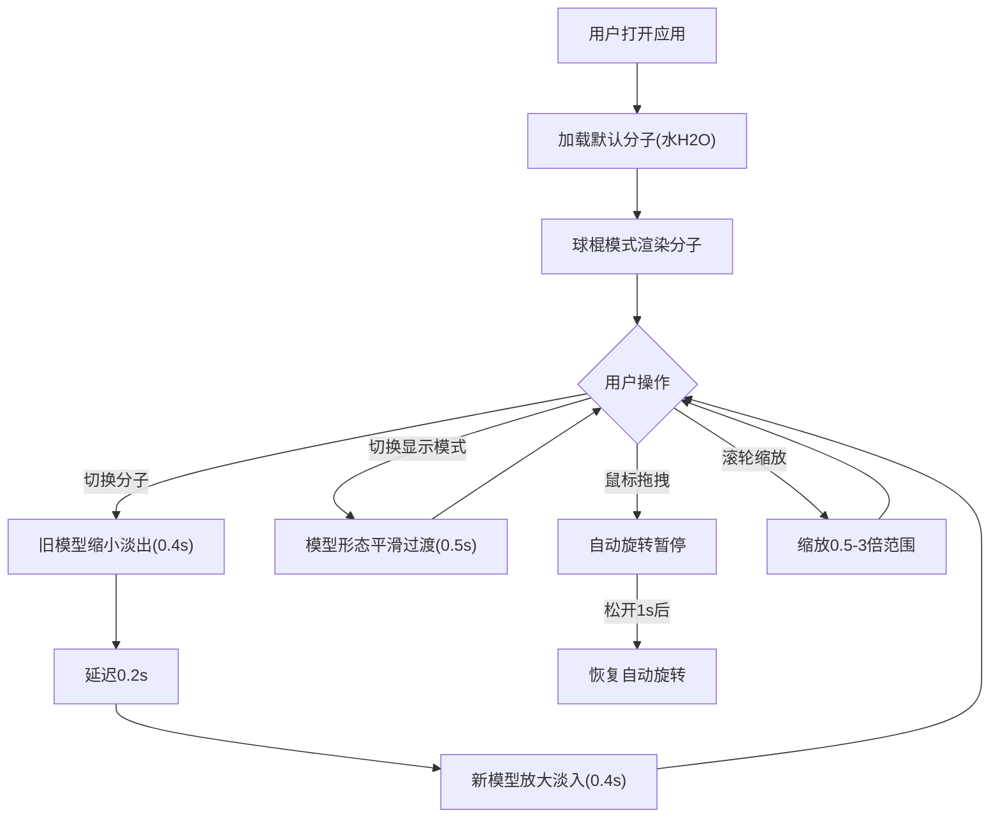

## 1. 产品概述

3D分子结构交互式查看器，基于Three.js和TypeScript构建的Web应用，让用户能够加载并旋转查看常见有机分子的3D模型，自由切换球棍模型、空间填充模型和线框模型三种显示模式。所有计算和渲染在浏览器本地完成，无需后端服务。

- 目标用户：化学教育工作者、学生及化学爱好者
- 核心价值：提供直观、流畅、视觉精美的分子3D可视化体验

## 2. 核心功能

### 2.1 功能模块

1. **3D分子查看页面**：分子3D渲染、显示模式切换、分子切换、交互控制、信息展示

### 2.2 页面详情

| 页面名称 | 模块名称 | 功能描述 |
|---------|---------|---------|
| 3D分子查看页面 | 顶部工具栏 | 毛玻璃效果工具栏，包含分子选择下拉菜单、显示模式切换按钮（球棍/空间填充/线框）、旋转速度滑块 |
| 3D分子查看页面 | 3D渲染区域 | 深蓝到深紫径向渐变背景，Three.js渲染的分子3D模型，自动旋转+鼠标拖拽旋转+滚轮缩放 |
| 3D分子查看页面 | 原子标签 | 每个原子上方悬浮半透明标签，显示元素符号，始终面向相机，文字随距离自适应 |
| 3D分子查看页面 | 信息卡片 | 左下角分子信息卡片（分子式、分子量、键角），切换分子时滑入动画和数字递增/递减动画 |

## 3. 核心流程

## 4. 用户界面设计

### 4.1 设计风格

- 主色调：深蓝(#0a0a2e)到深紫(#1a0a3e)径向渐变背景
- 强调色：亮蓝色(#4da6ff)用于按钮悬停和激活状态
- 按钮风格：圆角8px，半透明背景，悬停渐变为亮蓝(0.2s)，点击缩放至0.95(0.1s)
- 字体：白色文字，信息卡片使用小字号，行间距1.5倍
- 布局风格：顶部毛玻璃工具栏，左下角信息卡片，中心3D场景

### 4.2 页面设计概览

| 页面名称 | 模块名称 | UI元素 |
|---------|---------|--------|
| 3D分子查看页面 | 工具栏 | rgba(20,20,40,0.7)背景，blur(10px)毛玻璃，下拉菜单+圆角按钮 |
| 3D分子查看页面 | 3D场景 | 径向渐变背景，粒子光晕效果，原子彩色球体+化学键圆柱体 |
| 3D分子查看页面 | 原子标签 | Canvas 2D绘制，半透明背景，白色文字，Billboard朝向相机 |
| 3D分子查看页面 | 信息卡片 | 左对齐，4号字，行间距1.5倍，从底部滑入动画(0.3s缓出) |

### 4.3 响应式设计

- 桌面优先设计，全屏3D场景自适应
- 工具栏和信息卡片使用fixed定位，适配不同屏幕尺寸

### 4.4 3D场景指引

- 环境：深蓝到深紫径向渐变，粒子光晕营造科学氛围
- 光照：环境光+方向光组合，确保原子颜色清晰可辨
- 相机：透视相机，初始距离适中，缩放范围0.5-3倍
- 动画：自动旋转(0.3圈/秒)，分子切换缩放淡入淡出，显示模式平滑过渡
- 交互：鼠标拖拽旋转，滚轮缩放，拖拽时暂停自动旋转
- 性能：帧率不低于45FPS，动画流畅无卡顿
