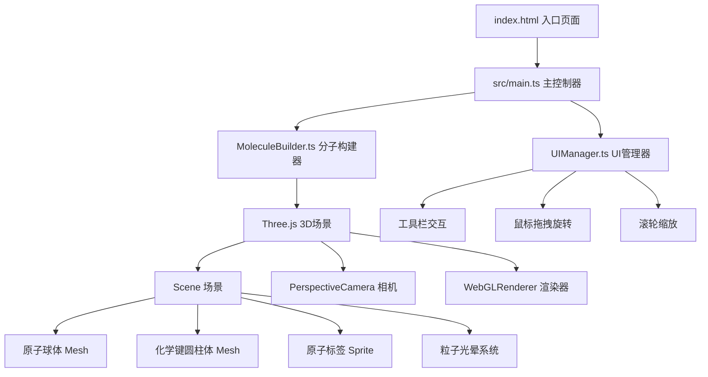

## 1. 架构设计



## 2. 技术说明

- 前端：TypeScript + Three.js + Vite
- 初始化工具：Vite
- 后端：无（纯前端应用）
- 数据库：无（分子数据硬编码在MoleculeBuilder.ts中）
- 依赖：three, typescript, vite, @types/three, dat.gui

## 3. 文件结构

| 文件路径 | 职责 |
|---------|------|
| package.json | 项目依赖和启动脚本 |
| vite.config.ts | Vite基础配置 |
| tsconfig.json | TypeScript严格模式，ES模块 |
| index.html | 入口页面，全屏深色渐变背景，顶部工具栏 |
| src/main.ts | 初始化Three.js场景/相机/渲染器，加载分子数据，启动动画循环，更新旋转和粒子光晕 |
| src/MoleculeBuilder.ts | 解析分子数据，生成原子球体和化学键圆柱体，处理三种显示模式切换 |
| src/UIManager.ts | 管理UI交互：分子切换按钮、显示模式切换、旋转速度滑块、鼠标拖拽和滚轮事件 |

## 4. 分子数据模型

### 4.1 数据结构定义

```typescript
interface AtomData {
  element: string;
  position: [number, number, number];
  color: string;
  radius: number;
}

interface BondData {
  from: number;
  to: number;
}

interface MoleculeData {
  name: string;
  formula: string;
  molecularWeight: number;
  bondAngles: string[];
  atoms: AtomData[];
  bonds: BondData[];
}
```

### 4.2 预设分子数据

- **水 H2O**：1个O原子(红色,r=0.4) + 2个H原子(白色,r=0.25)，键角104.5°
- **甲烷 CH4**：1个C原子(深灰,r=0.4) + 4个H原子(白色,r=0.25)，键角109.5°
- **苯 C6H6**：6个C原子(深灰,r=0.4) + 6个H原子(白色,r=0.25)，键角120°

## 5. 显示模式参数

| 参数 | 球棍模式 | 空间填充模式 | 线框模式 |
|------|---------|------------|---------|
| 原子半径 | 基准值 | 基准值×2.5+ | 基准值×0.3 |
| 原子透明度 | 1.0 | 1.0 | 0.3 |
| 化学键可见 | 是 | 否 | 是 |
| 化学键透明度 | 1.0 | 0.0 | 0.8 |
| 化学键粗细 | 标准 | 隐藏 | 细 |

## 6. 动画系统

- **分子切换**：旧模型缩小淡出(0.4s) → 延迟0.2s → 新模型放大淡入(0.4s)
- **显示模式切换**：原子半径和颜色透明度0.5s内平滑渐变
- **自动旋转**：默认0.3圈/秒，用户可调
- **交互旋转**：拖拽时暂停自动旋转，松开后1秒恢复
- **信息卡片**：从底部滑入(0.3s缓出)，数字递增/递减动画
