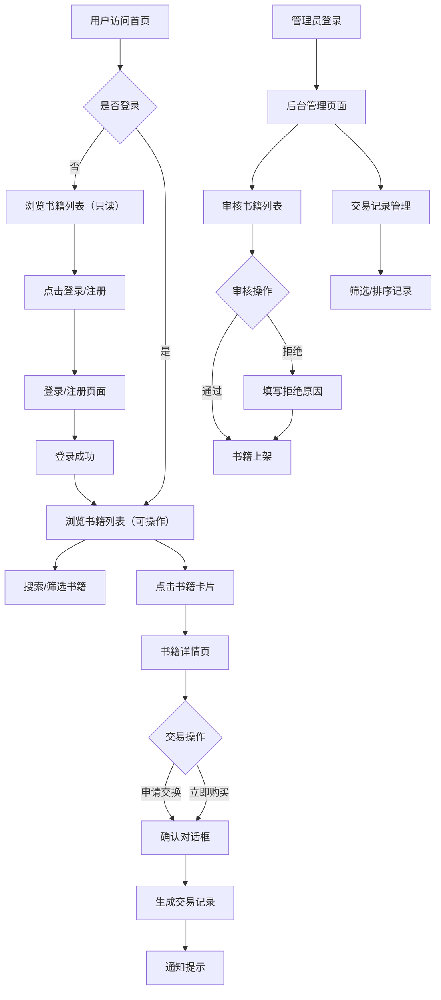

## 1. 产品概述

社区二手书店在线交易管理系统是为社区二手书店及其常客打造的线上书籍交换与折扣购买平台。店主可通过后台管理书籍审核与交易记录，用户可发布闲置旧书、浏览他人书籍并进行交换或购买。

- 主要用途：解决社区旧书流通问题，为常客提供便捷的线上交换和购买渠道
- 目标用户：社区二手书店的常客（普通用户）和书店店主（管理员）
- 产品价值：促进书籍循环利用，增强社区用户粘性，提升书店经营效率

## 2. 核心功能

### 2.1 用户角色

| 角色 | 注册方式 | 核心权限 |
|------|----------|----------|
| 普通用户 | 邮箱注册登录 | 浏览书籍、发布书籍、申请交换、购买书籍 |
| 管理员 | 管理员账号登录 | 审核书籍、查看交易记录、管理平台内容 |

### 2.2 功能模块

1. 首页：书籍列表展示、搜索框、筛选条件、书籍卡片网格
2. 登录注册页：用户登录、用户注册
3. 书籍详情页：书籍完整信息、发布者信息、交易操作
4. 发布书籍页：书籍信息填写表单
5. 管理员后台：待审核书籍列表、交易记录管理

### 2.3 页面详情

| 页面名称 | 模块名称 | 功能描述 |
|----------|----------|----------|
| 首页 | 顶部导航栏 | 品牌Logo、搜索框、用户头像/登录按钮 |
| 首页 | 筛选栏 | 出版年份范围、价格区间、书籍类别筛选 |
| 首页 | 书籍网格 | 响应式卡片网格展示，卡片悬停效果，展开动画 |
| 书籍详情页 | 书籍信息区 | 封面图、书名、作者、出版年份、简介、价格/交换信息 |
| 书籍详情页 | 发布者信息区 | 发布者头像、昵称、其他在售书籍 |
| 书籍详情页 | 交易操作区 | 申请交换按钮、立即购买按钮、确认对话框 |
| 发布书籍页 | 书籍表单 | 书名、作者、年份、简介、封面URL、交易方式（交换/出售） |
| 登录注册页 | 表单区 | 邮箱、密码输入框，登录/注册切换 |
| 管理员后台 | 审核列表 | 待审核书籍、通过/拒绝操作、拒绝原因输入 |
| 管理员后台 | 交易记录 | 交易表格、日期排序、状态筛选 |

## 3. 核心流程

普通用户核心流程：用户注册登录 → 浏览书籍列表 → 使用搜索筛选 → 进入书籍详情 → 申请交换或购买 → 确认交易

管理员核心流程：管理员登录 → 进入后台 → 审核待发布书籍（通过/拒绝）→ 查看所有交易记录 → 筛选排序交易记录

## 4. 用户界面设计

### 4.1 设计风格

- 主色调：温暖木色系 #8B7355、#C4A882、#F5E6D3
- 文字边框色：深棕色 #4A3728
- 卡片背景：浅米色 #FFF8F0
- 按钮样式：圆角设计，悬停加深背景色并轻微缩放（1.02倍）
- 字体：搭配优雅的衬线字体与清晰的无衬线字体
- 布局风格：卡片式布局，顶部导航栏
- 图标风格：简洁线性图标（lucide-react）

### 4.2 页面设计概览

| 页面名称 | 模块名称 | UI元素 |
|----------|----------|--------|
| 首页 | 导航栏 | 固定顶部、品牌标识、搜索框、用户头像 |
| 首页 | 筛选栏 | 下拉选择器、范围输入、平滑过渡 |
| 首页 | 书籍网格 | CSS Grid响应式布局（4/2/1列）、圆角16px卡片、悬停上移6px、阴影加深、从底部向上展开动画 |
| 书籍详情页 | 页面过渡 | 从右侧滑入（0.35秒缓出） |
| 书籍详情页 | 布局 | 左侧封面图（最大400px）、右侧文字信息、白色卡片背景 |
| 书籍详情页 | 对话框 | 背景模糊15px、中心弹出放大动画 |
| 登录注册页 | 页面效果 | 毛玻璃背景虚化20px、白色半透明卡片 |
| 登录注册页 | 输入框 | 聚焦时底部渐变下划线（灰色变木色） |
| 管理员后台 | 书籍卡片 | 未审核灰色边框、审核通过翻转消失动画（0.5秒） |
| 全局 | 通知提示 | 右上角滑入、3秒自动消失、滑出动画 |

### 4.3 响应式设计

- 桌面端（>1024px）：书籍网格4列
- 平板端（768px-1024px）：书籍网格2列
- 手机端（<768px）：书籍网格1列
- 触摸优化：增大点击区域，按钮最小44px高度

### 4.4 动画与交互

- 卡片展开：从底部向上展开，0.4秒缓出
- 列表更新：淡入淡出过渡，0.3秒
- 页面切换：详情页从右侧滑入，0.35秒缓出
- 对话框：中心弹出并轻微放大，0.2秒
- 审核操作：卡片180度翻转缩小消失，0.5秒
- 搜索按钮：点击放大1.05倍再复原，0.15秒
- 按钮悬停：背景加深15%，缩放1.02倍，0.2秒
- 通知提示：右侧滑入/滑出，0.4秒，3秒后自动消失
- 所有动画使用spring缓动曲线
