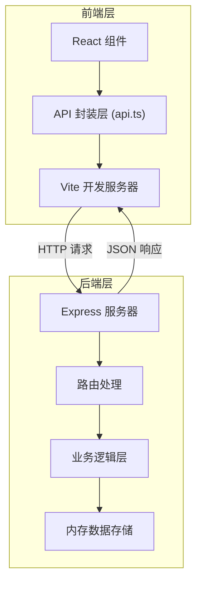
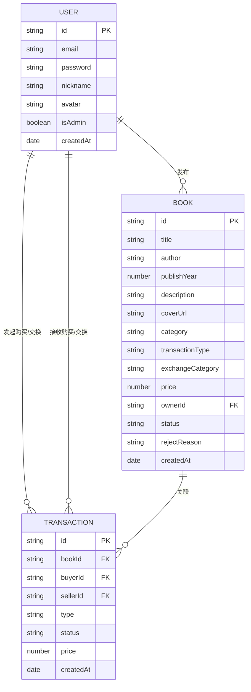

## 1. 架构设计



## 2. 技术描述

- 前端：React 18 + TypeScript + Vite
- 路由：React Router DOM
- 状态管理：React Hooks + Context
- 后端：Express 4 + TypeScript
- 数据存储：内存数组（运行时存储）
- 跨域处理：cors 中间件
- ID生成：uuid
- 并发启动：concurrently

## 3. 路由定义

### 前端路由

| 路由路径 | 用途 | 加载方式 |
|----------|------|----------|
| / | 首页，书籍列表展示 | 直接加载 |
| /login | 用户登录页面 | 懒加载 |
| /register | 用户注册页面 | 懒加载 |
| /book/:id | 书籍详情页面 | 懒加载 |
| /publish | 发布书籍页面 | 懒加载 |
| /admin | 管理员后台页面 | 懒加载 |

### 后端 API 路由

| 方法 | 路由路径 | 用途 |
|------|----------|------|
| POST | /api/auth/register | 用户注册 |
| POST | /api/auth/login | 用户登录 |
| GET | /api/books | 获取书籍列表（支持查询参数） |
| GET | /api/books/:id | 获取单本书籍详情 |
| POST | /api/books | 发布新书籍（需登录） |
| PUT | /api/books/:id/review | 管理员审核书籍 |
| GET | /api/users/:id/books | 获取用户发布的书籍 |
| POST | /api/transactions | 创建交易记录（需登录） |
| GET | /api/transactions | 获取交易记录（管理员） |

## 4. API 定义

### 数据类型定义

```typescript
// 用户类型
interface User {
  id: string
  email: string
  password: string
  nickname: string
  avatar: string
  isAdmin: boolean
  createdAt: Date
}

// 书籍类型
interface Book {
  id: string
  title: string
  author: string
  publishYear: number
  description: string
  coverUrl: string
  category: 'novel' | 'documentary' | 'technology' | 'art' | 'life'
  transactionType: 'exchange' | 'sale'
  exchangeCategory?: string
  price?: number
  ownerId: string
  status: 'pending' | 'approved' | 'rejected'
  rejectReason?: string
  createdAt: Date
}

// 交易记录类型
interface Transaction {
  id: string
  bookId: string
  buyerId: string
  sellerId: string
  type: 'exchange' | 'sale'
  status: 'pending' | 'confirmed' | 'completed'
  price?: number
  createdAt: Date
}

// 登录响应
interface AuthResponse {
  token: string
  user: Omit<User, 'password'>
}
```

## 5. 服务器架构图


## 6. 数据模型

### 6.1 数据模型关系



### 6.2 初始数据

- 默认管理员账号：admin@bookstore.com / admin123
- 预置若干书籍数据用于演示
