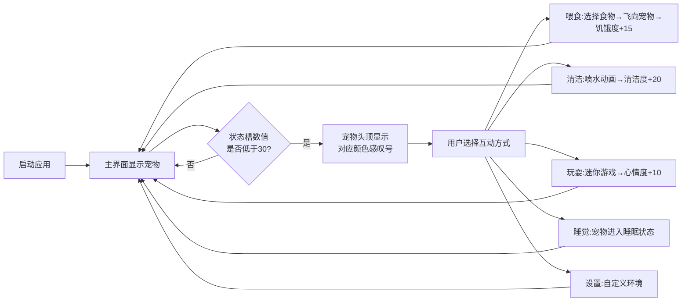

## 1. 产品概述

复古像素风格电子宠物养成应用，为快节奏生活中的用户提供低门槛的虚拟陪伴体验。
- 目标用户：无暇照顾真实宠物但渴望陪伴的都市人群
- 核心价值：通过Game Boy风格的复古像素美学和简单有趣的养成交互，提供治愈式的情感陪伴

## 2. 核心功能

### 2.1 功能模块

1. **主界面**：像素宠物展示、状态槽显示、底部工具栏
2. **宠物养成**：喂食、清洁、玩耍、睡觉四大互动功能
3. **迷你游戏**：点击追逐类小游戏提升心情度
4. **设置页面**：背景色、宠物颜色、装饰物密度自定义

### 2.2 页面详情

| 页面名称 | 模块名称 | 功能描述 |
|-----------|-------------|---------------------|
| 主界面 | 宠物展示区 | 16x16像素宠物，自动切换行走/跳跃/坐下/睡觉动作，点击触发雀跃动画和心形图标 |
| 主界面 | 状态槽 | 饥饿度、清洁度、心情度三个圆形像素槽，渐变色填充，低于30时显示感叹号闪烁警告 |
| 主界面 | 工具栏 | 喂食、清洁、玩耍、睡觉、设置五个圆形像素按钮，点击有缩放反馈动画 |
| 食物选择弹窗 | 食物网格 | 3x3食物图标网格（小鱼干、草莓、骨头等），选中后飞向宠物并增加饥饿度 |
| 清洁动画 | 喷水效果 | 宠物上方水滴随机下落3秒，清洁度增加20点 |
| 迷你游戏 | 像素棒追逐 | 像素棒从上方随机出现，点击成功心情度+10 |
| 设置页面 | 自定义滑块 | 背景色、宠物颜色、房间装饰物密度三个滑块，实时预览效果 |

## 3. 核心流程

用户打开应用 → 观察宠物自动活动 → 根据状态槽数值选择互动（喂食/清洁/玩耍/睡觉）→ 完成互动后状态数值提升 → 可进入设置页面自定义环境

## 4. 用户界面设计

### 4.1 设计风格
- **主色调**：Game Boy风格灰绿色系，主背景#9bbc0f，深绿色#306230
- **像素风格**：所有图标使用2x2像素基本块绘制，保留锯齿边缘，无抗锯齿
- **动画帧率**：宠物动作切换6fps，整体UI动画≥30fps
- **布局方式**：竖屏固定320px宽度，桌面端居中显示带左右留白

### 4.2 页面设计概览

| 页面名称 | 模块名称 | UI元素 |
|-----------|-------------|-------------|
| 主界面 | 宠物区 | 16x16像素精灵，4种动作帧动画，雀跃弹跳效果，心形粒子特效 |
| 主界面 | 状态槽 | 圆形半透明像素槽，红-黄/蓝-白/粉-紫渐变填充，数值0-100 |
| 主界面 | 工具栏 | 5个圆形像素按钮，点击1.1倍缩放0.2秒动画 |
| 弹窗/子页面 | 通用元素 | 页面切换从左到右滑动0.3秒线性动画 |

### 4.3 响应式设计
- 固定320px宽度竖屏布局
- 桌面端居中显示，左右自动留白
- 触摸操作友好，按钮尺寸适配手指点击
