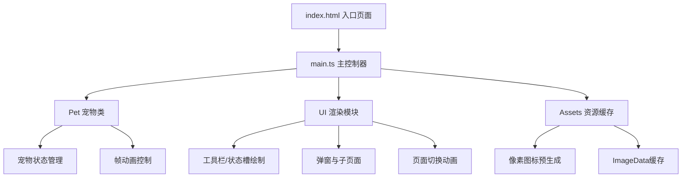

## 1. 架构设计



## 2. 技术描述

- **前端框架**：纯TypeScript + Canvas 2D API，无外部游戏引擎
- **构建工具**：Vite 4.x，开发服务器端口3000
- **类型系统**：TypeScript严格模式，ES模块
- **运行环境**：浏览器本地运行，无后端依赖

## 3. 模块定义

### 3.1 核心文件结构

| 文件路径 | 职责 |
|----------|------|
| src/main.ts | Canvas初始化、游戏循环、状态定时器、事件协调 |
| src/pet.ts | Pet类：位置/状态/动画帧管理，update/render方法 |
| src/ui.ts | UI绘制：工具栏/状态槽/弹窗/滑块，页面切换动画 |
| src/assets.ts | 资源管理：食物/装饰品数据，像素图标预生成与缓存 |

### 3.2 数据模型

#### 宠物状态
```typescript
interface PetState {
  x: number;           // 宠物X坐标
  y: number;           // 宠物Y坐标
  hunger: number;      // 饥饿度 0-100
  cleanliness: number; // 清洁度 0-100
  happiness: number;   // 心情度 0-100
  action: 'walk' | 'jump' | 'sit' | 'sleep' | 'happy';
  frameIndex: number;  // 当前动画帧
  actionTimer: number; // 动作切换计时器
}
```

#### UI状态
```typescript
interface UIState {
  currentPage: 'main' | 'settings';
  pageTransition: number; // 0-1 过渡进度
  selectedTool: string | null;
  showFoodMenu: boolean;
  miniGameActive: boolean;
  settings: {
    bgColor: string;
    petColor: string;
    decorDensity: number;
  };
}
```

## 4. 核心流程

### 4.1 游戏主循环 (60fps)
```
requestAnimationFrame → update(deltaTime) → render()
  update:
    - 更新宠物动画帧
    - 检查动作切换时机
    - 更新粒子特效
    - 更新过渡动画
  render:
    - 绘制背景
    - 绘制装饰物
    - 绘制宠物
    - 绘制状态槽
    - 绘制工具栏
    - 绘制弹窗/子页面
```

### 4.2 状态递减定时器
- 每3秒触发一次
- 饥饿度、清洁度、心情度各自减少2-3随机值
- 数值钳制在0-100范围

## 5. 性能优化

- 所有像素图标预生成为ImageData缓存，避免每帧重绘
- 使用Canvas离屏渲染减少重绘开销
- 动画帧状态机驱动，避免不必要的计算
- 内存占用控制在200MB以内
