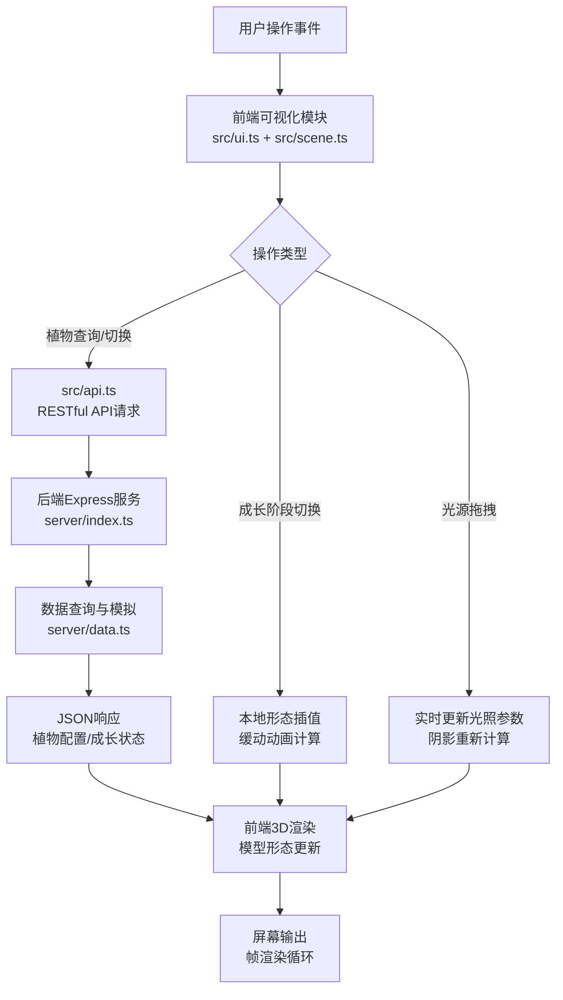

## 1. 产品概述

3D蕨类植物演化与成长模拟器是面向数字植物园科普项目的互动教育工具，通过三维可视化技术让参观者直观探索不同蕨类植物的生命周期和演化关系。

- 核心目的：将抽象的植物演化理论和生长过程转化为可交互的3D沉浸式体验，提升科普教育的趣味性和知识留存率
- 目标用户：植物园参观者、学生群体、自然教育工作者
- 市场价值：填补国内植物科普领域3D交互式教具的空白，可扩展至更多植物品类和自然博物馆场景

## 2. 核心功能

### 2.1 用户角色

| 角色 | 注册方式 | 核心权限 |
|------|----------|----------|
| 参观者/学习者 | 无需注册，直接使用 | 浏览3D植物模型、调节成长阶段、查看演化关系、阅读植物信息 |
| 教育工作者 | 无需注册 | 可作为教学演示工具使用所有功能 |

### 2.2 功能模块

1. **主场景页面**：3D植物渲染区、成长阶段控制、光源控制器、演化树面板、植物信息卡片
2. **成长模拟模块**：4阶段形态过渡（幼芽期→展开期→成熟期→孢子期）、颜色渐变、孢子囊生成
3. **演化树模块**：8种蕨类植物演化关系图、节点点击切换、选中高亮效果
4. **光照阴影模块**：可拖拽光源控制器、实时阴影更新、平滑过渡动画
5. **信息卡片模块**：双击弹出详情、学名/俗名/生长环境/演化阶段说明

### 2.3 页面详情

| 页面名称 | 模块名称 | 功能描述 |
|----------|----------|----------|
| 主场景页面 | 3D渲染区 | 全屏Three.js场景，程序化生成蕨类植物模型，支持轨道控制器旋转缩放 |
| 主场景页面 | 成长阶段滑块 | 4档位切换器（幼芽期/展开期/成熟期/孢子期），0.5秒缓动动画过渡 |
| 主场景页面 | 演化树面板 | 左侧悬浮240px宽面板，展示8种蕨类演化树，节点点击切换植物 |
| 主场景页面 | 光源控制器 | 右上角20px黄色拖拽圆点，控制主光源方向，实时更新阴影 |
| 主场景页面 | 信息卡片 | 双击植物弹出300px宽毛玻璃卡片，0.4秒弹性上滑动画 |
| 主场景页面 | 加载指示器 | 旋转蕨类叶片图标（24px，1.5秒/周），API请求和模型生成时显示 |

## 3. 核心流程

### 3.1 主用户流程

用户进入应用后，首先看到默认蕨类植物的3D模型处于成熟期。用户可以：
- 拖拽旋转视角观察植物细节，滚轮缩放
- 拖动成长阶段滑块，观察植物从幼芽到孢子期的形态演变
- 点击左侧演化树中不同节点，切换查看8种蕨类植物
- 拖拽右上角光源控制器，体验不同光照角度下的阴影效果
- 双击植物模型，弹出详细信息卡片学习植物知识
- 调整窗口大小，场景和UI自动适配

### 3.2 数据流程图

## 4. 用户界面设计

### 4.1 设计风格

- **主色调**：深绿色 `#1B3A2D`（背景基底）、浅绿色 `#A3D9A5`（文字/高亮）、棕色 `#6B4C3B`（演化树面板）、金色 `#E8C547`（选中高亮/交互反馈）
- **UI风格**：半透明深色毛玻璃效果（`backdrop-filter: blur()`），统一圆角 `8px`，自然有机感
- **按钮样式**：圆角8px，悬停时缩放1.05倍+背景色变亮，0.2秒过渡动画
- **字体方案**：主标题使用衬线字体（如 'Playfair Display', 'Noto Serif SC'）营造自然古典感，正文使用清晰无衬线字体（如 'Noto Sans SC'）
- **图标风格**：线性简约植物图标，统一线条粗细，金色点缀
- **空间层次**：3D场景为底层，半透明UI面板悬浮于上，通过z-index和模糊效果区分深度

### 4.2 页面设计概述

| 页面名称 | 模块名称 | UI元素 |
|----------|----------|--------|
| 主场景页面 | 全屏背景 | 深绿色径向渐变 `radial-gradient(ellipse at center, #2A5240 0%, #1B3A2D 50%, #0F2419 100%)` |
| 主场景页面 | 3D画布 | 铺满全屏，z-index: 0，接收鼠标拖拽事件 |
| 主场景页面 | 演化树面板 | 左边缘固定，宽度240px，深棕色半透明 `rgba(107,76,59,0.75)`，毛玻璃模糊，圆角8px，内边距16px |
| 主场景页面 | 演化树节点 | 圆形30px直径，淡灰连线，选中节点2px金色描边+外发光 `box-shadow: 0 0 12px #E8C547` |
| 主场景页面 | 成长滑块区 | 底部中央，半透明深绿条带，4个阶段标签，滑块轨道渐变填充 |
| 主场景页面 | 光源控制器 | 右上角绝对定位，20px黄色圆点 `#E8C547`，外层辐射光芒渐变环，可拖拽 |
| 主场景页面 | 信息卡片 | 点击位置上方弹出，宽度300px，深色半透明 `rgba(27,58,45,0.85)`，`backdrop-filter: blur(12px)`，圆角8px，内边距20px |
| 主场景页面 | 加载状态 | 中央叠加层，24px旋转蕨叶SVG，`animation: spin 1.5s linear infinite` |

### 4.3 响应式设计

- **桌面端（≥1024px）**：完整布局，左侧演化树常驻，所有控件可见
- **平板端（768-1023px）**：演化树面板默认收起为左侧40px标签，点击展开为240px抽屉式面板
- **移动端（<768px）**：所有UI面板默认隐藏，屏幕边缘显示可拖出图标按钮；滑块控件改为底部抽屉；支持触摸手势旋转场景

### 4.4 3D场景指引

- **环境氛围**：深绿色渐变背景模拟森林林下光影，添加体积光雾气效果增强沉浸感
- **光照设置**：1个可交互方向主光源（带阴影投射，分辨率2048x2048）+ 半球环境光（天空浅绿/地面深棕）+ 微弱点光源补光消除暗部死黑
- **相机参数**：PerspectiveCamera，fov=50，初始位置(0, 2, 5)对准原点，OrbitControls限制极角0~85度，最小距离2，最大距离15
- **构图焦点**：植物模型居中，地面接收阴影，相机初始角度略微俯视展示完整植株
- **交互动画**：植物切换时"缩小消散+放大出现"双阶段缩放动画（0.6秒）；成长阶段形态插值动画（0.5秒）；阴影随光源拖拽实时更新
- **后期效果**：轻微环境光遮蔽(SAO)增强立体感，色调映射ACES，轻微泛光让金色高亮更自然
- **性能预算**：单株植物顶点数≤20000，稳定帧率≥30fps，API响应≤200ms
