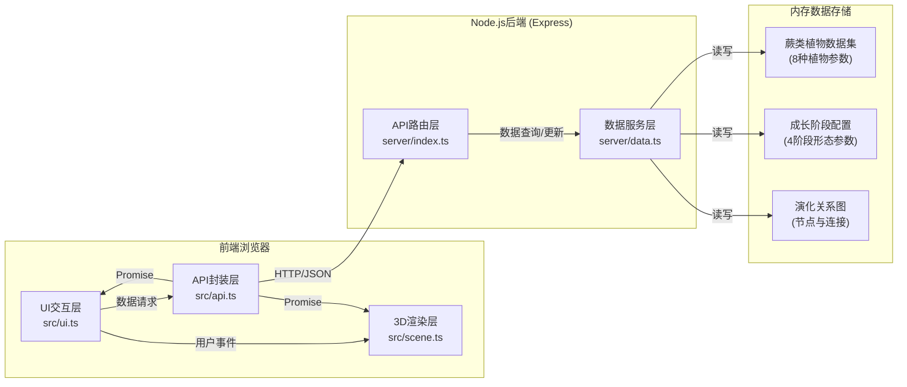
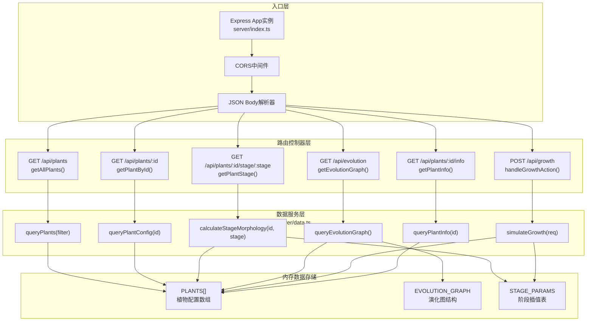
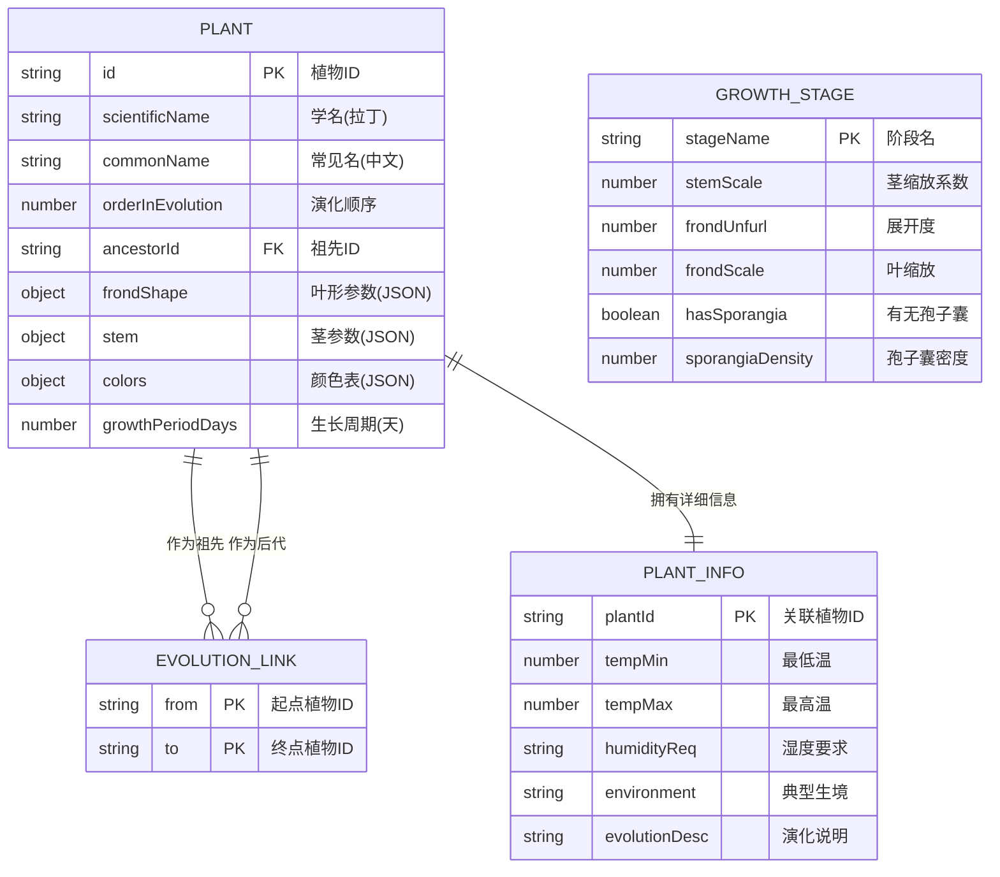

## 1. 架构设计



## 2. 技术描述

- **前端框架**：原生 TypeScript + Three.js（避免React/框架开销，追求3D渲染性能最大化）
- **构建工具**：Vite 5.x（快速热更新HMR，ESBuild编译TypeScript，优化打包）
- **前端依赖**：
  - `three` — WebGL 3D渲染核心库
  - `@types/three` — Three.js TypeScript类型声明
- **后端框架**：Node.js Express 4.x（轻量HTTP服务，RESTful API）
- **后端依赖**：
  - `express` — Web服务器框架
  - `cors` — 跨域资源共享中间件
  - `nodemon` — 开发时服务器热重载
- **语言规范**：TypeScript 5.x 严格模式（`strict: true`），统一使用ES模块（`"type": "module"`）
- **代码组织**：前后端分离，`src/`目录存放前端代码，`server/`目录存放后端代码

## 3. 路由定义

| 路由路径 | HTTP方法 | 用途 |
|----------|----------|------|
| `/api/plants` | GET | 获取所有蕨类植物列表（用于演化树面板） |
| `/api/plants/:id` | GET | 根据ID获取单个植物的详细配置数据（学名、叶形参数等） |
| `/api/plants/:id/stage/:stage` | GET | 获取指定植物在指定成长阶段的形态参数 |
| `/api/evolution` | GET | 获取演化关系图数据（节点列表和连线关系） |
| `/api/growth` | POST | 提交成长操作，返回模拟后的成长状态更新 |
| `/api/plants/:id/info` | GET | 获取植物科普信息卡片内容（学名、俗名、生境、演化说明） |

## 4. API定义

### 4.1 类型定义

```typescript
// 植物基础信息
interface PlantBase {
  id: string;
  scientificName: string;      // 学名
  commonName: string;          // 常见名
  orderInEvolution: number;    // 演化顺序(1-8)
  ancestorId: string | null;   // 演化祖先ID
}

// 植物形态配置
interface PlantConfig extends PlantBase {
  frondShape: {                // 叶片形态参数
    type: 'pinnate' | 'bipinnate' | 'palmate' | 'dichotomous';
    length: number;            // 叶片长度基准
    width: number;             // 叶片宽度基准
    curvature: number;         // 弯曲度 0-1
    segmentation: number;      // 分裂程度 0-1
  };
  stem: {                      // 茎参数
    height: number;            // 高度
    thickness: number;         // 粗细
    branchingAngle: number;    // 分支角度(度)
  };
  colors: {                    // 各阶段颜色
    sprout: string;            // 幼芽期
    unfolding: string;         // 展开期
    mature: string;            // 成熟期
    spore: string;             // 孢子期(叶片主色)
    sporangium: string;        // 孢子囊颜色
  };
  growthPeriodDays: number;    // 自然生长周期(天)
}

// 成长阶段枚举
type GrowthStage = 'sprout' | 'unfolding' | 'mature' | 'spore';

// 阶段形态插值参数
interface StageMorphology {
  stemScale: number;           // 茎缩放 0-1
  frondUnfurl: number;         // 叶片展开度 0-1 (卷→平)
  frondScale: number;          // 叶片大小 0-1
  colorBlend: string;          // 当前颜色(插值结果)
  hasSporangia: boolean;       // 是否产生孢子囊
  sporangiaDensity: number;    // 孢子囊密度 0-1
}

// 演化关系图
interface EvolutionNode {
  plantId: string;
  position: { x: number; y: number }; // 在面板中的相对位置0-1
}
interface EvolutionLink {
  from: string;
  to: string;
}
interface EvolutionGraph {
  nodes: EvolutionNode[];
  links: EvolutionLink[];
}

// 植物信息卡片
interface PlantInfo extends PlantBase {
  habitat: {
    temperatureRange: [number, number]; // 摄氏度[min, max]
    humidityRequirement: string;        // 描述文本
    typicalEnvironment: string;        // 典型生境
  };
  evolutionDescription: string;         // 演化阶段说明
  interestingFacts: string[];           // 趣味知识
}

// 成长操作请求/响应
interface GrowthActionRequest {
  plantId: string;
  fromStage: GrowthStage;
  action: 'grow' | 'reset';
}
interface GrowthActionResponse {
  plantId: string;
  currentStage: GrowthStage;
  morphology: StageMorphology;
  message: string;
}
```

### 4.2 响应格式

所有API统一JSON响应格式：
```typescript
interface ApiResponse<T> {
  success: boolean;
  data?: T;
  error?: string;
  timestamp: number;
}
```

## 5. 服务器架构图



## 6. 数据模型

### 6.1 数据模型关系图



### 6.2 初始数据（预定义数据集）

后端`server/data.ts`中预置8种代表性蕨类：

| 序号 | 学名 | 常见名 | 叶形类型 | 特征 |
|------|------|--------|----------|------|
| 1 | Psilotum nudum | 松叶蕨 | dichotomous | 最原始，二叉分支 |
| 2 | Lycopodium clavatum | 石松 | pinnate | 小型叶，孢子叶穗 |
| 3 | Selaginella moellendorffii | 卷柏 | pinnate | 异型孢子，耐旱 |
| 4 | Equisetum arvense | 问荆 | palmate | 茎中空，节轮生 |
| 5 | Osmunda regalis | 紫萁 | bipinnate | 大型叶，原始薄囊 |
| 6 | Adiantum capillus-veneris | 铁线蕨 | bipinnate | 纤细叶轴，扇形小叶 |
| 7 | Pteris vittata | 凤尾蕨 | pinnate | 一回羽状，耐砷 |
| 8 | Dicksonia antarctica | 软树蕨 | bipinnate | 树状茎，二回羽状 |

演化顺序从上到下，每一种的`ancestorId`指向前一种（第一种为`null`），形成线性演化主干。
