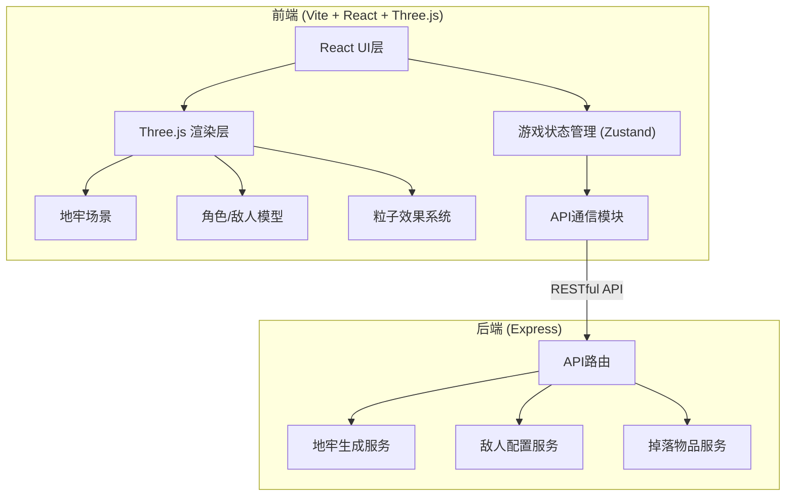
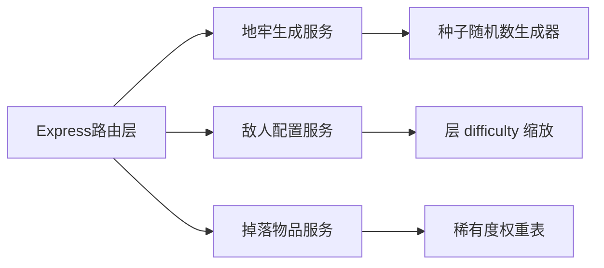
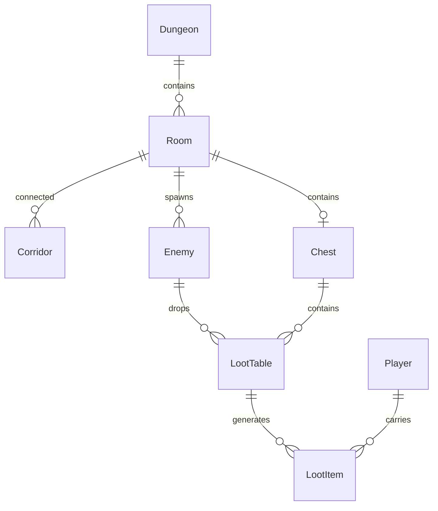

## 1. 架构设计



## 2. 技术说明

- 前端：React@18 + Three.js + TypeScript + Vite
- 初始化工具：vite-init (react-ts模板)
- 后端：Express@4 + CORS
- 状态管理：Zustand
- 通信方式：RESTful API (Fetch)

## 3. 路由定义

| 路由 | 用途 |
|------|------|
| / | 游戏标题屏幕与主入口 |
| /game | 游戏主界面(3D场景+HUD覆盖层) |

## 4. API定义

### 4.1 POST /api/dungeon/generate

请求：
```typescript
interface DungeonGenerateRequest {
  seed?: number;
  floor: number;
}
```

响应：
```typescript
interface Room {
  id: string;
  x: number;
  y: number;
  width: number;
  height: number;
  connections: string[];
  isEntrance: boolean;
  isExit: boolean;
  hasChest: boolean;
  enemyCount: number;
}

interface DungeonGenerateResponse {
  seed: number;
  floor: number;
  rooms: Room[];
  corridors: { from: string; to: string; points: { x: number; y: number }[] }[];
  enemies: EnemyConfig[];
  loot: LootItem[];
}
```

### 4.2 GET /api/enemies/config?floor={floor}

响应：
```typescript
interface EnemyConfig {
  type: 'skeleton' | 'ghost' | 'demon';
  name: string;
  hp: number;
  attack: number;
  defense: number;
  speed: number;
  attackRange: number;
  attackInterval: number;
}
```

### 4.3 POST /api/loot/roll

请求：
```typescript
interface LootRollRequest {
  playerLevel: number;
  floor: number;
}
```

响应：
```typescript
interface LootItem {
  id: string;
  name: string;
  type: 'weapon' | 'armor' | 'accessory';
  rarity: 'common' | 'rare' | 'epic' | 'legendary';
  stats: {
    attackBonus?: number;
    hpBonus?: number;
    energyRegenBonus?: number;
  };
  description: string;
}
```

## 5. 服务端架构图



## 6. 数据模型

### 6.1 数据模型定义



### 6.2 核心类型定义

```typescript
interface PlayerState {
  hp: number;
  maxHp: number;
  energy: number;
  maxEnergy: number;
  energyRegen: number;
  attack: number;
  defense: number;
  level: number;
  floor: number;
  gold: number;
  inventory: LootItem[];
  equippedWeapon: LootItem | null;
  equippedArmor: LootItem | null;
  equippedAccessory: LootItem | null;
  position: { x: number; y: number; z: number };
  isInvincible: boolean;
  isAttacking: boolean;
  isDead: boolean;
}

interface EnemyState {
  id: string;
  type: 'skeleton' | 'ghost' | 'demon' | 'boss';
  name: string;
  hp: number;
  maxHp: number;
  attack: number;
  defense: number;
  speed: number;
  position: { x: number; y: number; z: number };
  state: 'patrol' | 'chase' | 'attack' | 'dead';
  attackTimer: number;
  attackCooldown: number;
  isBoss: boolean;
  bossPhase?: number;
}

interface GameState {
  player: PlayerState;
  enemies: EnemyState[];
  currentFloor: number;
  dungeonData: DungeonGenerateResponse | null;
  isGameOver: boolean;
  isPaused: boolean;
}
```
