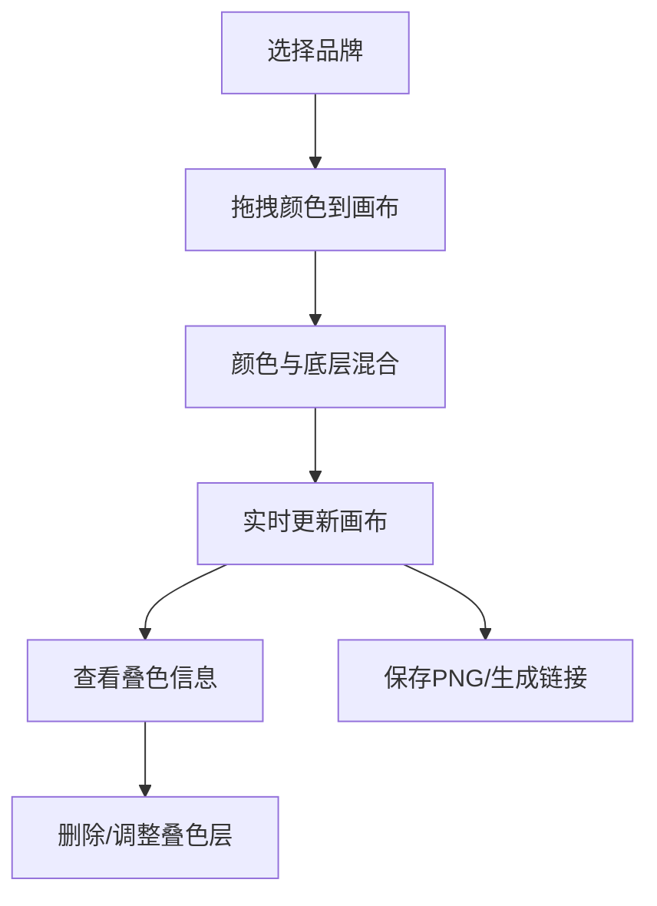

## 1. 产品概述

彩铅配色与叠色模拟器是一款面向绘画爱好者的在线工具，让用户能够在电脑上预览不同品牌彩铅颜色的叠涂效果，避免在真实纸张上反复试色造成的浪费。产品支持辉柏嘉、三菱、荷尔拜因三大品牌共36种基础颜色，通过Canvas实现半透明叠色混合效果，提供专业级的配色预览体验。

## 2. 核心功能

### 2.1 功能模块

1. **颜色色板区**：按品牌分组展示12种基础色，支持拖拽到画布
2. **画布模块**：核心渲染引擎，支持颜色叠加、混合、缩放、平移
3. **工具栏**：笔触选择、橡皮擦、重置画布功能
4. **颜色信息面板**：实时显示叠色层信息，支持删除指定层
5. **品牌库切换**：快速切换不同品牌的色板
6. **保存与分享**：导出PNG图片和生成分享链接

### 2.3 页面详情

| 页面名称 | 模块名称 | 功能描述 |
|-----------|-------------|---------------------|
| 主页面 | 颜色色板区 | 左侧固定，按品牌分组展示颜色方块，支持拖拽，悬停动效 |
| 主页面 | 画布模块 | 中央区域，浅米色仿纸纹理背景，支持颜色叠加、缩放平移 |
| 主页面 | 工具栏 | 画布上方，笔触选择、橡皮擦、重置按钮 |
| 主页面 | 颜色信息面板 | 底部固定，毛玻璃效果，显示叠色层列表 |
| 主页面 | 品牌库切换 | 右侧固定，三个品牌标签页切换 |
| 主页面 | 保存分享区 | 右上角，保存PNG和生成分享链接按钮 |

## 3. 核心流程

用户从左侧色板拖拽颜色方块到中央画布，颜色在画布上与已有颜色进行半透明混合。用户可通过工具栏选择不同笔触、使用橡皮擦或重置画布。底部面板实时显示叠色层信息，支持删除指定层。右侧可切换不同品牌的色板。右上角可保存画布为PNG或生成分享链接。

## 4. 用户界面设计

### 4.1 设计风格

- **主色调**：米色（#F5F0E6）、浅棕色（#D4C4A8）、象牙白（#FFFAF0）
- **强调色**：各品牌彩铅的鲜艳色块
- **按钮风格**：圆角4-8px，带细微阴影，悬停有过渡动效
- **字体**：Google Fonts手写体（Ma Shan Zheng）配合无衬线体
- **布局**：手账式杂货风，暖色调为主，视觉温馨舒适
- **动效**：所有交互元素带有0.15-0.3秒的平滑过渡动画

### 4.2 页面设计概述

| 页面名称 | 模块名称 | UI Elements |
|-----------|-------------|-------------|
| 主页面 | 颜色色板区 | 颜色方块4px圆角，悬停上浮2px，显示色号名称 |
| 主页面 | 画布模块 | 浅米色仿纸纹理背景，浅灰色十字格点辅助线 |
| 主页面 | 工具栏 | 浅灰色底，8px圆角，图标点击放大1.2倍动效 |
| 主页面 | 颜色信息面板 | 半透明毛玻璃效果，背景模糊10px，高度自适应 |
| 主页面 | 品牌库切换 | 浅灰色磨砂背景，蓝紫渐变滑动指示条 |
| 主页面 | 保存分享区 | 右上角按钮，toast提示消息从底部弹出 |

### 4.3 响应性

- 桌面端优先设计，支持1280px以上分辨率
- 画布区域自适应窗口大小
- 各功能区域固定位置，不随滚动变化

## 5. 性能要求

- 叠加8层颜色时，拖拽缩放帧率稳定60fps
- 使用requestAnimationFrame驱动渲染循环
- 内存消耗不超过200MB
- 所有交互响应时间不超过200ms
