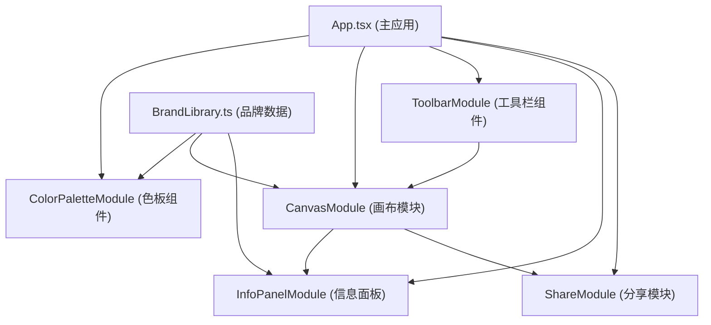

## 1. 架构设计



## 2. 技术描述

- **前端框架**：React 18 + TypeScript 5
- **构建工具**：Vite 5
- **状态管理**：React useState/useRef + 单向数据流
- **渲染引擎**：Canvas 2D Context
- **第三方库**：html2canvas（截图导出）
- **初始化方式**：Vite React TypeScript 模板

## 3. 项目结构

```
src/
├── components/
│   ├── ColorPaletteModule.tsx    # 颜色面板组件
│   ├── CanvasModule.tsx          # 画布模块（核心渲染）
│   ├── ToolbarModule.tsx         # 工具栏组件
│   └── InfoPanelModule.tsx       # 颜色信息面板
├── data/
│   └── BrandLibrary.ts           # 品牌库数据
├── utils/
│   └── ShareModule.ts            # 分享功能模块
├── App.tsx                       # 主应用组件
├── main.tsx                      # 入口文件
└── index.css                     # 全局样式
```

## 4. 核心数据结构

### 4.1 颜色数据

```typescript
interface ColorItem {
  name: string;
  hex: string;
}

interface BrandData {
  name: string;
  colors: ColorItem[];
}
```

### 4.2 叠色层数据

```typescript
interface LayerData {
  id: string;
  brandName: string;
  colorName: string;
  colorHex: string;
  opacity: number;
  x: number;
  y: number;
  brushType: 'circle' | 'bevel' | 'flat';
  timestamp: number;
}
```

## 5. 核心技术实现

### 5.1 颜色混合算法

- 使用乘法（multiply）和线性加深（linear-burn）混合模式
- RGB颜色空间计算：`result = (base * blend) / 255`
- 透明度渐变：从20%到80%，根据拖拽时间0.3s-1s递增

### 5.2 Canvas渲染优化

- requestAnimationFrame驱动渲染循环
- 离屏Canvas预渲染每层颜色
- 仅在数据变化时重绘
- 避免频繁创建Image对象

### 5.3 缩放与平移

- 变换矩阵管理：`ctx.setTransform(scale, 0, 0, scale, offsetX, offsetY)`
- 缩放范围：0.5x - 3x
- 格点辅助线按缩放比例动态显示

## 6. 性能指标

- 8层叠色时帧率 ≥ 60fps
- 交互响应时间 ≤ 200ms
- 内存占用 ≤ 200MB
- 初始化加载时间 ≤ 2s
