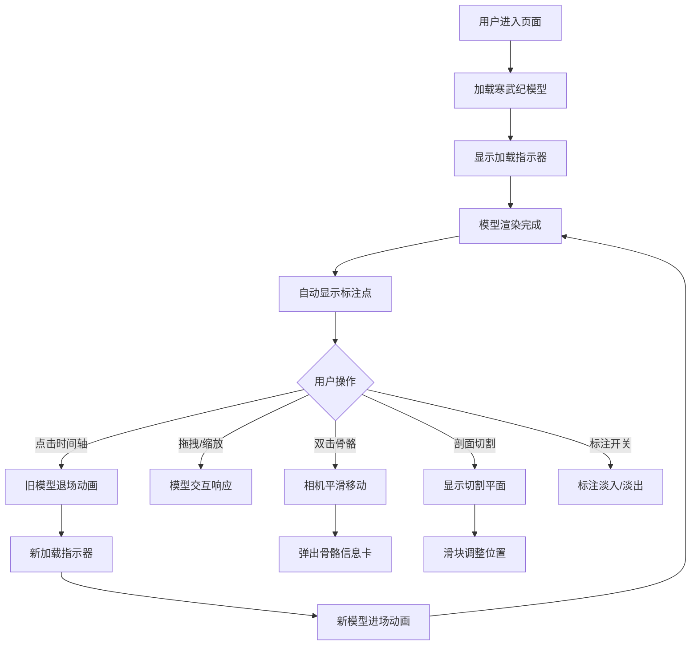

## 1. 产品概述
古生物化石三维交互展示应用，为古生物学数字展览提供交互式工具，让观众观察不同地质时期代表性古生物化石的三维结构和演化关系。

- 核心目标：通过沉浸式3D交互体验，帮助观众直观理解古生物化石的解剖结构和演化历程
- 目标用户：博物馆观众、古生物爱好者、学生和教育工作者
- 市场价值：提升数字展览的互动性和教育效果，使复杂的古生物学知识变得直观易懂

## 2. 核心特征

### 2.1 用户角色
| 角色 | 注册方式 | 核心权限 |
|------|----------|----------|
| 普通观众 | 无需注册 | 浏览3D模型、切换地质时期、使用交互功能 |
| 策展人 | 无需注册 | 配置展示内容（预留扩展） |

### 2.2 功能模块
1. **主展示区**：3D化石模型渲染、旋转/缩放交互、剖面切割
2. **地质时间轴**：6个地质时期节点、切换动画、高亮指示
3. **解剖学标注系统**：自动生成标注点、悬浮信息卡片、显示/隐藏控制
4. **工具栏**：剖面切割开关、标注显示开关
5. **信息面板**：当前化石详细信息展示

### 2.3 页面详情
| 页面名称 | 模块名称 | 功能描述 |
|----------|----------|----------|
| 主页面 | 3D展示区 | Three.js渲染化石模型，支持拖拽旋转、滚轮缩放、触摸屏交互 |
| 主页面 | 地质时间轴 | 水平排列6个地质时期节点，点击切换模型，带缓动动画 |
| 主页面 | 右侧工具栏 | 剖面切割按钮（滑块控制位置）、标注显示开关 |
| 主页面 | 信息面板 | 显示化石名称、年代、尺寸、发现地点 |
| 主页面 | 标注系统 | 骨骼标注点悬浮显示，悬停放大，双击骨骼弹出详情 |

## 3. 核心流程

### 用户浏览流程
用户进入页面 → 默认加载第一个地质时期（寒武纪）化石模型 → 显示加载指示器 → 模型加载完成后自动显示标注点 → 用户可：
- 点击时间轴切换不同时期 → 旧模型退场动画 → 新模型进场动画
- 拖拽旋转/滚轮缩放模型
- 双击骨骼区域 → 相机平滑移动 → 弹出骨骼信息卡片
- 点击剖面切割按钮 → 显示切割平面 → 拖动滑块调整切割位置
- 点击标注开关 → 显示/隐藏所有标注点

## 4. 用户界面设计

### 4.1 设计风格
- **主色调**：深灰到黑色渐变背景（顶部#2a2a2a，底部#0d0d0d）
- **强调色**：琥珀色#e8a820（选中状态高亮）、亮蓝色（工具按钮按下）
- **辅助色**：红色半透明（切割截面）、浅灰色（时间轴连线）
- **按钮风格**：圆角设计，按下时有轻微下沉效果，0.2秒过渡动画
- **字体**：使用思源宋体（展示性标题）+ 思源黑体（正文），营造学术与现代感的平衡
- **布局风格**：固定顶部导航 + 右侧垂直工具栏 + 右下角信息面板，毛玻璃半透明效果
- **图标风格**：线性简约图标，与古生物学术风格契合

### 4.2 页面设计概览
| 页面名称 | 模块名称 | UI元素 |
|----------|----------|--------|
| 主页面 | 3D展示区 | 全屏Canvas，深灰渐变背景，模型居中，加载指示器为旋转半透明圆环 |
| 主页面 | 顶部导航栏 | 60px高，半透明黑色毛玻璃，水平时间轴居中，圆形节点带缩写标签 |
| 主页面 | 右侧工具栏 | 160px宽，半透明毛玻璃，垂直排列工具按钮，图标+文字 |
| 主页面 | 信息面板 | 280px宽，毛玻璃背景，化石名称、年代范围、尺寸、发现地点 |
| 主页面 | 标注系统 | 方形标注框带连接线，悬停放大1.1倍，透明度0.7→1.0过渡 |

### 4.3 响应式设计
- **桌面端**（>768px）：完整布局，顶部导航60px，右侧工具栏160px宽，信息面板280px宽
- **移动端**（≤768px）：
  - 导航栏高度压缩到45px
  - 时间轴节点缩小30%
  - 工具栏折叠为底部弹出式，点击右下角齿轮图标展开
  - 信息面板调整为全屏高度的半透明条
  - 触摸操作优化：双指旋转/捏合缩放

### 4.4 3D场景指引
- **环境与氛围**：深灰色渐变背景，柔和环境光，模拟博物馆展厅氛围
- **光照设置**：
  - 环境光：HemisphereLight，强度0.6，天空色#444444，地面色#222222
  - 主光源：DirectionalLight，强度1.0，位置(5, 10, 7)，投射阴影
  - 补光源：PointLight × 2，强度0.3，分别位于模型两侧
- **相机设置**：PerspectiveCamera，fov=45，near=0.1，far=1000，初始位置(0, 2, 5)
- **相机动画**：双击骨骼时使用gsap缓动，0.5秒easeOut移动到骨骼正前方
- **构图与焦点**：模型始终位于屏幕中央，标注点围绕模型分布，切割平面半透明不遮挡主体
- **交互与动画**：
  - 模型退场：0.6秒，y轴旋转360°同时scale缩小到0
  - 模型进场：0.8秒，scale从0.2→1，z轴从-3→0
  - 标注框悬停：0.15秒放大1.1倍
  - 时间轴高亮：0.4秒easeOut滑动
- **后处理效果**：FXAA抗锯齿，轻微Bloom效果增强化石质感
- **资产来源与性能预算**：
  - 使用程序化生成的简化化石模型（无需外部GLB文件，确保离线可用）
  - 单模型面数控制在5000-10000三角面
  - 帧率目标稳定45FPS以上

## 5. 性能约束
- 帧率稳定在45FPS以上
- 模型加载时间不超过2秒（使用缓存和预先加载策略）
- 标注系统在10个以上标注点时无视觉卡顿
- 内存占用控制在200MB以内
