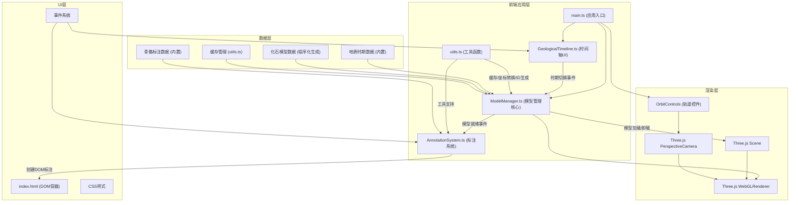

## 1. 架构设计



**数据流向说明：**
1. 用户点击时间轴 → GeologicalTimeline捕获事件 → 触发自定义事件传递给ModelManager
2. ModelManager接收时期切换事件 → 从内置数据源获取模型数据 → 触发旧模型退场动画
3. 退场完成 → 生成/加载新模型 → 进场动画 → 模型添加到Scene
4. 模型就绪 → 触发事件给AnnotationSystem → 计算标注位置 → 创建DOM叠加层
5. 渲染循环 → main.ts每帧调用 → 更新OrbitControls → 渲染Scene → 更新标注位置

## 2. 技术描述

- **前端框架**：TypeScript + Three.js (原生，无React/Vue等上层框架)
- **构建工具**：Vite 5.x
- **核心依赖**：
  - `three` ^0.160.0 - WebGL 3D渲染引擎
  - `@types/three` ^0.160.0 - Three.js TypeScript类型定义
  - `lil-gui` ^0.19.0 - 轻量级GUI控件（用于剖面切割滑块）
  - `typescript` ^5.3.0 - 类型系统
  - `vite` ^5.0.0 - 构建工具

- **无后端服务**：所有计算和渲染在浏览器本地完成
- **无数据库**：所有数据内置为TypeScript常量

## 3. 目录结构

```
auto97/
├── index.html                 # 入口HTML
├── package.json               # 项目配置与依赖
├── vite.config.ts             # Vite构建配置
├── tsconfig.json              # TypeScript配置
├── src/
│   ├── main.ts                # 应用初始化、场景创建、动画循环
│   ├── ModelManager.ts        # 模型管理核心类
│   ├── GeologicalTimeline.ts  # 地质时间轴UI组件
│   ├── AnnotationSystem.ts    # 解剖学标注系统
│   └── utils.ts               # 工具函数
└── .trae/
    └── documents/
        ├── prd.md
        └── technical-architecture.md
```

**文件职责与调用关系：**

| 文件 | 职责 | 被调用方 | 调用方 |
|------|------|----------|--------|
| main.ts | 应用入口，创建Three.js核心对象，启动动画循环，协调各模块 | GeologicalTimeline, ModelManager, utils | - |
| ModelManager.ts | 解析地质数据，模型生成/加载/卸载，剖面切割平面管理，标注数据传递 | Three.js Scene, utils, AnnotationSystem | main.ts |
| GeologicalTimeline.ts | 时间轴UI渲染，用户交互处理，时期切换事件触发 | utils | main.ts |
| AnnotationSystem.ts | 标注DOM创建，位置计算，交互处理，显示/隐藏控制 | utils | ModelManager |
| utils.ts | 缓存管理，坐标转换，唯一ID生成，缓动函数 | - | ModelManager, GeologicalTimeline, AnnotationSystem |

## 4. 核心类与接口定义

### 4.1 数据类型定义

```typescript
// 地质时期定义
interface GeologicalPeriod {
  id: string;
  name: string;
  abbreviation: string;
  startAge: number; // 百万年前
  endAge: number;
  color: string;
}

// 化石信息
interface FossilInfo {
  id: string;
  name: string;
  scientificName: string;
  periodId: string;
  ageRange: string;
  size: string;
  discoveryLocation: string;
  description: string;
}

// 骨骼标注点
interface BoneAnnotation {
  id: string;
  boneName: string;
  boneNameCn: string;
  function: string;
  localPosition: [number, number, number]; // 相对于模型的局部坐标
}

// 化石模型数据
interface FossilModelData {
  fossilInfo: FossilInfo;
  annotations: BoneAnnotation[];
  // 程序化模型生成参数
  modelParams: ModelGenerationParams;
}

// 模型生成参数
interface ModelGenerationParams {
  type: 'trilobite' | 'ammonite' | 'fish' | 'tetrapod' | 'insect' | 'reptile';
  scale: number;
  segments: number;
  complexity: number;
}
```

### 4.2 核心类接口

```typescript
// ModelManager 接口
interface IModelManager {
  currentPeriod: GeologicalPeriod | null;
  currentModel: THREE.Group | null;
  
  switchPeriod(periodId: string): Promise<void>;
  setCutPlaneEnabled(enabled: boolean): void;
  setCutPlanePosition(position: number): void; // 0-100
  setAnnotationsVisible(visible: boolean): void;
  dispose(): void;
}

// GeologicalTimeline 接口
interface IGeologicalTimeline {
  currentPeriodId: string;
  onPeriodChange: ((periodId: string) => void) | null;
  
  render(container: HTMLElement): void;
  setActivePeriod(periodId: string): void;
  dispose(): void;
}

// AnnotationSystem 接口
interface IAnnotationSystem {
  visible: boolean;
  
  attachToModel(model: THREE.Group, annotations: BoneAnnotation[]): void;
  updatePositions(camera: THREE.Camera): void;
  setVisible(visible: boolean): void;
  clear(): void;
}
```

## 5. 关键技术实现方案

### 5.1 程序化化石模型生成
由于要求无后端服务且离线可用，采用程序化方式生成6种代表性古生物模型：
- 寒武纪：三叶虫（Trilobite）- 多段体节 + 外壳
- 奥陶纪：角石（Cephalopod）- 锥形外壳 + 体管
- 志留纪：板足鲎（Eurypterid）- 节肢动物身体结构
- 泥盆纪：盾皮鱼（Placoderm）- 鱼类身体 + 骨甲
- 石炭纪：巨脉蜻蜓（Meganeura）- 昆虫身体 + 翅膀
- 二叠纪：异齿兽（Dimetrodon）- 四足动物 + 背帆

使用Three.js的BufferGeometry、ExtrudeGeometry、LatheGeometry等组合生成模型。

### 5.2 剖面切割实现
使用Three.js的ClippingPlane功能：
1. 创建一个THREE.Plane作为切割平面
2. 将平面应用到模型所有材质的clippingPlanes属性
3. 创建一个半透明平面可视化切割位置
4. 使用CSG（构造实体几何）算法或Shader计算切割截面的红色半透明显示

### 5.3 标注系统实现
采用DOM叠加层方式：
1. 每个标注点创建一个独立的DOM元素
2. 使用THREE.Vector3.project()将3D坐标转换为屏幕坐标
3. 使用SVG绘制从标注框到骨骼点的连接线
4. 使用CSS transform实现悬停放大和平滑过渡

### 5.4 动画系统
不引入额外动画库，使用requestAnimationFrame + 自定义缓动函数：
- 缓动函数：easeOutCubic, easeInOutQuad
- 动画状态机管理模型进场/退场
- 使用时间增量(deltaTime)确保动画速度一致

### 5.5 性能优化
1. **缓存策略**：
   - 生成的模型几何体存入LRU缓存
   - 标注DOM元素复用而非重建
2. **渲染优化**：
   - 使用BufferGeometry而非Geometry
   - 合并可合并的几何体
   - 合理设置像素比（pixelRatio）
3. **动画优化**：
   - 仅在需要时更新矩阵
   - 标注位置更新节流
4. **内存管理**：
   - 模型卸载时正确dispose几何体和材质
   - 移除事件监听器防止内存泄漏

## 6. 内置数据集

### 6.1 地质时期数据
```typescript
const GEOLOGICAL_PERIODS: GeologicalPeriod[] = [
  { id: 'cambrian', name: '寒武纪', abbreviation: '寒', startAge: 541, endAge: 485.4, color: '#7fa052' },
  { id: 'ordovician', name: '奥陶纪', abbreviation: '奥', startAge: 485.4, endAge: 443.8, color: '#009270' },
  { id: 'silurian', name: '志留纪', abbreviation: '志', startAge: 443.8, endAge: 419.2, color: '#b3e1c6' },
  { id: 'devonian', name: '泥盆纪', abbreviation: '泥', startAge: 419.2, endAge: 358.9, color: '#cb8c37' },
  { id: 'carboniferous', name: '石炭纪', abbreviation: '石', startAge: 358.9, endAge: 298.9, color: '#67a59a' },
  { id: 'permian', name: '二叠纪', abbreviation: '二', startAge: 298.9, endAge: 252.2, color: '#e86a6a' },
];
```

### 6.2 化石数据
每个时期对应一种代表性化石，包含：
- 基本信息（名称、学名、年代、尺寸、发现地）
- 骨骼标注点数据（5-8个关键点）
- 模型生成参数

## 7. 构建配置

### vite.config.ts
- base: './'（相对路径，支持本地直接打开）
- build.target: 'es2020'
- server.port: 5173

### tsconfig.json
- strict: true（严格模式）
- module: 'ESNext'
- moduleResolution: 'Bundler'
- paths: { '@/*': ['src/*'] }（路径映射）
- target: 'ES2020'

### package.json scripts
- `dev`: `vite` - 开发服务器
- `build`: `tsc && vite build` - 生产构建
- `preview`: `vite preview` - 预览构建结果
