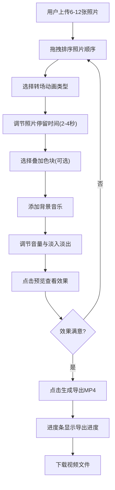

## 1. 产品概述

**回忆拼贴**是一款帮助用户将6-12张照片快速拼贴成带转场动画和背景音乐的动态回忆视频的Web应用。解决手动剪辑回忆视频耗时且缺乏创意的痛点，让用户通过简单的拖拽排序和一键操作即可生成专业级回忆短片。

- 目标用户：希望快速制作回忆视频的普通用户（旅行照片、生日回忆、毕业纪念等场景）
- 核心价值：零门槛创作，3分钟内完成从选片到导出的全流程

## 2. 核心功能

### 2.1 用户角色

| 角色 | 注册方式 | 核心权限 |
|------|----------|----------|
| 普通用户 | 无需注册 | 使用全部功能（照片管理、视频预览、导出下载） |

### 2.2 功能模块

1. **主界面**: 照片上传与排序、转场选择、音乐添加、视频预览与导出

### 2.3 页面详情

| 页面名称 | 模块名称 | 功能描述 |
|----------|----------|----------|
| 主界面 - 左侧控制面板 | 照片上传 | 从本地选择6-12张照片，支持多选，显示上传进度 |
| 主界面 - 左侧控制面板 | 拖拽排序 | 预览区网格展示照片卡片，支持拖拽重新排序，卡片带微阴影和8px圆角，拖拽时放大1.05倍并弹性跟随0.3秒 |
| 主界面 - 左侧控制面板 | 转场选择 | 下拉框选择5种预设转场之一（淡入淡出、左滑入、缩放放大、旋转进入、棋盘格碎裂进入） |
| 主界面 - 左侧控制面板 | 照片停留时间 | 滑块调节每张照片停留2-4秒 |
| 主界面 - 左侧控制面板 | 叠加色块 | 6色渐变调色板圆形径向排列，点击后色块以波浪扩散动画覆盖照片0.5秒 |
| 主界面 - 左侧控制面板 | 音乐添加 | 选择本地MP3/WAV音频文件 |
| 主界面 - 左侧控制面板 | 音量与淡入淡出 | 音量滑块0-100，线性渐变条+拇指圆点缩放动画0.2秒；淡入淡出开关（首尾各1秒自动淡入淡出） |
| 主界面 - 右侧预览区 | 视频预览 | 16:9 Canvas播放转场动画预览，一键预览动态拼贴视频 |
| 主界面 - 右侧预览区 | 波形图 | 右上角Canvas实时绘制音频波形，颜色与主色一致，峰值亮20%，30fps更新 |
| 主界面 - 底部时间线 | 时间线轨道 | 128px高，显示每张照片缩略图和时间条，支持拖拽调整顺序，其他照片自动重新排列0.3秒缓动 |
| 主界面 - 导出 | 视频导出 | 生成MP4视频，进度条实时百分比（浅蓝→亮蓝渐变），完成后弹出下载链接 |

## 3. 核心流程

1. 用户上传6-12张照片到应用
2. 在网格预览区或时间线拖拽排序照片顺序
3. 选择转场动画类型、调节照片停留时间
4. 可选：选择叠加色块滤镜
5. 选择背景音乐，调节音量和淡入淡出
6. 点击预览按钮，在预览区实时查看效果
7. 点击生成按钮，导出带转场和音频的MP4视频
8. 下载生成的视频文件

## 4. 用户界面设计

### 4.1 设计风格

- **主色调**: 星空蓝 (#4a90d9) 和玫瑰金 (#e8c3b9) 搭配
- **背景色**: 深色主题 (#1a1a2e)
- **按钮风格**: 玻璃态毛玻璃效果（背景模糊12px，四周浅色边框1px，透明度90%），点击时缩放0.95再恢复0.2秒
- **字体**: 系统默认无衬线字体 (-apple-system, BlinkMacSystemFont, 'Segoe UI', Roboto)
- **动画曲线**: 缓出曲线 cubic-bezier(0.25, 0.46, 0.45, 0.94)
- **圆角**: 照片卡片8px
- **阴影**: 照片卡片带微阴影

### 4.2 页面设计概览

| 页面名称 | 模块名称 | UI元素 |
|----------|----------|--------|
| 主界面 | 左侧控制面板(320px宽) | 毛玻璃背景、照片上传按钮、拖拽网格、转场下拉框、停留时间滑块、调色板、音频选择、音量滑块、淡入淡出开关、预览按钮、导出按钮 |
| 主界面 | 右侧预览区(剩余宽度,16:9) | Canvas元素播放转场动画、右上角波形图小区域 |
| 主界面 | 底部时间线(128px高) | 照片缩略图条、时间条、拖拽排序手柄 |

### 4.3 响应式适配

- **桌面端(>768px)**: 左侧320px控制面板 + 右侧预览区 + 底部时间线
- **平板端(≤768px)**: 左侧面板折叠为顶部mega菜单，时间线变为底部横向可滚动条

### 4.4 性能要求

- 导出视频时内存占用不超过200MB
- 预览时FPS稳定60帧
- 导出时FPS不低于15帧
