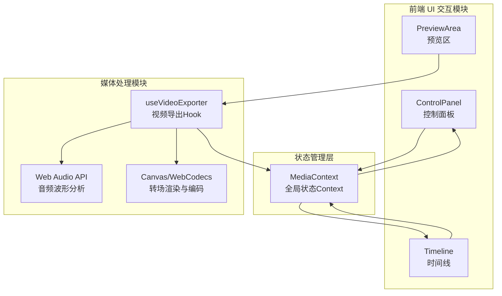

## 1. 架构设计



## 2. 技术说明

- **前端框架**: React@18 + TypeScript + Vite
- **状态管理**: React Context + useReducer (MediaContext)
- **初始化工具**: vite-init (react-ts 模板)
- **后端**: 无（纯前端应用）
- **数据库**: 无（所有数据本地处理）
- **音频处理**: Web Audio API (AudioContext, AnalyserNode)
- **视频编码**: Canvas渲染 + WebCodecs API (VideoEncoder) / MediaRecorder API 作为回退方案
- **拖拽交互**: 原生HTML5 Drag & Drop API

## 3. 路由定义

| 路由 | 用途 |
|------|------|
| / | 主界面（单页应用，无需路由） |

## 4. 文件组织结构

```
├── package.json
├── vite.config.ts
├── tsconfig.json
├── index.html
└── src/
    ├── App.tsx                    # 主应用组件
    ├── context/
    │   └── MediaContext.tsx       # 媒体处理模块核心Context
    ├── hooks/
    │   └── useVideoExporter.ts    # 视频导出自定义Hook
    ├── components/
    │   ├── ControlPanel.tsx       # 左侧控制面板
    │   ├── PreviewArea.tsx        # 右侧预览区
    │   └── Timeline.tsx           # 底部时间线
    └── styles/
        └── global.css             # 全局样式
```

## 5. 核心模块设计

### 5.1 MediaContext 状态结构

```typescript
interface PhotoItem {
  id: string;
  file: File;
  url: string;
  order: number;
}

interface MediaState {
  photos: PhotoItem[];
  audioFile: File | null;
  audioUrl: string | null;
  transitionType: 'fade' | 'slideLeft' | 'zoom' | 'rotate' | 'checkerboard';
  photoDuration: number; // 2-4秒
  overlayColor: string | null;
  volume: number; // 0-100
  fadeInOut: boolean;
  isExporting: boolean;
  exportProgress: number; // 0-100
}

type MediaAction =
  | { type: 'ADD_PHOTOS'; payload: PhotoItem[] }
  | { type: 'REORDER_PHOTOS'; payload: PhotoItem[] }
  | { type: 'SET_AUDIO'; payload: { file: File; url: string } }
  | { type: 'SET_TRANSITION'; payload: MediaState['transitionType'] }
  | { type: 'SET_DURATION'; payload: number }
  | { type: 'SET_OVERLAY_COLOR'; payload: string | null }
  | { type: 'SET_VOLUME'; payload: number }
  | { type: 'SET_FADE_IN_OUT'; payload: boolean }
  | { type: 'SET_EXPORTING'; payload: boolean }
  | { type: 'SET_EXPORT_PROGRESS'; payload: number };
```

### 5.2 useVideoExporter Hook

职责：
- 加载和预处理照片（创建Image对象，预渲染到离屏Canvas）
- 音频波形分析（使用AudioContext + AnalyserNode）
- 转场动画渲染（5种转场在Canvas上实时绘制）
- 视频编码导出（使用WebCodecs VideoEncoder或MediaRecorder回退）
- 进度回调更新

### 5.3 转场动画实现

5种转场效果均基于Canvas 2D API实现：
1. **淡入淡出**: globalAlpha从0到1的线性插值
2. **左滑入**: translateX从-100%到0的缓动动画
3. **缩放放大**: scale从0.5到1的缓动动画
4. **旋转进入**: rotate从-15deg到0 + scale从0.8到1
5. **棋盘格碎裂进入**: 将画面分割为8x8网格块，随机顺序逐块显示

### 5.4 波形图绘制

- 使用Web Audio API的AnalyserNode获取频域数据
- Canvas绘制频率柱状图，颜色与主色(#4a90d9)一致
- 峰值颜色比主色亮20%
- 更新频率30fps（使用requestAnimationFrame节流）

## 6. 关键依赖

| 依赖 | 版本 | 用途 |
|------|------|------|
| react | ^18.2.0 | UI框架 |
| react-dom | ^18.2.0 | DOM渲染 |
| typescript | ^5.3.0 | 类型安全 |
| vite | ^5.0.0 | 构建工具 |
| @vitejs/plugin-react | ^4.2.0 | React Vite插件 |
| uuid | ^9.0.0 | 生成唯一ID |
