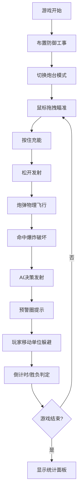

## 1. 产品概述
基于真实物理模拟的弹射抛射对战游戏，玩家通过调整炮台角度和力度发射弹药摧毁敌方防御工事，同时躲避敌方AI的反击。

- **核心玩法**：布防 → 瞄准 → 发射 → 破坏的策略循环
- **目标用户**：休闲策略游戏爱好者，喜欢物理模拟和对战玩法的玩家
- **市场价值**：结合塔防布防与物理弹射的创新玩法，复古手绘风格具有独特辨识度

## 2. 核心特性

### 2.1 功能模块
1. **防御工事布置系统**：墙体、木栅栏、沙袋三种防御建筑，拖拽放置，放置动画
2. **炮台瞄准发射系统**：抛物线瞄准器、充能机制、物理发射
3. **物理破坏系统**：爆炸粒子、碎片物理、不同工事破坏效果
4. **敌方AI系统**：随机发射、预警圈、AI决策
5. **单位移动系统**：可动单位选中、路径显示、缓动移动
6. **游戏流程系统**：倒计时、胜负判定、统计面板
7. **UI界面系统**：资源面板、技能圆盘、动画效果

### 2.2 页面详情
| 页面名称 | 模块名称 | 功能描述 |
|---------|---------|----------|
| 游戏主界面 | 战场区域 | 网格背景、工事实时渲染、炮弹飞行、爆炸效果 |
| 游戏主界面 | 资源等级面板 | 左上角显示资源、等级、倒计时 |
| 游戏主界面 | 技能弹药圆盘 | 右下角扇形菜单、弹药切换 |
| 游戏主界面 | 抛物线瞄准器 | 虚线轨迹、半透明圆点、跟随鼠标更新 |
| 游戏主界面 | 充能条 | 底部向上增长、炮身颜色渐变 |
| 游戏主界面 | 预警圈 | 红色闪烁、直径缩小、提示落点 |
| 游戏主界面 | 统计面板 | 顶部滑入、半透明遮罩、战斗数据 |

## 3. 核心流程
玩家进入游戏后，首先在起始区域拖拽布置防御工事（墙体、木栅栏、沙袋），每种建筑放置时有0.5倍到1倍的弹性缩放动画。布置完成后切换到炮台控制模式，通过鼠标拖拽调整抛物线瞄准器（虚线轨迹带半透明圆点），按住鼠标左键充能（充能条从底部向上增长，炮身从灰变红），松开发射。炮弹以真实物理抛物线飞行，命中后产生爆炸粒子效果（碎片飞溅0.6秒），对防御工事造成不同破坏（墙体碎3块、栅栏断2段、沙袋击飞）。敌方AI每8-12秒随机发射一轮，落点有红色预警圈（1.5秒内从3米缩到0.5米），玩家可点击单位移动躲避（0.5秒缓动）。游戏3分钟倒计时或一方工事全毁结束，显示统计面板（从顶部滑入0.4秒）。

## 4. 界面设计

### 4.1 设计风格
- **主色调**：暖黄色(#D4A574)、棕色(#8B4513)为主的复古纸质地图风格
- **辅助色**：淡绿色(#90EE90)网格背景、红色(#FF4444)预警和爆炸
- **字体**：花体装饰字体用于标题，清晰手写体用于正文
- **按钮风格**：手绘轮廓描边，悬停加粗边框+1.05倍放大，点击凹陷压感动画0.15秒
- **视觉效果**：所有元素手绘轮廓描边，羊皮纸半透明背景

### 4.2 UI元素详情
| 组件名称 | 位置 | 样式与动画 |
|---------|------|-----------|
| 资源等级面板 | 左上角 | 半透明羊皮纸背景、花体字体 |
| 技能弹药圆盘 | 右下角 | 四扇形区域，悬停分离弹出0.2秒+技能说明 |
| 充能条 | 炮台附近 | 从底部向上增长0-100%，炮身灰→红渐变 |
| 抛物线瞄准器 | 屏幕中央 | 虚线轨迹+半透明圆点，跟随鼠标实时更新 |
| 预警圈 | 敌方落点 | 红色闪烁，直径3m→0.5m，1.5秒 |
| 统计面板 | 屏幕中央 | 从顶部滑入0.4秒，半透明遮罩背景 |
| 建筑放置动画 | 战场网格 | 0.5倍→1倍弹性缩放0.3秒 |
| 单位移动 | 战场 | 虚线路径，0.5秒缓动曲线移动 |

### 4.3 性能要求
- 整体帧率稳定60fps
- 炮弹出膛到落地全过程≥30fps
- 粒子效果和物理计算优化

### 4.4 响应式
- 全屏Canvas渲染，自适应窗口大小
- UI元素使用相对坐标定位
