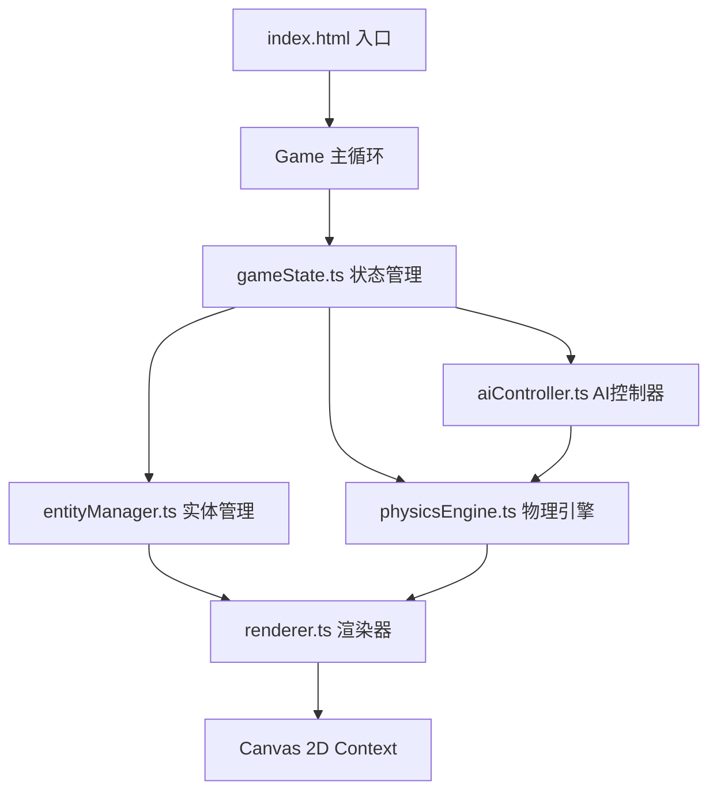

## 1. 架构设计



## 2. 技术栈描述
- **前端框架**：纯TypeScript + HTML5 Canvas（无第三方框架）
- **构建工具**：Vite 5.x
- **物理引擎**：手动实现（抛物线、重力9.8m/s²、AABB碰撞、爆炸力模拟）
- **渲染方式**：Canvas 2D API，手绘描边效果
- **状态管理**：事件发射器模式，模块化状态管理

## 3. 文件结构
```
d:\Pro\tasks\auto99\
├── package.json          # 项目依赖与脚本
├── index.html            # 入口HTML，全屏Canvas
├── tsconfig.json         # TypeScript严格模式配置
├── vite.config.ts        # Vite基础配置
└── src\
    ├── main.ts           # 游戏入口，初始化和主循环
    ├── physicsEngine.ts  # 物理引擎：抛物线、重力、碰撞、爆炸
    ├── gameState.ts      # 状态管理：单位、弹药、AI、计时器、统计
    ├── entityManager.ts  # 实体管理：工事、粒子、碎片创建销毁
    ├── renderer.ts       # 渲染器：Canvas绘制所有图形和UI动画
    └── aiController.ts   # AI控制器：发射决策、弹道计算
```

## 4. 核心模块接口定义

### 4.1 物理引擎 (physicsEngine.ts)
```typescript
export interface Vector2 { x: number; y: number; }
export interface AABB { min: Vector2; max: Vector2; }
export interface Projectile { position: Vector2; velocity: Vector2; mass: number; }
export interface Fragment { position: Vector2; velocity: Vector2; angularVelocity: number; rotation: number; mass: number; }

export class PhysicsEngine {
    static readonly GRAVITY: number = 9.8;
    static calculateTrajectory(angle: number, power: number, startPos: Vector2): Vector2[];
    static updateProjectile(projectile: Projectile, deltaTime: number): void;
    static checkAABBCollision(a: AABB, b: AABB): boolean;
    static applyExplosionForce(center: Vector2, radius: number, force: number, fragments: Fragment[]): void;
    static updateFragment(fragment: Fragment, deltaTime: number): void;
}
```

### 4.2 游戏状态 (gameState.ts)
```typescript
export type GamePhase = 'placing' | 'aiming' | 'firing' | 'aiTurn' | 'ended';
export type StructureType = 'wall' | 'fence' | 'sandbag';
export interface Structure { id: string; type: StructureType; position: Vector2; health: number; maxHealth: number; scale: number; }
export interface Unit { id: string; position: Vector2; targetPosition: Vector2 | null; moveProgress: number; }
export interface GameStats { playerStructuresLeft: number; enemyStructuresLeft: number; hitRate: number; maxSingleDamage: number; shotsFired: number; shotsHit: number; }

export class GameState {
    phase: GamePhase;
    timeRemaining: number;
    playerStructures: Structure[];
    enemyStructures: Structure[];
    projectiles: Projectile[];
    particles: Particle[];
    fragments: Fragment[];
    units: Unit[];
    stats: GameStats;
    chargeLevel: number;
    aimAngle: number;
    selectedAmmoType: string;
    
    on(event: string, callback: Function): void;
    emit(event: string, data?: any): void;
    update(deltaTime: number): void;
}
```

### 4.3 实体管理 (entityManager.ts)
```typescript
export class EntityManager {
    createStructure(type: StructureType, position: Vector2, isPlayer: boolean): Structure;
    destroyStructure(structure: Structure): Fragment[];
    createProjectile(position: Vector2, velocity: Vector2, type: string): Projectile;
    createExplosion(position: Vector2, radius: number): Particle[];
    createFragmentsFromStructure(structure: Structure): Fragment[];
    updateAll(deltaTime: number, physics: PhysicsEngine): void;
    cleanup(): void;
}
```

### 4.4 渲染器 (renderer.ts)
```typescript
export class Renderer {
    constructor(canvas: HTMLCanvasElement);
    clear(): void;
    drawGrid(): void;
    drawStructure(structure: Structure): void;
    drawProjectile(projectile: Projectile): void;
    drawParticle(particle: Particle): void;
    drawFragment(fragment: Fragment): void;
    drawTrajectory(points: Vector2[]): void;
    drawWarningCircle(position: Vector2, radius: number, alpha: number): void;
    drawChargeBar(level: number, cannonPosition: Vector2): void;
    drawCannon(position: Vector2, angle: number, heatLevel: number): void;
    drawUI(state: GameState): void;
    drawStatsPanel(stats: GameStats, progress: number): void;
    drawHandDrawnOutline(path: Path2D, color: string, lineWidth: number): void;
}
```

### 4.5 AI控制器 (aiController.ts)
```typescript
export class AIController {
    nextShotTime: number;
    currentWarning: { position: Vector2; startTime: number; duration: number } | null;
    
    update(gameState: GameState, physics: PhysicsEngine, deltaTime: number): void;
    calculateAimTarget(playerStructures: Structure[]): Vector2;
    generateFiringParams(target: Vector2): { angle: number; power: number };
    startWarning(position: Vector2): void;
}
```

## 5. 性能优化策略
1. **对象池模式**：粒子和碎片使用对象池复用，避免频繁GC
2. **空间分区**：碰撞检测使用网格空间分区，减少检测次数
3. **帧率控制**：固定时间步长物理更新，可变渲染帧率
4. **渲染优化**：离屏Canvas预渲染静态元素，合并绘制调用
5. **物理简化**：远距离物体降低物理更新频率

## 6. 动画系统
- 使用requestAnimationFrame主循环
- 缓动函数：easeOutElastic（建筑放置）、easeInOutQuad（单位移动）、easeOutBack（UI滑入）
- 所有动画时间参数可配置
