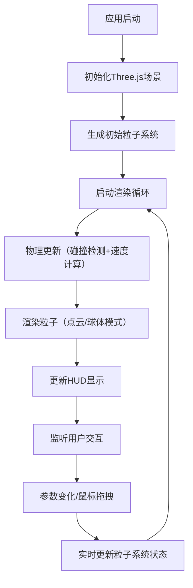

## 1. 产品概述

实时3D粒子碰撞模拟可视化应用，解决游戏与交互场景中大量粒子碰撞时性能与视觉反馈难以兼得的问题。面向游戏开发者、视觉设计师和技术美术，提供高性能、高可配置的粒子系统演示与调试工具。

## 2. 核心功能

### 2.1 功能模块
1. **粒子物理模拟**：500+粒子弹性碰撞、重力效果、碰撞颜色变化
2. **交互控制系统**：鼠标拖拽吸引/排斥力、实时轨迹响应
3. **渲染可视化**：点云/球体模式切换、碰撞光晕效果、FPS与碰撞计数显示
4. **参数控制面板**：粒子数量、重力、吸引力、大小范围实时调节

### 2.2 页面详情

| 页面名称 | 模块名称 | 功能描述 |
|-----------|-------------|---------------------|
| 主页面 | 3D场景容器 | 全屏Canvas展示粒子系统，深蓝紫渐变背景 |
| 主页面 | 控制面板 | 右侧半透明毛玻璃面板，参数调节控件 |
| 主页面 | HUD显示 | 左上角FPS和碰撞事件计数显示 |
| 主页面 | 交互指引 | 鼠标拖拽时淡蓝色虚线轨迹指引 |

## 3. 核心流程

## 4. 用户界面设计

### 4.1 设计风格
- **主色调**：深蓝紫渐变背景（#0a0a1f → #1a0a2e → #0d1f3c）
- **粒子色**：霓虹色系（青蓝#00f0ff、品红#ff00ff、黄绿#aaff00、橙红#ff6600）
- **控件样式**：毛玻璃半透明（backdrop-filter: blur(12px)）、圆角8px、细边框
- **字体**：Orbitron（科技感标题）+ JetBrains Mono（等宽数值显示）
- **动效**：控件悬停微上浮+亮度提升、碰撞径向渐变光晕、拖拽轨迹虚线流动

### 4.2 页面设计概述

| 页面名称 | 模块名称 | UI Elements |
|-----------|-------------|-------------|
| 主页面 | 3D场景 | 全屏Canvas、渐变背景、粒子光晕、碰撞闪光 |
| 主页面 | 控制面板 | 右侧320px宽、毛玻璃效果、滑块控件、模式切换按钮、数值显示 |
| 主页面 | HUD | 左上角、半透明深色底、白色等宽字体、实时刷新 |
| 主页面 | 交互指引 | 鼠标按下时出现淡蓝色虚线、跟随鼠标轨迹、松开消失 |

### 4.3 响应性
- **桌面端**：控制面板常驻右侧320px，自适应窗口高度
- **平板端**：控制面板宽度280px，字体缩小0.9倍
- **移动端**：控制面板可折叠（右上角按钮），折叠后仅显示图标条，展开时全屏覆盖
- **触控优化**：滑块触控区域增大至44px高，按钮最小尺寸48×48px

### 4.4 3D场景设计
- **环境**：深蓝紫径向渐变背景，无HDRI（保持纯净科技感）
- **光照**：环境光强度0.3 + 两盏点光源（青蓝和品红，位置对角线）
- **相机**：PerspectiveCamera，fov 75°，初始位置z轴15单位
- **后期处理**：Bloom效果增强光晕，FXAA抗锯齿
- **性能预算**：500球体模式≥45FPS，碰撞检测≥30Hz
