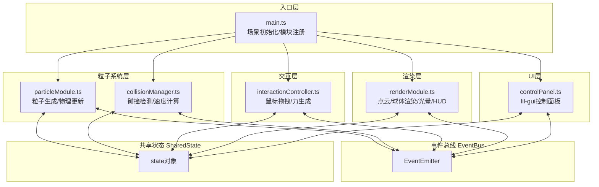

## 1. 架构设计



## 2. 技术描述

- **前端框架**：原生TypeScript + ES Modules（无需React/Vue，按用户指定文件结构）
- **3D引擎**：Three.js ^0.160.0
- **UI控件**：lil-gui ^0.19.0
- **构建工具**：Vite ^5.0.0
- **开发语言**：TypeScript ^5.3.0（严格模式）

## 3. 核心模块设计

### 3.1 EventBus 事件总线
```typescript
type EventMap = {
  'collision': { particles: [Particle, Particle], position: Vector3 }
  'mouse-force': { position: Vector3, strength: number, isAttract: boolean }
  'param-change': { key: string, value: number }
  'render-mode-change': { mode: 'points' | 'spheres' }
  'frame-update': { delta: number, fps: number }
}
```

### 3.2 SharedState 共享状态
```typescript
interface SharedState {
  particleCount: number
  gravity: number
  attractStrength: number
  particleSizeMin: number
  particleSizeMax: number
  renderMode: 'points' | 'spheres'
  collisionCount: number
  particles: Particle[]
}
```

## 4. 文件结构

```
auto1/
├── package.json
├── index.html
├── tsconfig.json
├── vite.config.js
└── src/
    ├── main.ts                              # 入口文件
    ├── types.ts                             # 类型定义（新增，按组织需要）
    ├── utils/
    │   └── eventBus.ts                      # 事件总线工具
    ├── particleSystem/
    │   ├── particleModule.ts                # 粒子模块
    │   └── collisionManager.ts              # 碰撞管理
    ├── interaction/
    │   └── interactionController.ts         # 交互控制
    ├── renderer/
    │   └── renderModule.ts                  # 渲染模块
    └── ui/
        └── controlPanel.ts                  # 控制面板
```

## 5. 性能优化策略

### 5.1 碰撞检测优化
- **空间划分**：Uniform Grid 空间网格，减少O(n²)复杂度
- **Broad Phase**：AABB包围盒粗检测
- **Narrow Phase**：球体-球体精确检测
- **更新频率**：物理更新独立于渲染，固定30Hz

### 5.2 渲染优化
- **InstancedMesh**：球体模式使用实例化渲染，单次Draw Call
- **BufferGeometry**：点云模式使用缓冲区几何体
- **模式过渡**：材质透明度插值平滑切换
- **Lerp优化**：位置/颜色差值使用快速近似算法

### 5.3 内存优化
- **对象池**：光晕、闪光效果复用对象
- **TypedArray**：粒子数据使用Float32Array存储
- **事件节流**：鼠标移动事件节流到60fps
