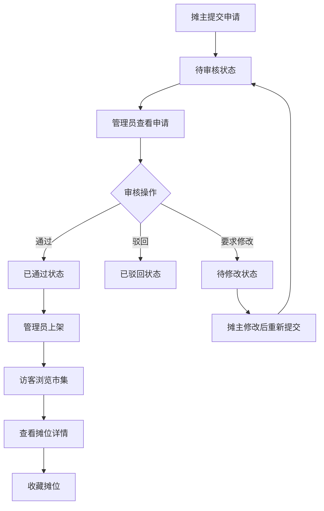

## 1. 产品概述
社区市集摊位申请与审核管理平台，为摊主提供线上摊位申请通道，为管理员提供审核管理后台，为访客提供市集浏览与收藏体验。
- 解决传统线下摊位申请流程繁琐、信息不对称的问题，打造温暖、便捷的社区市集生态
- 目标用户：社区摊主、市集管理员、社区访客

## 2. 核心功能

### 2.1 用户角色
| 角色 | 权限说明 |
|------|----------|
| 摊主 | 提交摊位申请、上传商品图样与经营计划、查看申请状态 |
| 管理员 | 审核申请、上架/下架摊位、查看审核日志 |
| 访客 | 浏览已上架摊位、搜索过滤、收藏摊位、查看摊位详情 |

### 2.2 功能模块
1. **市集浏览模块（market）**：摊位列表、搜索过滤、收藏功能、摊位详情、商品图轮播
2. **后台审核模块（admin）**：申请列表、审核表单、上架/下架控制、审核日志
3. **摊位申请模块**：申请表单、我的申请列表、状态查看
4. **共享API服务层**：数据持久化、状态管理、模拟接口

### 2.3 页面详情
| 页面名称 | 模块名称 | 功能描述 |
|-----------|-------------|---------------------|
| 市集首页 | MarketApp | 已上架摊位网格展示、类型筛选、评分排序、关键词搜索、收藏入口 |
| 摊位详情页 | StallDetail | 封面大图、商品图轮播、经营计划全文、评分展示、收藏按钮 |
| 我的收藏页 | Favorites | 收藏摊位列表展示、取消收藏操作 |
| 摊位申请表 | ApplyForm | 摊位信息填写、商品图样上传、经营计划描述、表单校验与提交 |
| 我的申请页 | MyApplications | 已提交申请列表、状态展示（待审核/审核中/已通过/已驳回） |
| 管理员后台 | AdminApp | 申请列表表格、状态筛选、关键词搜索、进入审核详情 |
| 审核详情页 | AuditDetail | 申请完整信息、商品缩略图放大查看、审核操作（通过/驳回/要求修改）、备注输入 |
| 审核日志页 | AuditLog | 审核记录列表、操作人、时间、操作类型、备注展示 |

## 3. 核心流程
摊主填写申请表单并提交 → 系统保存申请并标记为"待审核" → 管理员在后台查看申请列表 → 管理员进入审核详情页查看全部信息 → 管理员执行审核操作（通过/驳回/要求修改）并填写备注 → 系统更新申请状态并记录审核日志 → 审核通过后管理员可上架摊位 → 访客在市集首页浏览已上架摊位 → 访客点击摊位查看详情 → 访客可收藏喜欢的摊位

## 4. 用户界面设计

### 4.1 设计风格
- **主色调**：暖橙色 (#FF8C42) 搭配米白色 (#FFF8F0)，营造温暖、轻松的社区氛围
- **辅助色**：深橙色 (#E07A30)、浅灰色 (#F5F0E8)、文字深灰 (#3D3D3D)
- **按钮样式**：圆角胶囊按钮，主按钮为暖橙色填充，悬停时加深
- **字体**：标题使用 "Noto Serif SC"（思源宋体），正文使用 "PingFang SC"，凸显人文气息
- **布局风格**：卡片式布局，毛玻璃效果（backdrop-filter），圆润边角
- **图标风格**：使用 Lucide 图标，线性风格，颜色与主色调统一

### 4.2 页面设计概述
| 页面名称 | 模块名称 | UI元素 |
|-----------|-------------|-------------|
| 市集首页 | 摊位网格 | 毛玻璃卡片、上浮动画、类型标签、星级评分、收藏心形按钮（弹簧动画） |
| 摊位详情页 | 详情展示 | 大图封面、商品图轮播（淡入切换）、经营计划文本、评分星级、底部固定收藏栏 |
| 申请表单页 | 表单组件 | 聚焦边框渐变（浅灰→暖橙，0.2s过渡）、URL输入、文本域字数统计、提交按钮加载态 |
| 管理员后台 | 表格列表 | 状态标签（不同颜色区分）、搜索框、筛选下拉、行悬停高亮 |
| 审核详情页 | 审核操作 | 缩略图网格、点击放大（缩放淡入模态框）、审核操作按钮组、备注输入（驳回/修改时必填） |

### 4.3 响应式设计
- **桌面端（1200px以上）**：三栏网格布局，侧边导航栏固定
- **平板端（768px左右）**：两栏网格布局，顶部导航栏
- **移动端（小于640px）**：单栏布局，底部Tab导航栏（随滚动自动隐藏/显示）
- 所有图片使用响应式尺寸，触控区域不小于44x44px

### 4.4 动画与交互
- 卡片悬停：translateY(-4px) + 阴影加深，0.25s过渡
- 收藏按钮：framer-motion spring动画，点击时缩放回弹
- 模态框：缩放淡入（scale 0.9→1，opacity 0→1）
- 底部导航：滚动时自动隐藏（translateY(100%)），停止滚动后显示
- 骨架屏：animate-pulse 脉冲动画
- 空状态：插画风格提示图 + 友好文案
