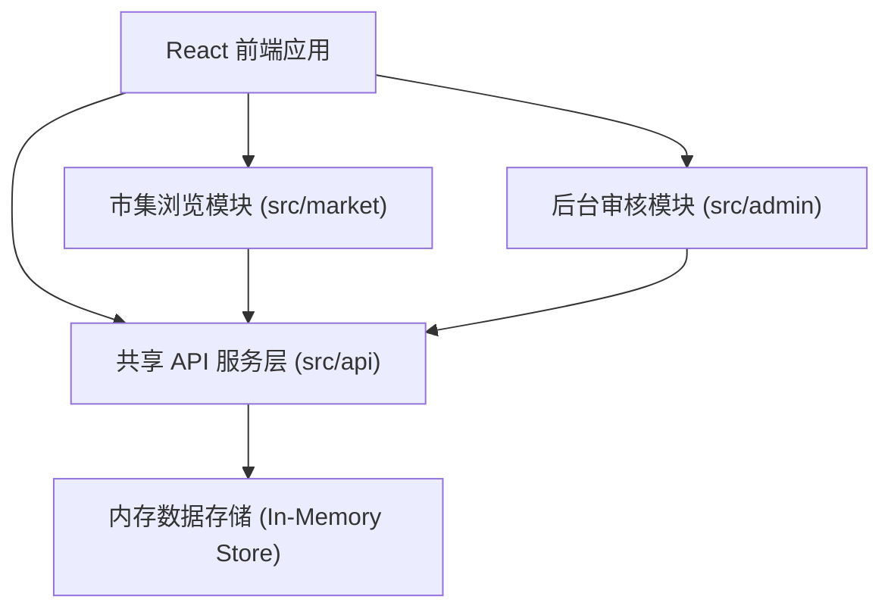
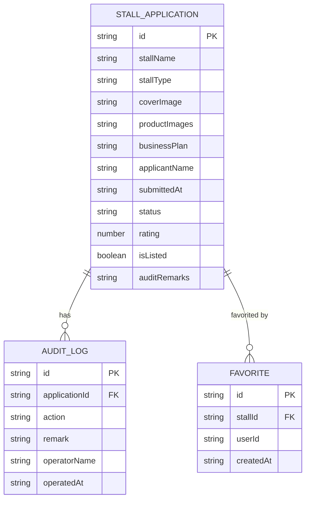

## 1. 架构设计



## 2. 技术说明
- **前端框架**：React@18 + TypeScript@5
- **构建工具**：Vite@5 + @vitejs/plugin-react
- **路由管理**：react-router-dom@6
- **状态管理**：zustand（轻量状态管理）
- **动画库**：framer-motion（弹簧动画、过渡效果）
- **图标库**：lucide-react
- **ID生成**：uuid
- **后端**：无真实后端，使用内存模拟API（src/api/marketApi.ts）
- **数据持久化**：localStorage（模拟持久化）

## 3. 路由定义
| 路由 | 用途 | 模块 |
|-------|---------|------|
| / | 市集首页（已上架摊位列表） | market |
| /stall/:id | 摊位详情页 | market |
| /favorites | 我的收藏页 | market |
| /apply | 摊位申请表单页 | market |
| /my-applications | 我的申请列表页 | market |
| /admin | 管理员后台首页（申请列表） | admin |
| /admin/audit/:id | 申请审核详情页 | admin |
| /admin/logs | 审核日志页 | admin |

## 4. API 定义（模拟接口）

### 4.1 TypeScript 类型定义
```typescript
type StallType = 'food' | 'handcraft' | 'vintage' | 'art';
type ApplicationStatus = 'pending' | 'reviewing' | 'approved' | 'rejected' | 'modification_required';
type AuditAction = 'approve' | 'reject' | 'request_modification';

interface StallApplication {
  id: string;
  stallName: string;
  stallType: StallType;
  coverImage: string;
  productImages: string[];
  businessPlan: string;
  applicantName: string;
  submittedAt: string;
  status: ApplicationStatus;
  rating: number;
  isListed: boolean;
  auditRemarks?: string;
}

interface AuditLog {
  id: string;
  applicationId: string;
  action: AuditAction;
  remark: string;
  operatorName: string;
  operatedAt: string;
}

interface Favorite {
  id: string;
  stallId: string;
  userId: string;
  createdAt: string;
}
```

### 4.2 接口列表
| 方法名 | 功能 | 参数 | 返回值 |
|--------|------|------|--------|
| createApplication | 提交摊位申请 | formData | StallApplication |
| getApplications | 获取申请列表（支持筛选、搜索） | filters, keyword | StallApplication[] |
| getApplicationById | 获取单个申请详情 | id | StallApplication |
| auditApplication | 审核申请 | id, action, remark | StallApplication |
| toggleStallListing | 上架/下架摊位 | id, isListed | StallApplication |
| getListedStalls | 获取已上架摊位（支持搜索、排序） | keyword, sortBy | StallApplication[] |
| getStallById | 获取摊位详情 | id | StallApplication |
| addFavorite | 添加收藏 | stallId | Favorite |
| removeFavorite | 取消收藏 | stallId | void |
| getFavorites | 获取收藏列表 | | StallApplication[] |
| getAuditLogs | 获取审核日志 | applicationId? | AuditLog[] |

## 5. 数据模型（内存存储）

### 5.1 实体关系图


### 5.2 初始模拟数据
- 6-8条摊位申请记录，覆盖各种状态
- 3-5条审核日志记录
- 2-3条收藏记录
