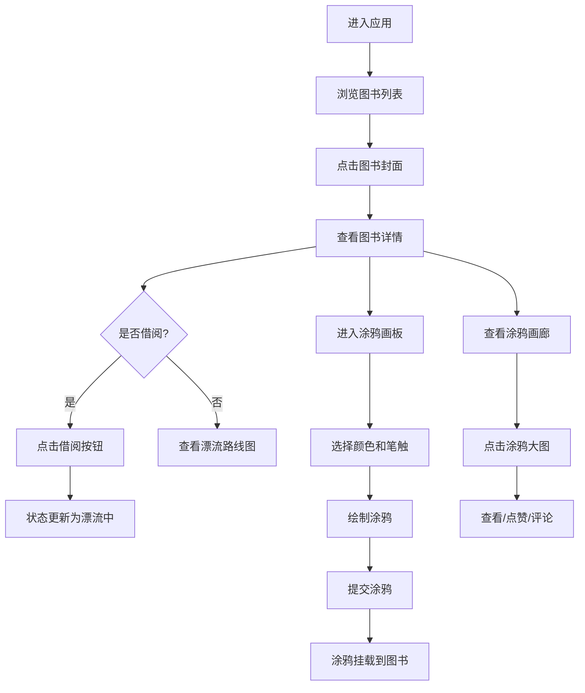

## 1. 产品概述

童书漂流与创意涂鸦社区是一个面向小读者的线上童书漂流活动平台，让孩子们可以浏览童书、登记借阅并记录与书相关的创意涂鸦作品。

- **主要目的**：打造一个有趣、温馨的童书漂流社区，激发孩子们的阅读兴趣和创造力
- **目标用户**：社区图书馆的小读者及其家长
- **核心价值**：通过童书漂流传递知识，通过创意涂鸦记录阅读感悟

## 2. 核心功能

### 2.1 用户角色

| 角色 | 注册方式 | 核心权限 |
|------|----------|----------|
| 小读者 | 无需注册（体验模式） | 浏览童书、借阅/归还、创作涂鸦、查看涂鸦画廊、点赞评论 |

### 2.2 功能模块

1. **图书列表页**：50本童书展示、漂流状态标签、虚拟滚动列表
2. **图书详情页**：图书信息、借阅按钮、历史漂流路线图
3. **涂鸦画板**：Canvas绘制、多种笔触、颜色选择、橡皮擦、撤销、清空
4. **涂鸦画廊**：3列网格展示、点赞、评论、大图查看

### 2.3 页面详情

| 页面名称 | 模块名称 | 功能描述 |
|----------|----------|----------|
| 图书列表页 | 图书卡片 | 展示封面（随机几何图形+HSL背景）、漂流状态标签（绿/橙/红）、点击跳转详情 |
| 图书列表页 | 虚拟列表 | 仅渲染视口内10张卡片，滚动性能优化 |
| 图书详情页 | 图书信息 | 书名、作者、简介（140字限制+展开） |
| 图书详情页 | 借阅操作 | 借阅/归还按钮切换，状态实时更新 |
| 图书详情页 | 漂流路线图 | Canvas绘制城市节点、弯曲虚线连接、日期戳显示 |
| 图书详情页 | 涂鸦画廊 | 3列网格展示涂鸦缩略图、悬停放大、点赞数显示 |
| 涂鸦画板页 | 画布区域 | 800x600px画布、浅灰背景、坐标网格 |
| 涂鸦画板页 | 颜色面板 | 5种预设颜色选择（红橙蓝绿紫） |
| 涂鸦画板页 | 笔触切换 | 圆珠笔/水彩笔/马克笔三种笔触、圆形图标按钮 |
| 涂鸦画板页 | 工具栏 | 橡皮擦、撤销（最多5步）、清空画布、上传提交 |
| 涂鸦画廊 | 大图预览 | 点击缩略图全屏展示、评论输入（50字限制） |
| 涂鸦画廊 | 互动功能 | 点赞、评论列表（按时间倒序） |

## 3. 核心流程

### 3.1 主要用户流程

用户打开应用 → 浏览图书列表 → 点击感兴趣的图书 → 查看图书详情和漂流历史 → 点击借阅按钮 → 进入涂鸦画板创作 → 提交涂鸦 → 在涂鸦画廊查看和互动

### 3.2 流程图

## 4. 用户界面设计

### 4.1 设计风格

- **主题色系**：马卡龙色系，温馨可爱
- **主色调**：奶油色渐变背景 (#FFF8E7 → #FCE4EC)
- **状态色**：绿色=可借、橙色=漂流中、红色=待归还
- **按钮风格**：圆角20px、按下回弹动画 (scale:0.95, transition:0.1s)
- **字体**：圆润友好的无衬线字体，适合儿童阅读
- **布局风格**：卡片式布局，每行4列（桌面端）
- **导航栏**：半透明磨砂玻璃效果 (blur:8px, rgba(255,255,255,0.7))
- **图标风格**：圆润可爱风格，与整体主题一致

### 4.2 页面设计概览

| 页面名称 | 模块名称 | UI 元素 |
|----------|----------|----------|
| 图书列表页 | 顶部导航 | 磨砂玻璃效果、标题、返回按钮 |
| 图书列表页 | 图书卡片 | 200x280px卡片、动态阴影、圆角封面、状态标签（微光晕动画） |
| 图书列表页 | 虚拟滚动 | 占位符替换、平滑滚动体验 |
| 图书详情页 | 图书信息区 | 封面大图、书名、作者、简介（展开/收起） |
| 图书详情页 | 借阅按钮 | 大尺寸圆角按钮、状态切换动画 |
| 图书详情页 | 漂流路线图 | Canvas绘制、城市圆点节点、弯曲虚线、日期标签 |
| 图书详情页 | 涂鸦画廊 | 3列网格、2px圆角边框、悬停放大10%、上升阴影 |
| 涂鸦画板页 | 画布区域 | 浅灰色 (#F5F5F5)、坐标网格 (#E0E0E0虚线、间距20px) |
| 涂鸦画板页 | 颜色面板 | 5个圆形颜色按钮、浮于左下角 |
| 涂鸦画板页 | 笔触按钮 | 圆形图标32px、选中态2px金色边框 |
| 涂鸦画板页 | 工具栏 | 橡皮擦、撤销、清空、上传按钮 |
| 涂鸦画廊 | 大图模态 | 全屏展示、评论区、关闭按钮 |

### 4.3 响应式设计

- **设计原则**：桌面端优先，移动端自适应
- **断点**：768px以下为移动端
- **移动端适配**：
  - 图书列表单列布局
  - 导航栏折叠为汉堡菜单
  - 画布尺寸自适应屏幕宽度
  - 涂鸦画廊2列布局

### 4.4 动效与交互

- **状态标签**：微光晕呼吸动画
- **卡片悬停**：阴影加深、轻微上浮
- **按钮按下**：scale(0.95)回弹效果
- **涂鸦悬停**：放大10%、显示点赞数
- **页面切换**：平滑过渡动画
- **借阅状态切换**：颜色渐变过渡

## 5. 性能要求

- 涂鸦画板绘制响应时间 ≤ 16ms（60FPS）
- 图书列表虚拟滚动，仅渲染视口内10张卡片
- 首屏加载时间 ≤ 2s
- 图片资源懒加载
