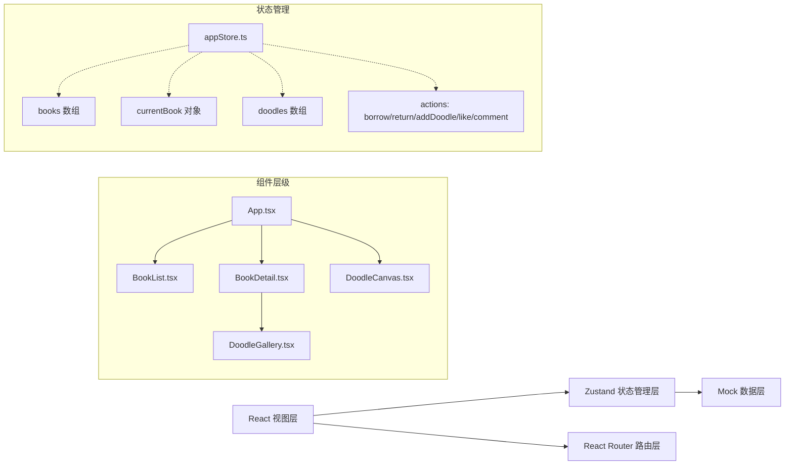

## 1. 架构设计



**数据流向说明：**
- 视图组件 → 触发 action → 更新 store → 视图响应式更新
- 涂鸦画板绘制完成 → 调用 addDoodle action → store 更新涂鸦列表 → 涂鸦画廊重新渲染
- 借阅操作 → 调用 borrowBook/returnBook action → store 更新图书状态 → 列表和详情页同步更新

**文件调用关系：**
- `App.tsx` 引入 `BookList.tsx`、`BookDetail.tsx`、`DoodleCanvas.tsx`
- `BookDetail.tsx` 引入 `DoodleGallery.tsx`
- 所有组件都引入 `appStore.ts` 获取状态和 action
- `appStore.ts` 内部生成 Mock 数据，不依赖其他文件

## 2. 技术栈描述

- **前端框架**：React 18 + TypeScript
- **构建工具**：Vite 5
- **路由管理**：React Router DOM 6
- **状态管理**：Zustand 4
- **唯一ID生成**：uuid
- **样式方案**：CSS Modules + 内联样式
- **Canvas绘图**：原生 Canvas 2D API

## 3. 项目结构

```
src/
├── books/
│   ├── BookList.tsx       # 童书列表组件（虚拟滚动）
│   └── BookDetail.tsx     # 童书详情组件（含漂流路线图）
├── doodle/
│   ├── DoodleCanvas.tsx   # 涂鸦画板组件
│   └── DoodleGallery.tsx  # 涂鸦画廊组件
├── store/
│   └── appStore.ts        # Zustand 全局状态管理
├── types/
│   └── index.ts           # TypeScript 类型定义
├── utils/
│   ├── bookCover.ts       # 图书封面生成工具
│   └── canvasUtils.ts     # Canvas 绘图工具函数
├── App.tsx                # 主应用组件（路由配置）
├── main.tsx               # 入口文件
└── index.css              # 全局样式
```

## 4. 路由定义

| 路由 | 用途 | 对应组件 |
|------|------|----------|
| `/` | 图书列表页 | BookList |
| `/book/:id` | 图书详情页（含涂鸦画廊） | BookDetail + DoodleGallery |
| `/book/:id/doodle` | 涂鸦画板页 | DoodleCanvas |

## 5. 数据模型

### 5.1 数据类型定义

```typescript
// 图书状态
type BookStatus = 'available' | 'drifting' | 'returning'

// 漂流记录节点
interface DriftNode {
  city: string
  date: string
}

// 图书
interface Book {
  id: string
  title: string
  author: string
  description: string
  status: BookStatus
  coverColor: string
  coverShape: 'circle' | 'triangle' | 'star' | 'diamond'
  driftHistory: DriftNode[]
}

// 评论
interface Comment {
  id: string
  content: string
  createdAt: string
}

// 涂鸦
interface Doodle {
  id: string
  bookId: string
  imageData: string  // base64 dataURL
  likes: number
  comments: Comment[]
  createdAt: string
}

// Store 状态
interface AppState {
  books: Book[]
  currentBook: Book | null
  doodles: Doodle[]
  // actions
  setCurrentBook: (bookId: string) => void
  borrowBook: (bookId: string) => void
  returnBook: (bookId: string) => void
  addDoodle: (bookId: string, imageData: string) => void
  likeDoodle: (doodleId: string) => void
  addComment: (doodleId: string, content: string) => void
}
```

### 5.2 Mock 数据生成策略

- **图书数据**：生成50本随机童书，使用 HSL 色盘生成封面颜色（饱和度≥70%）
- **漂流记录**：每本书3-5个随机城市和日期
- **涂鸦数据**：初始为空，由用户创作后添加
- **唯一ID**：使用 uuid v4 生成

## 6. 核心技术实现

### 6.1 虚拟列表实现

- 使用 `useRef` 监听滚动容器
- 计算视口内可见的卡片索引范围
- 仅渲染可见范围内的卡片
- 使用占位符填充上下空白区域
- 滚动节流优化性能

### 6.2 Canvas 绘图优化

- 使用 requestAnimationFrame 确保 60FPS
- 离屏 Canvas 预渲染坐标网格
- 笔迹数据结构优化，便于撤销操作
- 笔触实现：
  - 圆珠笔：lineWidth=2, lineCap='round', globalAlpha=1
  - 水彩笔：lineWidth=5, globalAlpha=0.3-0.6渐变
  - 马克笔：lineWidth=8, lineCap='square', globalAlpha=1

### 6.3 撤销功能实现

- 使用栈结构保存每笔操作的图像数据快照
- 最多保存5步历史记录
- 撤销时恢复上一步快照

### 6.4 漂流路线图绘制

- 使用 Canvas 2D 绘制
- 贝塞尔曲线连接城市节点
- 节点为带描边的圆点
- 日期标签悬浮在节点上方

### 6.5 响应式布局

- 使用 CSS 媒体查询
- 768px 断点切换布局
- 移动端汉堡菜单
- 画布尺寸动态适配

## 7. 性能优化策略

1. **虚拟列表**：仅渲染视口内的图书卡片
2. **Canvas 优化**：离屏渲染、requestAnimationFrame
3. **状态管理**：Zustand 轻量高效，避免不必要的重渲染
4. **图片优化**：base64 缩略图压缩存储
5. **组件懒渲染**：大图模态按需渲染
