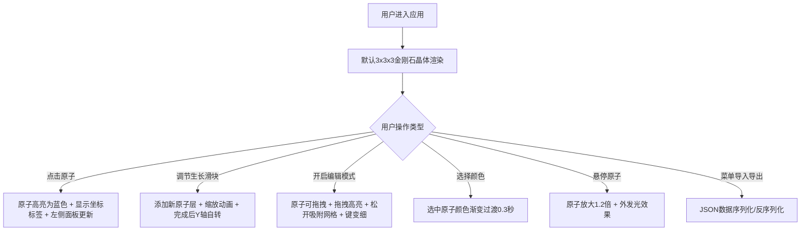

## 1. 产品概述

动态分子晶体结构可视化与交互探索应用，主要解决化学教学中分子晶体结构抽象、难以直观理解原子空间排列与晶格生长过程的问题。面向化学教师、学生及科研人员，提供沉浸式3D交互体验。

- 核心价值：将抽象的分子晶体结构转化为可交互、可编辑、可生长的3D可视化模型
- 目标用户：化学教育工作者、学生、材料科学研究人员

## 2. 核心功能

### 2.1 功能模块

1. **3D晶体展示模块**：金刚石型晶体结构渲染、旋转缩放、原子信息标签
2. **晶体生长模拟模块**：层数控制、生长动画、自动旋转
3. **晶格编辑模块**：原子拖拽、网格吸附、编辑痕迹标记
4. **属性面板模块**：原子信息展示、颜色自定义
5. **数据管理模块**：导入导出JSON、菜单导航

### 2.2 页面详情

| 页面名称 | 模块名称 | 功能描述 |
|-----------|-------------|---------------------|
| 主应用页面 | 3D场景区域 | 全屏3D渲染，支持鼠标旋转/缩放，FPS与原子数信息条 |
| 主应用页面 | 左侧属性面板 | 显示选中原子详细信息（序号、坐标、连接数），12色颜色选择器 |
| 主应用页面 | 右侧控制面板 | 生长层数滑块（1-5）、编辑模式开关 |
| 主应用页面 | 顶部菜单按钮 | 三条横线图标，展开侧边栏显示导入导出功能 |
| 主应用页面 | 信息标签 | 跟随3D场景旋转显示选中原子坐标 |

## 3. 核心流程

## 4. 用户界面设计

### 4.1 设计风格
- **主色调**：科技冷光蓝 #00BFFF
- **辅助色**：高亮黄 #FFD700、警示红 #FF4500
- **背景色**：纯黑 #000000，面板深色 rgba(30,30,30,0.8)
- **视觉风格**：科技感暗色调，扁平化设计，冷光点缀
- **按钮样式**：扁平化，悬停变亮，圆角设计

### 4.2 页面设计概述

| 页面区域 | 模块名称 | UI元素 |
|-----------|-------------|-------------|
| 全屏主体 | 3D场景 | Three.js渲染，OrbitControls交互，纯黑背景 |
| 左上角 | 信息条 | 12px白色半透明字体，rgba(0,0,0,0.5)背景，圆角4px，显示FPS和原子数 |
| 左上角 | 菜单按钮 | 三条横线图标，点击展开侧边栏 |
| 左侧 | 属性面板 | 半透明深色，圆角12px，宽220px，原子信息+颜色选择器 |
| 右侧 | 控制栏 | 滑块+开关按钮，扁平化设计 |
| 场景内 | 信息标签 | CSS2DRenderer渲染，跟随3D旋转 |

### 4.3 响应式适配
- **桌面端（>768px）**：左侧面板固定，右侧控制栏独立
- **移动端（≤768px）**：控制面板变为底部固定条（全宽60px高，可左右滑动），3D场景自动调整竖向视图

### 4.4 3D场景设计
- **环境**：纯黑背景，方向光+环境光组合
- **光照**：主方向光带阴影，环境光提供基础照明，支持specular高光
- **相机**：PerspectiveCamera，初始距离合适展示3x3x3晶体
- **材质**：MeshPhongMaterial实现半透明和高光效果
- **动画**：生长缩放动画（0.5s）、颜色渐变（0.3s）、Y轴自转（0.01 rad/s）、拖拽弹簧回弹

## 5. 性能指标
- 1000个原子渲染 ≥ 30 FPS
- 拖拽响应延迟 < 100ms
- 网格吸附计算实时完成
