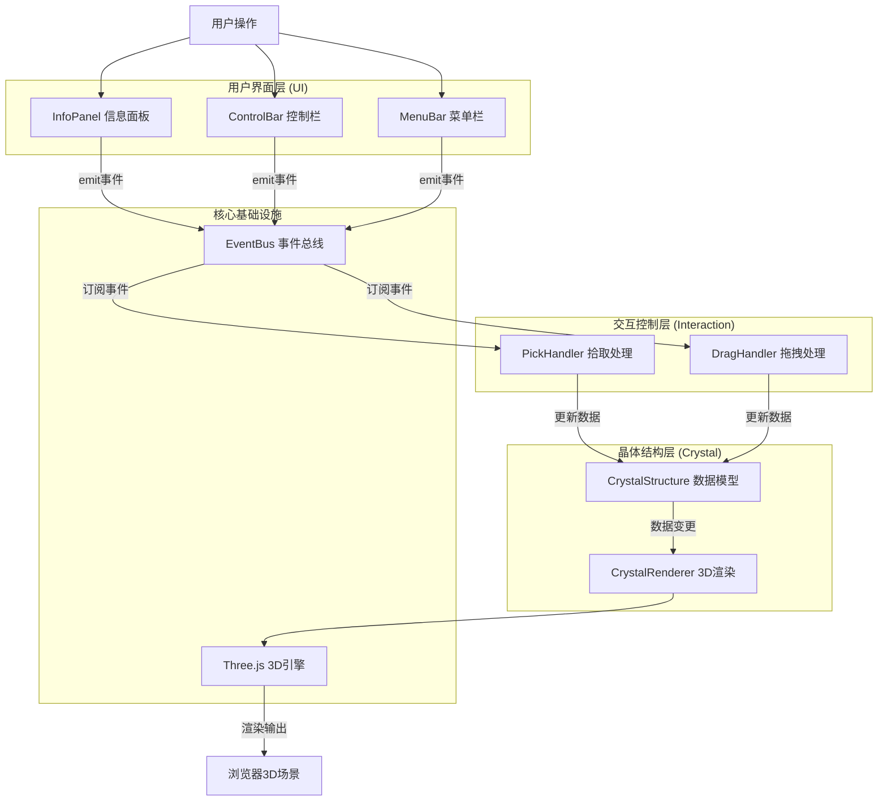

## 1. 架构设计



## 2. 技术描述

- **前端框架**：TypeScript + Three.js
- **构建工具**：Vite 5.x
- **类型系统**：TypeScript严格模式 (strict: true)
- **模块路径**：@ 别名指向 src 目录
- **无后端**：纯前端应用，数据通过JSON导入导出

## 3. 项目文件结构

```
auto103/
├── package.json
├── vite.config.js
├── tsconfig.json
├── index.html
└── src/
    ├── main.ts                    # 应用入口
    ├── EventBus.ts                # 事件总线
    ├── crystal/
    │   ├── CrystalStructure.ts    # 晶体数据模型
    │   └── CrystalRenderer.ts     # Three.js渲染器
    ├── interaction/
    │   ├── PickHandler.ts         # 鼠标拾取
    │   └── DragHandler.ts         # 拖拽交互
    └── ui/
        ├── InfoPanel.ts           # 左侧属性面板
        └── ControlBar.ts          # 控制栏（滑块/开关）
```

## 4. 数据模型定义

### 4.1 核心数据结构

```typescript
// 原子数据结构
interface AtomData {
    id: number;           // 原子唯一ID
    index: number;        // 原子序号（从1开始）
    position: { x: number; y: number; z: number };
    color: string;        // 当前颜色
    originalColor: string;// 原始颜色
    isEdited: boolean;    // 是否被编辑过
}

// 化学键数据结构
interface BondData {
    id: number;
    atomA: number;        // 连接的原子A ID
    atomB: number;        // 连接的原子B ID
    isEdited: boolean;    // 是否被编辑过（变细标记）
}

// 晶体结构数据
interface CrystalData {
    atoms: AtomData[];
    bonds: BondData[];
    growthLayer: number;  // 当前生长层数 (1-5)
}
```

### 4.2 金刚石晶格坐标算法

金刚石晶体结构采用FCC面心立方+四面体间隙，基元包含2个碳原子，晶格常数a=3.57Å（单位化处理）。

基元坐标：
- 原子1: (0, 0, 0)
- 原子2: (0.25, 0.25, 0.25)

FCC平移向量：
- (0, 0.5, 0.5), (0.5, 0, 0.5), (0.5, 0.5, 0)

每个晶胞共8个原子。

## 5. 事件总线定义

| 事件名 | 触发方 | 监听方 | 数据载荷 | 说明 |
|--------|--------|--------|----------|------|
| `atom:selected` | PickHandler | InfoPanel, CrystalRenderer | `{atomId, position}` | 原子被点击选中 |
| `atom:hovered` | PickHandler | CrystalRenderer | `{atomId, isHover}` | 鼠标悬停/离开原子 |
| `atom:dragStart` | DragHandler | CrystalRenderer | `{atomId}` | 开始拖拽原子 |
| `atom:dragMove` | DragHandler | CrystalStructure, CrystalRenderer | `{atomId, position}` | 拖拽中位置更新 |
| `atom:dragEnd` | DragHandler | CrystalStructure, CrystalRenderer | `{atomId, position}` | 结束拖拽，网格吸附 |
| `atom:colorChange` | InfoPanel | CrystalStructure, CrystalRenderer | `{atomId, color}` | 修改原子颜色 |
| `crystal:growth` | ControlBar | CrystalStructure, CrystalRenderer | `{layer}` | 晶体生长层数变更 |
| `mode:editToggle` | ControlBar | DragHandler | `{isEditMode}` | 切换编辑模式 |
| `crystal:export` | MenuBar | CrystalStructure | - | 导出JSON数据 |
| `crystal:import` | MenuBar | CrystalStructure, CrystalRenderer | `{data: CrystalData}` | 导入JSON数据 |
| `crystal:updated` | CrystalStructure | CrystalRenderer | - | 晶体数据变更触发重绘 |

## 6. 关键技术实现方案

### 6.1 Three.js渲染优化
- 使用InstancedMesh批量渲染相同几何体（原子球体、键圆柱体）
- 射线拾取基于Raycaster + 物体ID映射
- CSS2DRenderer渲染跟随3D的信息标签
- requestAnimationFrame驱动动画循环

### 6.2 网格吸附算法
```
snapToGrid(value, gridSize = 0.5):
    return Math.round(value / gridSize) * gridSize
```

### 6.3 动画系统
- 生长动画：TWEEN.js或手动线性插值，scale从0→1
- 颜色渐变：RGB颜色线性插值，duration 300ms
- 自转：每帧对晶体Group应用rotation.y += 0.01
- 弹簧回弹：缓动函数 easeOutElastic

### 6.4 响应式布局
- CSS Media Query: `@media (max-width: 768px)`
- 左侧面板切换为底部横向滚动条
- Three.js renderer根据window.resize自动更新

## 7. 性能保障策略
- 几何体复用（SphereGeometry, CylinderGeometry单例）
- 材质按需创建，颜色变更仅修改material.color
- 拖拽更新使用矩阵变换而非重建Mesh
- 帧率监测并在必要时降级渲染质量
