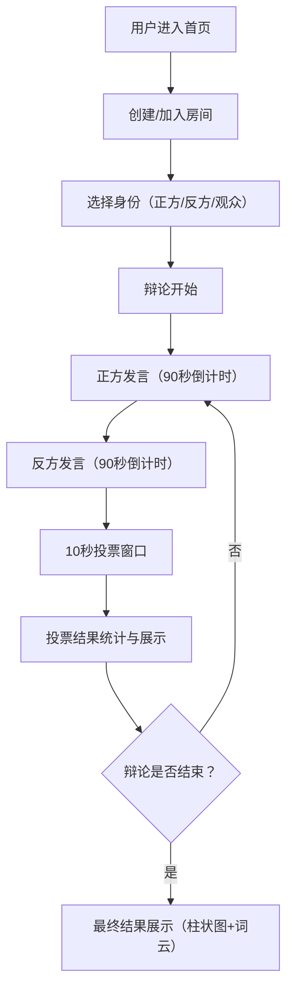

## 1. 产品概述

虚拟辩论赛系统是一个在线实时辩论平台，让不同城市的学生组队进行实时辩论，系统自动记录关键论点并统计观众投票。

- **主要目的**：提供沉浸式的线上辩论体验，支持多方实时互动，自动记录辩论过程并可视化展示结果
- **目标用户**：学生、教师、辩论爱好者
- **核心价值**：打破地域限制，提供专业的辩论流程管理和直观的结果可视化

## 2. 核心功能

### 2.1 用户角色
| 角色 | 参与方式 | 核心权限 |
|------|----------|----------|
| 辩手 | 输入房间号加入，选择正反方 | 发言、提交论点、查看实时投票结果 |
| 观众 | 输入房间号加入 | 观看辩论、每轮结束后投票、查看结果 |

### 2.2 功能模块
1. **辩论房间管理**：创建/加入房间、分配正反方角色、辩手列表展示
2. **发言计时与轮次管理**：90秒倒计时、轮次切换、论点自动记录
3. **观众投票系统**：10秒投票窗口、实时得票率统计、投票结果反馈
4. **论点时间线**：双方论点按时间展示、左右分栏布局
5. **结果可视化**：动态柱状图对比、关键词云生成

### 2.3 页面详情
| 页面名称 | 模块名称 | 功能描述 |
|---------|---------|----------|
| 首页/房间入口 | 房间创建/加入 | 输入房间号或随机生成，选择身份加入 |
| 辩论主界面 | 辩论房间 | 左右分屏展示正反方、中央计时器、论点时间线、投票弹窗 |
| 结果展示 | 计票可视化 | 柱状图对比、词云展示、最终结果判定 |

## 3. 核心流程

### 主流程描述
用户进入首页 → 创建或加入房间 → 选择正反方身份 → 辩论开始（交替发言，每轮90秒）→ 每轮结束后开放10秒投票 → 投票结果实时展示 → 辩论结束后显示最终结果和词云

## 4. 用户界面设计

### 4.1 设计风格
- **主色调**：深蓝灰色调渐变背景（#1A1A2E → #16213E），营造严肃辩论氛围
- **正方色**：蓝色 #4A90D9
- **反方色**：红色 #E63946
- **按钮样式**：圆角矩形，悬停时颜色加深10%并上浮2px
- **字体**：Inter 字体家族
- **布局风格**：左右分屏（桌面）/ 上下布局（移动端），卡片式论点展示
- **动效**：计时器脉动动画、柱状图淡入动画、投票弹窗模糊背景

### 4.2 页面设计概述
| 页面名称 | 模块名称 | UI元素 |
|---------|---------|--------|
| 房间入口页 | 房间表单 | 深色背景、居中卡片、输入框、按钮 |
| 辩论主界面 | 辩论房间 | 顶部导航栏、左右分屏辩手区、中央计时器、右侧论点时间线、投票模态框 |
| 结果展示 | 可视化组件 | 动态柱状图、关键词云、最终结果文字 |

### 4.3 响应式
- **桌面端**：左右分屏布局，正方40% / 中间20% / 反方40%
- **移动端**：上下布局，正方在上45% / 计时器居中 / 反方在下45%
- **触摸优化**：按钮最小尺寸48px，论点卡片支持手势滚动

### 4.4 性能约束
- 计时器更新频率 ≥ 60fps
- 柱状图更新动画帧率 ≥ 30fps
- 词云渲染平滑过渡
