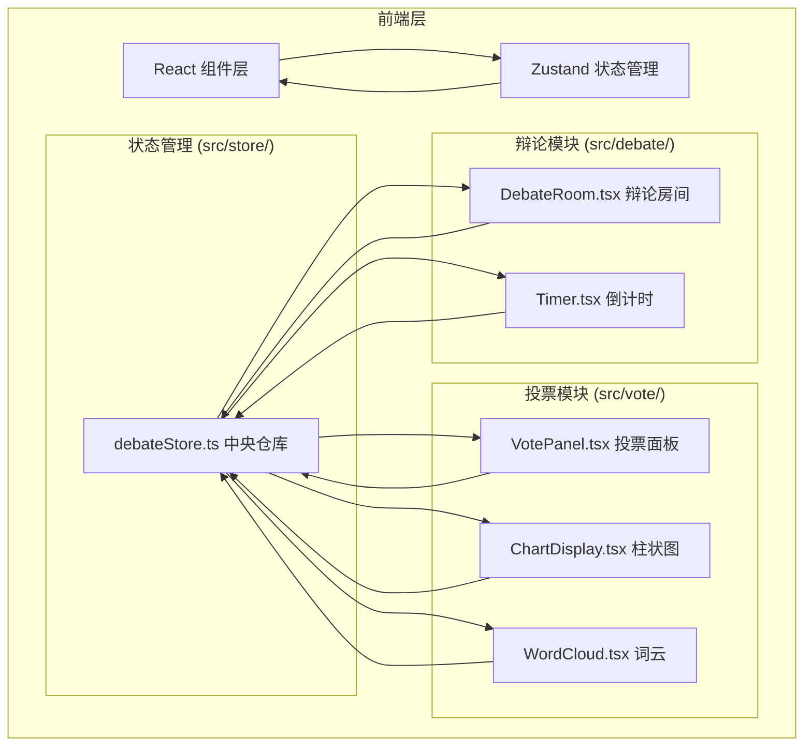

## 1. 架构设计



## 2. 技术描述

- **前端框架**：React 18 + TypeScript
- **构建工具**：Vite 5 + @vitejs/plugin-react
- **状态管理**：Zustand
- **图表库**：Chart.js (react-chartjs-2)
- **词云库**：d3-cloud
- **唯一ID生成**：uuid
- **路径别名**：@ → src

### 数据流
1. 辩论管理模块生成辩论轮次状态 → 存入 zustand store
2. 每轮结束时，Timer 组件触发投票开启事件 → 更新 store 中的投票状态
3. 投票模块监听 store 变化 → 显示投票面板
4. 用户投票 → VotePanel 更新 store 中的票数
5. ChartDisplay 监听 store 票数变化 → 实时更新柱状图
6. 辩论结束时，WordCloud 从 store 读取所有论点 → 生成词云

## 3. 文件结构与调用关系

```
src/
├── debate/
│   ├── DebateRoom.tsx    # 辩论房间主组件（调用 Timer，依赖 store）
│   └── Timer.tsx         # 倒计时组件（被 DebateRoom 调用，触发 vote 事件）
├── vote/
│   ├── VotePanel.tsx     # 投票面板（依赖 store，更新票数）
│   ├── ChartDisplay.tsx  # 柱状图（依赖 store，展示票数）
│   └── WordCloud.tsx     # 词云（依赖 store 论点数据）
├── store/
│   └── debateStore.ts    # zustand 中央状态仓库
├── App.tsx               # 根组件
├── main.tsx              # 入口文件
└── index.css             # 全局样式
```

### 调用关系
- `App.tsx` → `DebateRoom.tsx`（主界面）
- `DebateRoom.tsx` → `Timer.tsx`（倒计时）
- `DebateRoom.tsx` → `VotePanel.tsx`（投票弹窗）
- `DebateRoom.tsx` → `ChartDisplay.tsx`（结果图）
- `DebateRoom.tsx` → `WordCloud.tsx`（词云）
- 所有组件 ↔ `debateStore.ts`（双向数据流）

## 4. 数据模型

### 4.1 状态类型定义

```typescript
// 辩手信息
interface Debater {
  id: string;
  name: string;
  side: 'pro' | 'con';
}

// 论点
interface Argument {
  id: string;
  side: 'pro' | 'con';
  content: string;
  timestamp: number;
  round: number;
}

// 投票数据
interface VoteData {
  proVotes: number;
  conVotes: number;
  totalVotes: number;
  isVotingOpen: boolean;
  userVoted: 'pro' | 'con' | null;
}

// 辩论状态
type DebatePhase = 'waiting' | 'speaking-pro' | 'speaking-con' | 'voting' | 'finished';

// 完整状态
interface DebateState {
  roomId: string;
  topic: string;
  currentRound: number;
  totalRounds: number;
  phase: DebatePhase;
  timeRemaining: number;
  proDebaters: Debater[];
  conDebaters: Debater[];
  arguments: Argument[];
  voteData: VoteData;
  currentSpeaker: string | null;
  
  // actions
  setRoomId: (id: string) => void;
  joinAs: (side: 'pro' | 'con', name: string) => void;
  startDebate: () => void;
  addArgument: (side: 'pro' | 'con', content: string) => void;
  startVoting: () => void;
  castVote: (side: 'pro' | 'con') => void;
  endVoting: () => void;
  nextRound: () => void;
  endDebate: () => void;
  setTimeRemaining: (time: number) => void;
}
```

## 5. 性能优化策略

- **计时器**：使用 requestAnimationFrame 保证 60fps 流畅度
- **柱状图**：Chart.js 内置动画，配置 0.6s 淡入效果
- **词云**：d3-cloud 布局计算完成后一次性渲染，避免重排
- **状态更新**：Zustand 选择器优化，避免不必要的重渲染
- **响应式**：CSS 媒体查询，移动端点触优化
