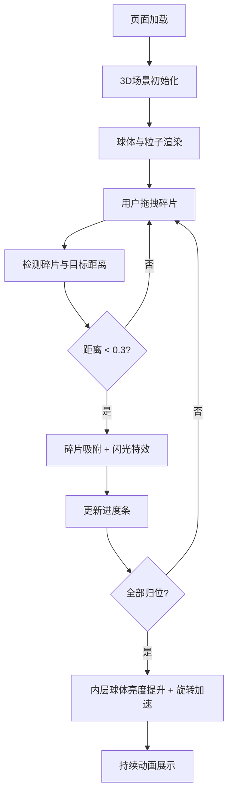

## 1. 产品概述

加密信息球体与动态密码廊交互可视化应用，通过3D多层同心球体展示加密核心，用户拖拽纠错码碎片解锁信息层，观察密码粒子沿螺旋路径飞行的沉浸式交互体验。

- 主要用途：教育演示加密技术原理、可视化数据安全概念、科技展示交互装置
- 目标用户：科技爱好者、学生、展览参观者、安全领域从业者
- 产品价值：将抽象的加密概念转化为直观的3D交互体验，寓教于乐

## 2. 核心特性

### 2.1 用户角色

| 角色 | 注册方式 | 核心权限 |
|------|---------|---------|
| 普通用户 | 无需注册 | 浏览3D场景、拖拽交互碎片、观察动画效果 |

### 2.2 功能模块

1. **3D加密球体展示**：三层同心球体结构（外层加密层、中层纠错码层、内层信息核心）
2. **碎片拖拽交互**：12个六边形纠错码碎片的拖拽归位与吸附反馈
3. **密码粒子系统**：50个彩色粒子沿三维螺旋路径飞行动画
4. **相机交互控制**：360度旋转、平移、缩放操作
5. **UI状态显示**：FPS计数器、进度条、拖拽反馈

### 2.3 页面详情

| 页面名称 | 模块名称 | 功能描述 |
|---------|---------|---------|
| 主场景页面 | 3D球体渲染 | 展示三层同心球体，外层200个编码粒子沿纬度正弦移动 |
| 主场景页面 | 碎片交互系统 | 12个六边形碎片初始随机偏移，拖拽归位，距离<0.3自动吸附并发光 |
| 主场景页面 | 信息核心动画 | 内层球体显示8位动态密码，每2秒刷新带闪烁，全归位后亮度提升、旋转加速 |
| 主场景页面 | 螺旋粒子系统 | 50个彩色粒子沿螺旋路径飞行，整体公转，个体闪烁 |
| 主场景页面 | UI状态面板 | FPS计数器（左下角）、进度条（右上角） |

## 3. 核心流程

用户打开页面 → 3D场景加载完成 → 观察加密球体与粒子动画 → 鼠标拖拽六边形碎片 → 碎片归位吸附 → 进度条更新 → 全部归位后内层球体激活 → 持续观察粒子飞行与旋转效果

## 4. 用户界面设计

### 4.1 设计风格
- **主色调**：深蓝 #00BFFF、金色 #FFD700、深灰蓝渐变背景
- **视觉风格**：科幻太空感、深色主题、半透明效果、光晕粒子
- **字体**：等宽科技字体，数字使用 monospace 字体增强密码感
- **布局**：全屏3D场景，UI元素悬浮于角落
- **动画**：平滑过渡、正弦波动、螺旋运动、闪烁特效

### 4.2 页面设计概览

| 页面名称 | 模块名称 | UI元素 |
|---------|---------|--------|
| 主场景 | 背景层 | 径向渐变（深灰蓝到黑色）、太空感 |
| 主场景 | 外球体 | 半透明蓝色、200个银色粒子沿纬度正弦移动 |
| 主场景 | 中层碎片 | 12个六边形、拖拽时抓取光标、吸附时淡黄色闪光 |
| 主场景 | 内球体 | 发光球体、8位动态密码文字、每2秒闪烁刷新 |
| 主场景 | 螺旋粒子 | 50个彩虹色粒子、螺旋路径、公转+自闪烁 |
| 主场景 | FPS计数器 | 左下角、白色16px字体、半透明背景 |
| 主场景 | 进度条 | 右上角200×10px、填充色蓝到金渐变、右侧百分比 |

### 4.3 响应式设计
- **桌面端**：球体正常尺寸，完整UI显示
- **移动端**（<600px）：球体初始缩放0.6倍，UI元素适当缩小
- **触摸优化**：支持触摸拖拽旋转、双指缩放

### 4.4 3D场景指导
- **环境**：深色太空背景，无HDRI，使用径向渐变CSS背景
- **光照**：环境光 + 两盏点光源（蓝色主光、金色补光），内层球体自发光
- **相机**：PerspectiveCamera，初始距离10单位，fov 60度
- **交互**：OrbitControls实现旋转（左键）、平移（右键）、缩放（滚轮），缩放范围3-15单位
- **后处理**：Bloom效果增强发光感，适当抗锯齿
- **性能**：总粒子数≤300，使用BufferGeometry，requestAnimationFrame驱动动画

## 5. 性能指标
- 帧率稳定≥45fps
- 粒子总数≤300个
- 交互响应延迟<100ms
- 移动端适配流畅运行
