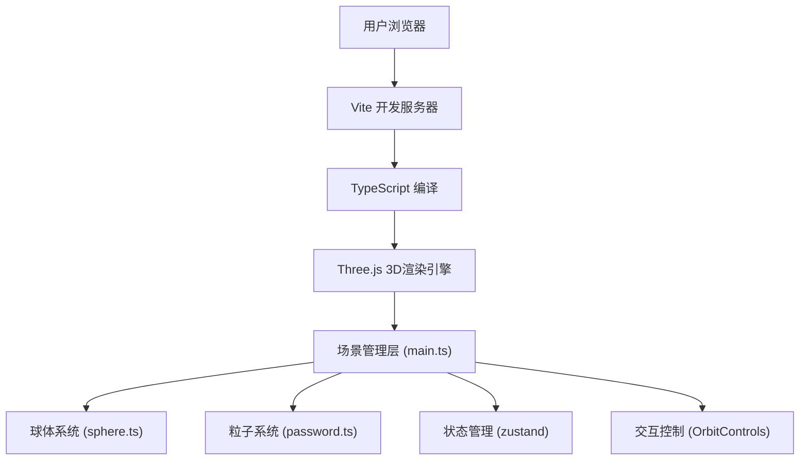

## 1. 架构设计



## 2. 技术选型说明

- **前端框架**：原生 TypeScript + Three.js（无需React，按用户指定实现）
- **构建工具**：Vite 5.x
- **状态管理**：zustand 4.x（轻量级状态管理，管理碎片归位状态、进度等）
- **3D引擎**：three 0.160.x + @types/three
- **编程语言**：TypeScript 5.x（严格模式，target ES2020）

## 3. 项目文件结构

```
auto105/
├── package.json              # 项目依赖与脚本
├── vite.config.js            # Vite构建配置
├── tsconfig.json             # TypeScript配置
├── index.html                # 入口HTML
└── src/
    ├── main.ts               # 场景初始化、渲染循环
    ├── sphere.ts             # 三层球体系统（外/中/内层）
    └── password.ts           # 密码粒子系统（螺旋路径）
```

## 4. 核心模块接口定义

### 4.1 球体系统类型定义

```typescript
// 六边形碎片数据结构
interface HexFragment {
  id: number;
  mesh: THREE.Mesh;
  targetPosition: THREE.Vector3;
  isSnapped: boolean;
  originalOffset: THREE.Vector3;
}

// 球体系统配置
interface SphereSystemConfig {
  outerRadius: number;      // 外层半径 6
  middleRadius: number;     // 中层半径 4.5
  innerRadius: number;      // 内层半径 2
  particleCount: number;    // 外层粒子数 200
  fragmentCount: number;    // 碎片数 12
  passwordLength: number;   // 密码长度 8
}

// 球体系统类
class EncryptedSphere {
  constructor(scene: THREE.Scene, config: SphereSystemConfig);
  public update(deltaTime: number): void;
  public onPointerDown(event: PointerEvent): void;
  public onPointerMove(event: PointerEvent): void;
  public onPointerUp(event: PointerEvent): void;
  public getSnappedCount(): number;
  public getAllSnapped(): boolean;
}
```

### 4.2 粒子系统类型定义

```typescript
// 螺旋路径配置
interface HelixConfig {
  radius: number;           // 螺旋半径 1.5
  pitch: number;            // 螺距 0.8
  height: number;           // 总高度 4
  centerOffset: number;     // 中心偏移 1
  particleCount: number;    // 粒子数 50
  orbitSpeed: number;       // 公转速度 0.1 rad/s
}

// 粒子数据
interface PasswordParticle {
  mesh: THREE.Mesh;
  phase: number;           // 螺旋相位
  flickerFreq: number;     // 闪烁频率 0.2-0.5Hz
  flickerPhase: number;    // 闪烁相位
  hue: number;             // HSL色相
}

// 粒子系统类
class PasswordHelix {
  constructor(scene: THREE.Scene, config: HelixConfig, sphereCenter: THREE.Vector3);
  public update(deltaTime: number): void;
}
```

### 4.3 状态管理（zustand）

```typescript
interface AppState {
  snappedCount: number;
  totalFragments: number;
  progress: number;
  fps: number;
  isComplete: boolean;
  setSnappedCount: (count: number) => void;
  setFps: (fps: number) => void;
  setComplete: (complete: boolean) => void;
}
```

## 5. 关键技术实现点

### 5.1 三层球体实现
- **外层**：`SphereGeometry` + `MeshPhysicalMaterial`（透明、蓝色、透光率0.3），200个`Points`粒子，顶点着色器实现正弦纬度移动
- **中层**：12个`CylinderGeometry`（六边形，半径方向），使用`Raycaster`实现拖拽，距离检测自动吸附，TWEEN.js实现吸附动画
- **内层**：`SphereGeometry` + `MeshBasicMaterial`（自发光），`CanvasTexture`动态生成密码文字纹理

### 5.2 螺旋粒子路径
- 参数方程：`x = (R + offset) * cos(θ)`, `y = (pitch / 2π) * θ`, `z = (R + offset) * sin(θ)`
- θ范围：`-2π*height/pitch` 到 `2π*height/pitch`
- 整体旋转矩阵实现公转效果

### 5.3 交互控制
- `OrbitControls`：enableDamping=true，dampingFactor=0.05
- 自定义拖拽：`Raycaster` + `pointerdown/move/up`事件
- 碰撞检测：`distanceTo()` < 0.3 触发吸附

### 5.4 动画系统
- 统一`requestAnimationFrame`循环，deltaTime计算
- 外层粒子：`sin(latitude + time * speed) * amplitude`
- 内层旋转：`rotation.y += speed * delta`，完成后speed从0.2→0.5
- 粒子闪烁：`opacity = 0.6 + 0.4 * sin(time * freq + phase)`

## 6. 性能优化策略

1. **几何体复用**：12个六边形共享同一个`BufferGeometry`
2. **粒子系统**：使用`Points`而非独立`Mesh`，减少draw call
3. **材质共享**：同类物体共享材质实例
4. **矩阵更新**：禁用`matrixAutoUpdate`，手动`updateMatrix()`
5. **视锥体剔除**：Three.js内置frustum culling
6. **像素比限制**：`renderer.setPixelRatio(Math.min(window.devicePixelRatio, 2))`

## 7. 构建与运行

- **开发命令**：`npm run dev` → Vite开发服务器
- **构建命令**：`npm run build` → 输出到dist目录
- **预览命令**：`npm run preview` → 预览构建结果
