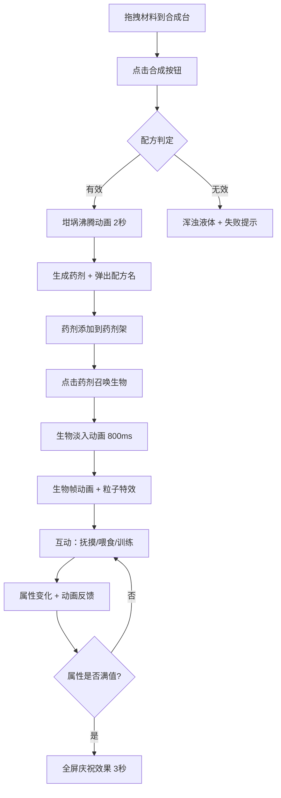

## 1. 产品概述

炼金术士的地下实验室是一款浏览器端暗黑奇幻风格炼金养成游戏。玩家扮演中世纪炼金术士，在地下实验室中通过拖拽材料合成魔法药剂，召唤并培养奇幻生物。

- 解决传统养成游戏中合成系统与生物交互缺乏可视化和深度关联的问题
- 目标用户：喜欢奇幻养成、炼金合成玩法的休闲游戏玩家

## 2. 核心功能

### 2.1 功能模块

1. **实验室主界面**：地下实验室场景，包含合成台、材料架、坩埚、药剂架、生物召唤区
2. **炼金合成系统**：拖拽四种基础材料到合成槽位，点击合成生成药剂
3. **生物召唤与养成**：使用药剂召唤对应奇幻生物，进行抚摸/喂食/训练互动
4. **环境交互元素**：植物盆栽、炼金书籍、魔法阵等沉浸式细节

### 2.2 页面详情

| 页面名称 | 模块名称 | 功能描述 |
|----------|----------|----------|
| 实验室主界面 | 合成台 | 木质纹理面板，4个槽位接收拖拽材料，合成按钮触发炼金过程 |
| 实验室主界面 | 材料架 | 右侧展示4种基础材料（龙血草/月光石/魔菇/黄金砂），可拖拽到合成台 |
| 实验室主界面 | 坩埚 | 中央SVG绘制坩埚，合成时冒泡沸腾动画，2秒后生成药剂 |
| 实验室主界面 | 药剂架 | 右侧展示已合成药剂，点击药剂召唤生物 |
| 实验室主界面 | 生物召唤区 | 中央区域显示被召唤的奇幻生物，带帧动画和粒子特效 |
| 实验室主界面 | 状态栏 | 右上角三条进度条：饱食度、心情值、亲密度 |
| 实验室主界面 | 环境元素 | 悬挂盆栽、可翻阅书籍、魔法阵等可交互装饰 |

## 3. 核心流程

### 3.1 炼金合成流程
1. 玩家从右侧材料架拖拽材料到左侧合成台槽位
2. 释放材料时产生闪光粒子反馈
3. 点击合成按钮，坩埚开始沸腾动画（冒泡效果）
4. 约2秒后判定配方结果：有效配方生成对应颜色药剂并弹出名称；无效组合显示浑浊液体并提示失败
5. 药剂自动添加到药剂架

### 3.2 生物召唤与养成流程
1. 玩家点击药剂架上的药剂
2. 中央召唤区播放淡入动画召唤对应生物
3. 生物展示帧动画（站立/呼吸/转头）和属性粒子特效
4. 玩家点击生物进行互动（抚摸/喂食/训练）
5. 每次互动有动画和粒子反馈，提升对应属性
6. 属性满时触发全屏庆祝效果

## 4. 用户界面设计

### 4.1 设计风格
- 主色调：暗紫（#2A0A3A）、暗金（#C59B27）、石灰白（#E0D5C1）
- 背景：深色石头纹理
- 按钮风格：哥特式装饰边框，金色描边，悬浮时脉动光效（周期2秒）
- 字体：哥特/中世纪风格衬线体
- 布局：左侧合成台（35%宽度）、中央坩埚与召唤区、右侧材料架/药剂架/状态栏
- 圆角控件，所有交互有动画过渡

### 4.2 页面设计概览

| 页面名称 | 模块名称 | UI元素 |
|----------|----------|--------|
| 实验室主界面 | 合成台 | 木质纹理面板，35%屏宽，4个50x50px虚线边框槽位，放下材料后变对应颜色实线边框 |
| 实验室主界面 | 材料架 | 右侧面板，4种材料图标（红龙血草/蓝月光石/绿魔菇/黄黄金砂） |
| 实验室主界面 | 坩埚 | 半透明深色SVG，直径120px，沸腾时8个气泡上浮 |
| 实验室主界面 | 药剂架 | 右侧展示已合成药剂的列表 |
| 实验室主界面 | 状态栏 | 右上角3条进度条（200x20px），红→黄→绿渐变 |
| 实验室主界面 | 环境元素 | 蜡烛火焰（10-20px摇曳）、锈铁色烛台、悬挂盆栽、炼金书籍、魔法阵 |

### 4.3 响应式设计
- 桌面优先设计，Canvas全屏自适应
- 宽高比变化时保持各区域相对位置不重叠
- 关键尺寸按比例缩放

### 4.4 动画规范
- 合成过程：至少500ms动画
- 生物召唤：至少800ms淡入动画
- 进度条变化：ease-out过渡600ms
- 粒子系统：最大200个粒子，55FPS以上
- 拖拽响应：延迟不超过50ms

## 5. 配方系统设计（12种有效配方）

| 材料组合 | 药剂名称 | 对应生物 | 药剂颜色 |
|----------|----------|----------|----------|
| 红+蓝 | 紫色幻兽引诱剂 | 飞龙 | 紫色 |
| 红+绿 | 猩红狂暴药水 | 地狱犬 | 暗红 |
| 红+黄 | 烈日之焰药剂 | 凤凰 | 橙红 |
| 蓝+绿 | 深渊安神露 | 水妖 | 青色 |
| 蓝+黄 | 星辉觉醒剂 | 独角兽 | 金蓝 |
| 绿+黄 | 生命复苏药水 | 树精 | 黄绿 |
| 红+蓝+绿 | 暗影通灵剂 | 石像鬼 | 暗紫 |
| 红+蓝+黄 | 王者威仪药水 | 狮鹫 | 金紫 |
| 红+绿+黄 | 大地之力药剂 | 巨魔 | 棕红 |
| 蓝+绿+黄 | 精灵祝福露 | 精灵鹿 | 翠金 |
| 红+蓝+绿+黄 | 万物始源圣液 | 远古巨龙 | 彩虹渐变 |
| 红+红 | 纯焰精华 | 火蜥蜴 | 亮红 |

## 6. 生物互动属性影响

| 生物 | 抚摸效果 | 喂食效果 | 训练效果 |
|------|----------|----------|----------|
| 飞龙 | 心情+10 | 饱食+20 | 亲密+15 |
| 独角兽 | 心情+20 | 饱食+10 | 亲密+10 |
| 石像鬼 | 心情+5 | 饱食+15 | 亲密+25 |
| 凤凰 | 心情+15 | 饱食+10 | 亲密+15 |
| 地狱犬 | 心情+10 | 饱食+25 | 亲密+10 |
| 水妖 | 心情+20 | 饱食+10 | 亲密+10 |
