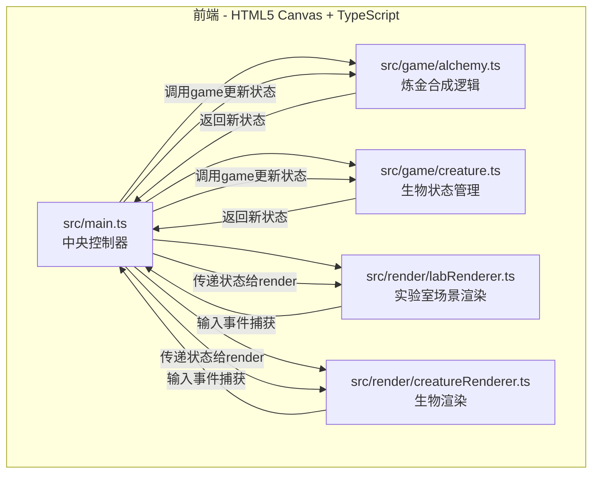

## 1. 架构设计



数据流向：输入事件 → render模块捕获 → 调用game模块更新状态 → game模块返回新状态 → render模块重新绘制

## 2. 技术说明

- 前端：TypeScript + HTML5 Canvas + Vite
- 初始化工具：Vite + TypeScript模板
- 后端：无（纯前端应用）
- 数据库：无（所有状态在内存中管理）
- 依赖：typescript, vite, canvas-confetti

## 3. 文件结构

```
project/
├── package.json          # 依赖：typescript, vite, canvas-confetti；启动脚本
├── vite.config.js        # 构建配置，支持TypeScript
├── tsconfig.json         # 严格模式，target ES2020
├── index.html            # 入口页面，全屏暗色背景，内联基础CSS重置
├── src/
│   ├── main.ts           # 中央控制器
│   ├── game/
│   │   ├── alchemy.ts    # 炼金逻辑
│   │   └── creature.ts   # 生物状态管理
│   └── render/
│       ├── labRenderer.ts    # 实验室场景渲染
│       └── creatureRenderer.ts # 生物渲染
```

## 4. 模块职责定义

### 4.1 src/main.ts - 中央控制器
- 初始化Canvas和游戏循环（requestAnimationFrame）
- 定义全局状态接口（GameState）
- 协调game模块与render模块的数据流调度
- 管理场景切换和事件分发

### 4.2 src/game/alchemy.ts - 炼金合成逻辑
- 配方数据库定义（12种有效配方 + 无效组合判断）
- 材料组合判定算法（根据放入槽位的材料类型匹配配方）
- 药剂生成逻辑（返回药剂类型、颜色、名称、对应生物ID）
- 合成结果状态返回

### 4.3 src/game/creature.ts - 生物状态管理
- 生物数据结构定义（类型、属性值、帧动画状态、粒子特效配置）
- 饱食度/心情值/亲密度属性计算（每种生物对不同互动的响应差异）
- 互动反馈算法（抚摸/喂食/训练对不同生物的效果映射）
- 成长阶段管理
- 属性满值判定和庆祝触发

### 4.4 src/render/labRenderer.ts - 实验室场景渲染
- 石头纹理背景绘制
- 合成台木质纹理面板绘制
- 材料架和材料图标绘制
- 坩埚SVG绘制与冒泡动画
- 蜡烛火焰粒子系统（10-20px，摇曳动画）
- 闪光粒子效果（15个粒子，3-8px，向上飘散）
- 拖拽槽位绘制（虚线/实线边框切换）
- 环境交互元素（盆栽、书籍、魔法阵）
- UI控件绘制（按钮哥特式边框、脉动光效）

### 4.5 src/render/creatureRenderer.ts - 生物渲染
- 2D帧动画加载与6帧循环播放（站立/呼吸/转头）
- 属性粒子特效管理（飞龙火星、独角兽星形闪烁等）
- 互动动画触发（抚摸/喂食/训练的视觉反馈）
- 状态条绘制（3条200x20px进度条，红→黄→绿渐变）
- 生物召唤淡入动画（800ms）
- 属性满值全屏庆祝效果
- 进度条数值跳动动画和闪光

## 5. 关键数据结构

### 5.1 全局状态接口
```typescript
interface GameState {
  slots: (MaterialType | null)[4];      // 合成台4个槽位
  potions: Potion[];                     // 已合成药剂列表
  activeCreature: Creature | null;       // 当前展示生物
  isBrewing: boolean;                    // 是否正在炼金
  brewProgress: number;                  // 炼金进度 0-1
  particles: Particle[];                 // 全局粒子数组
  interactionState: InteractionState;    // 交互状态
}
```

### 5.2 配方数据结构
```typescript
interface Recipe {
  materials: MaterialType[];             // 所需材料组合
  potionName: string;                    // 药剂名称
  potionColor: string;                   // 药剂颜色
  creatureId: CreatureType;              // 对应生物ID
}
```

### 5.3 生物数据结构
```typescript
interface Creature {
  type: CreatureType;                    // 生物类型
  hunger: number;                        // 饱食度 0-100
  mood: number;                          // 心情值 0-100
  bond: number;                          // 亲密度 0-100
  frameIndex: number;                    // 当前帧索引
  animationTimer: number;                // 动画计时器
  particleConfig: ParticleConfig;        // 粒子特效配置
  interactionResponse: InteractionMap;   // 互动响应映射
}
```

## 6. 性能约束

- 所有动画使用requestAnimationFrame驱动，目标55FPS+
- 粒子数量上限200个
- 拖拽响应延迟≤50ms
- 页面加载后2秒内完成所有资源初始化
- 合成动画≥500ms
- 生物召唤淡入动画≥800ms
- 进度条变化ease-out过渡600ms

## 7. 运行方式

```bash
npm install && npm run dev
```

所有文件在同一目录下，确保直接运行即可，不需要额外配置server或数据库。
