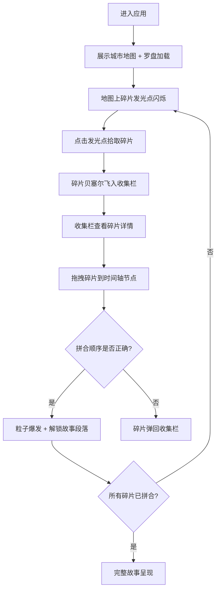

## 1. 产品概述

城市记忆碎片收集器是一款沉浸式交互网页应用，用户在虚拟城市地图上探索、拾取散落的历史记忆碎片（老照片、语音片段、文字笔记），并将它们拼合到时间轴上，逐步还原一段百年前的都市故事。

- 目标用户：历史文化爱好者、交互叙事体验用户、都市记忆探索者
- 核心价值：将城市历史探索游戏化，通过视觉、听觉、文字多维碎片拼合，构建沉浸式叙事体验

## 2. 核心功能

### 2.1 用户角色
| 角色 | 注册方式 | 核心权限 |
|------|----------|----------|
| 探索者 | 无需注册 | 探索地图、拾取碎片、拼合时间轴、解锁故事 |

### 2.2 功能模块
1. **主界面（城市地图）**：俯瞰视角网格化城市街区、碎片发光点、点击拾取与飞入动画
2. **收集栏**：底部碎片缩略图横向排列、拖拽交互、悬停放大
3. **时间轴**：左侧垂直年代节点、碎片拖放验证、解锁动画与故事显示

### 2.3 页面详情
| 页面名称 | 模块名称 | 功能描述 |
|----------|----------|----------|
| 主界面 | 城市地图 | Canvas绘制80x80px网格街区，暖灰色道路40px，南瓜色系随机填充，碎片发光点闪烁，点击触发贝塞尔曲线飞入动画（0.6秒，缓出） |
| 主界面 | 碎片内容展示 | 褪色照片（棕褐色滤镜+虚线描边）、语音波形可视化（Canvas实时绘制，蓝紫渐变）、文字笔记（衬线字体+羊皮纸纹理背景） |
| 主界面 | 收集栏 | 底部150px高度，深灰蓝渐变背景，80x80px圆角缩略图横向排列，悬停缩放1.1倍+阴影，支持拖拽到时间轴 |
| 主界面 | 时间轴 | 左侧垂直排列，30x30px圆形节点，棕色深浅表示年代，拖入碎片验证顺序，成功触发粒子爆发（100粒子，1.5秒）并显示完整故事段落 |
| 主界面 | 加载状态 | 老式罗盘旋转动画替代普通loading条 |

## 3. 核心流程

用户进入应用后，看到俯瞰视角的城市地图，街区间随机分布闪烁的发光碎片点。用户点击发光点拾取碎片，碎片以贝塞尔曲线飞入底部收集栏。在收集栏中查看碎片详情（照片/语音/文字），将碎片拖拽到左侧时间轴的对应年代节点上。若拼合顺序正确，触发粒子爆发动画并解锁一段完整故事段落。随着碎片不断拼合，百年前的都市故事逐步完整。

## 4. 用户界面设计

### 4.1 设计风格
- 主色：#B8860B（复古黄铜金）
- 辅助色：#8B4513（深棕）
- 背景：深褐到浅黄的径向渐变
- 街区色：#D3C5B5（暖灰道路）+ #E8A87C到#C38D77（南瓜色系街区）
- 碎片光晕：#FFD700（金色）到#00BFFF（青色）渐变闪烁
- 按钮风格：hover时发光边框（透明→金色，过渡0.3秒）
- 字体：衬线字体（文字碎片内容14px，行高1.8）
- 布局：地图居中，时间轴左侧，收集栏底部

### 4.2 页面设计概览
| 页面名称 | 模块名称 | UI元素 |
|----------|----------|--------|
| 主界面 | 城市地图 | Canvas渲染，80x80px街区网格，40px暖灰道路，南瓜色系填充，金色-青色发光点闪烁 |
| 主界面 | 碎片飞入动画 | 贝塞尔曲线路径，0.6秒缓出，从发光点飞至收集栏 |
| 主界面 | 碎片详情-照片 | 半透明棕褐色滤镜，虚线描边，复古相框感 |
| 主界面 | 碎片详情-语音 | Canvas波形可视化，蓝紫渐变，60秒以内 |
| 主界面 | 碎片详情-文字 | 衬线字体14px行高1.8，羊皮纸纹理背景 |
| 主界面 | 收集栏 | 深灰蓝渐变背景，80x80px圆角8px缩略图，悬停1.1倍缩放+阴影 |
| 主界面 | 时间轴 | 左侧垂直，30x30px棕色圆形节点，年代深浅层次 |
| 主界面 | 解锁动画 | 100粒子爆发，随机颜色，3-8px大小，1.5秒持续 |
| 主界面 | 加载动画 | 老式罗盘旋转 |

### 4.3 响应式
- 桌面端优先，平板设备自适应
- 平板端：街区尺寸缩小到60x60px，文字内容自适应缩放
- 触摸优化：拖拽操作适配触摸事件

### 4.4 性能要求
- 碎片飞入动画帧率稳定55fps以上
- 碎片数据加载200ms内完成
- Canvas渲染优化：仅重绘变化区域
