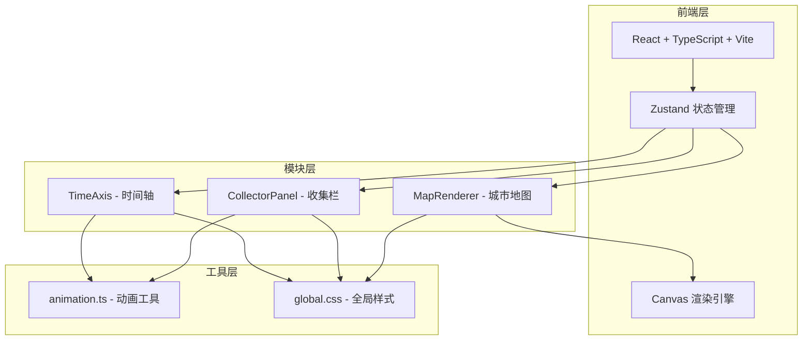
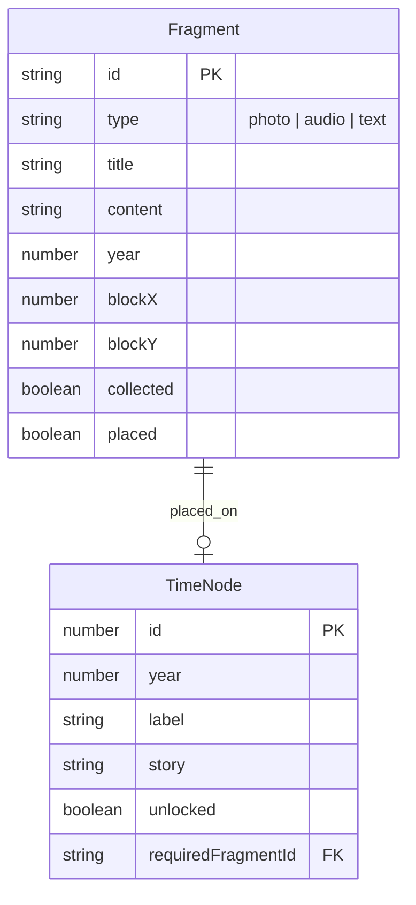

## 1. 架构设计

## 2. 技术说明
- 前端：React@18 + TypeScript（严格模式）+ Vite
- 初始化工具：vite-init（react-ts模板）
- 状态管理：Zustand
- 样式：CSS（全局样式 + 复古色板）
- 后端：无（纯前端应用，碎片数据为模拟数据）
- 数据库：无（内存中的模拟碎片数据集）

## 3. 路由定义
| 路由 | 用途 |
|------|------|
| / | 主界面，包含城市地图、收集栏和时间轴 |

## 4. 文件结构
| 文件路径 | 职责 |
|----------|------|
| package.json | 项目依赖和启动脚本 |
| vite.config.js | Vite构建配置，支持React和TypeScript |
| tsconfig.json | TypeScript严格模式配置 |
| index.html | 入口页面，全屏无滚动 |
| src/main.tsx | 应用入口，组合三个模块，Zustand状态管理 |
| src/map/MapRenderer.tsx | Canvas渲染城市街区地图，暴露点击坐标，接收碎片列表 |
| src/collector/CollectorPanel.tsx | 底部收集栏，碎片缩略图排列与拖拽交互 |
| src/time/TimeAxis.tsx | 左侧时间轴，年代节点标记和拼合验证逻辑 |
| src/utils/animation.ts | 贝塞尔飞入和粒子爆发动画工具函数 |
| src/styles/global.css | 全局样式，复古色板、响应式断点、hover动画 |

## 5. 数据模型

### 5.1 数据模型定义

### 5.2 模拟数据
- 预置8-12个碎片（混合照片、语音、文字类型）
- 预置5-6个时间节点（覆盖1910-1925年代）
- 每个时间节点关联1-2个碎片，拼合后解锁对应故事段落

## 6. 关键技术实现

### 6.1 Canvas地图渲染
- 使用useRef获取Canvas上下文
- 网格布局计算：街区80x80px + 道路40px
- 随机南瓜色系填充使用HSL色彩空间插值
- 碎片发光点使用requestAnimationFrame驱动闪烁动画
- 性能优化：脏矩形重绘，避免全量重绘

### 6.2 贝塞尔飞入动画
- 起点为碎片在地图上的位置，终点为收集栏对应位置
- 控制点计算生成自然弧线
- 使用cubic-bezier(0.25,0.46,0.45,0.94)缓出函数
- requestAnimationFrame驱动，时长0.6秒，确保55fps+

### 6.3 拖拽交互
- HTML5 Drag and Drop API
- 收集栏碎片作为拖拽源，时间轴节点作为放置目标
- 触摸设备使用touch事件模拟

### 6.4 粒子爆发效果
- Canvas绘制100个粒子
- 随机颜色、3-8px大小、随机方向速度
- 1.5秒后渐隐消失
- 使用requestAnimationFrame驱动

### 6.5 语音波形可视化
- 使用Web Audio API的AnalyserNode获取频率数据
- Canvas实时绘制波形
- 颜色根据频率从蓝色渐变到紫色
