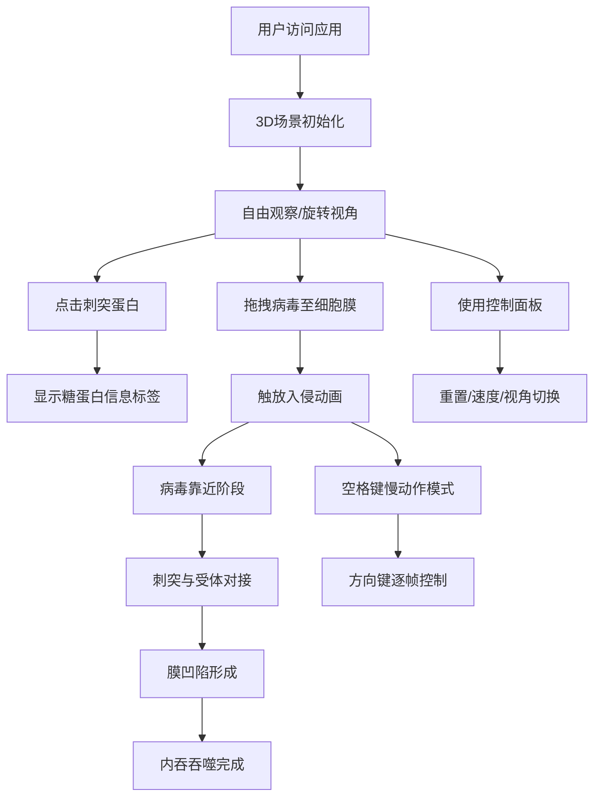

## 1. 产品概述

病毒入侵细胞3D交互模拟器 - 一款面向生物教学的交互式Web应用，通过Three.js在浏览器中模拟微观世界中病毒颗粒与宿主细胞膜之间的动态交互过程，帮助学生直观理解病毒入侵的分子机制。

- 核心目标：解决生物教学中病毒入侵过程抽象难懂的问题，将病毒表面蛋白与细胞受体结合、膜融合及内容物释放等动态步骤可视化呈现
- 目标用户：生物教师、学生及对分子生物学感兴趣的学习者
- 产品价值：将抽象的微观生物过程转化为可交互、可控制的3D可视化体验，提升教学效果和学习兴趣

## 2. 核心功能

### 2.1 用户角色
无需用户注册和登录系统，所有访问者均可使用全部功能。

### 2.2 功能模块
1. **3D场景渲染模块**：宿主细胞膜局部区域、病毒颗粒及其刺突蛋白的3D可视化
2. **交互操作模块**：视角旋转/缩放、病毒拖拽、刺突信息查看、键盘控制
3. **入侵动画模块**：病毒靠近、刺突对接、膜凹陷、内吞吞噬四个阶段的动画序列
4. **控制面板模块**：重置按钮、速度滑块、视角切换、步骤指示器、进度条
5. **操作提示模块**：底部操作提示栏，自动淡出

### 2.3 页面详情

| 页面名称 | 模块名称 | 功能描述 |
|---------|---------|---------|
| 主页面 | 3D场景渲染 | 渲染半透明脂质双分子层细胞膜（厚度0.3单位，覆盖视口80%）、随机分布彩色六边形受体蛋白（颜色#FF6B6B到#4ECDC4渐变）、球状病毒颗粒（半径0.8单位，金色到红色渐变刺突蛋白，长0.25单位） |
| 主页面 | 病毒拖拽交互 | 点击病毒颗粒拖拽至细胞膜附近自动触发入侵动画；病毒移动速度0.5单位/秒，缓入缓出 |
| 主页面 | 刺突对接动画 | 至少3个刺突蛋白与受体精准对接，刺突角度自动旋转对齐，释放绿色粒子光晕 |
| 主页面 | 膜凹陷与内吞 | 细胞膜形变凹陷（深度0.3单位，1.2秒动画）、囊泡闭合包裹病毒（直径缩至0.6单位）、蓝色边界光晕 |
| 主页面 | 刺突信息标签 | 旋转病毒后点击刺突蛋白显示糖蛋白详细信息（类型、受体亲和度），标签跟踪3D坐标 |
| 主页面 | 慢动作与逐帧 | 空格键进入慢动作模式（时间流速0.2x，粒子速度降50%）；方向键或滚轮逐帧步进（每次0.1秒） |
| 主页面 | 控制面板 | 右下角半透明暗色面板（屏幕15%宽度），包含重置按钮、速度滑块（0.1x-2x）、视角切换按钮（默认/俯视/侧面，平滑过渡0.5秒）、步骤文本指示器、进度条 |
| 主页面 | 操作提示栏 | 底部半透明提示栏显示鼠标/键盘操作说明，5秒后自动淡出 |

## 3. 核心流程

用户打开应用后看到3D场景，可自由旋转缩放视角观察细胞膜和病毒。用户点击刺突蛋白可查看其信息。拖拽病毒到细胞膜附近触放入侵动画序列：靠近→对接→膜凹陷→内吞。动画过程中可按空格键进入慢动作模式，使用方向键逐帧控制。控制面板提供重置、速度调节、视角切换等功能，并实时显示当前步骤和进度。

## 4. 用户界面设计

### 4.1 设计风格
- **主色调**：深空蓝到紫黑渐变背景 (#0a0a1a → #1a0a2a)，营造显微镜观测沉浸感
- **强调色**：科技感蓝色 (#00D4FF) 到紫色 (#7B2FBE) 渐变用于按钮
- **文本色**：浅灰白色 (#E0E0E0)
- **按钮样式**：圆角矩形，渐变填充，悬停时发光并扩大1.1倍
- **字体**：sans-serif 无衬线字体
- **整体风格**：科技感、生物医学、深空微观感

### 4.2 页面设计概述

| 页面名称 | 模块名称 | UI元素 |
|---------|---------|-------|
| 主页面 | 3D场景区域 | 全屏显示，深空蓝紫渐变背景，16:9宽高比，最小宽度1024px |
| 主页面 | 控制面板 | 屏幕右下角，半透明暗色背景圆角矩形，占屏宽15%，包含重置按钮、速度滑块、视角切换按钮组、步骤文本、进度条 |
| 主页面 | 刺突信息标签 | 跟随3D坐标，半透明深色背景，白色文字 |
| 主页面 | 操作提示栏 | 屏幕底部，半透明，5秒后淡出，显示快捷键说明 |

### 4.3 响应式
- Desktop-first 设计
- 保持16:9宽高比，最小宽度1024px
- 浏览器窗口调整大小时自动保持比例

### 4.4 3D场景指导
- **环境背景**：深空蓝到紫黑渐变，模拟电子显微镜观测氛围
- **光照设置**：环境光 + 方向光 + 点光源，突出细胞膜半透明质感和病毒刺突金属光泽
- **摄像机设置**：PerspectiveCamera，支持OrbitControls自由旋转缩放，三种预设视角（默认/俯视/侧面），切换时0.5秒平滑过渡
- **核心元素**：
  - 细胞膜：半透明脂质双分子层平面（厚度0.3），随机分布六边形受体凸起
  - 病毒：球体核心（半径0.8）+ 刺突蛋白（锥形，金色→红色渐变，长0.25）
- **粒子系统**：绿色对接光晕粒子、蓝色囊泡边界粒子，总数不超过150个
- **动画系统**：GSAP风格自实现缓动函数，支持时间缩放和逐帧控制
- **性能预算**：渲染帧率≥30FPS，粒子≤150个，单帧draw call尽量控制
