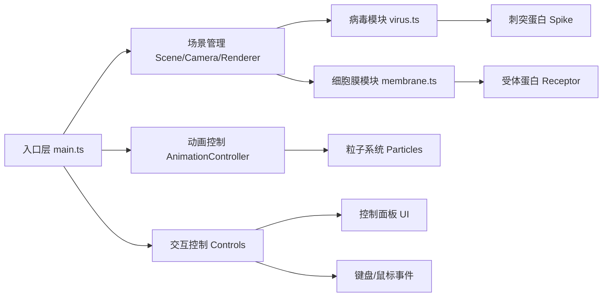

## 1. 架构设计

纯前端单页应用，采用模块化分层架构。



## 2. 技术说明

- **前端框架**：TypeScript + Three.js (原生，不使用React/Vue)
- **构建工具**：Vite
- **语言版本**：ES2020，TypeScript严格模式
- **无后端**，纯前端静态应用

技术选型说明：用户明确指定使用TypeScript和Three.js原生实现，因此不使用@react-three/fiber等封装库，保持代码轻量和直接控制。

## 3. 文件组织结构

```
auto109/
├── package.json          # 依赖配置
├── vite.config.js        # Vite构建配置
├── tsconfig.json         # TypeScript配置
├── index.html            # 入口HTML
└── src/
    ├── main.ts           # 场景初始化、渲染循环、动画调度中心
    ├── virus.ts          # 病毒类、刺突蛋白、入侵动画序列
    ├── membrane.ts       # 细胞膜类、受体蛋白、膜形变
    └── controls.ts       # 控制面板UI、键盘事件、速度/视角控制
```

## 4. 核心模块设计

### 4.1 类型定义

```typescript
// 动画阶段枚举
enum InvasionPhase {
  IDLE = 'idle',
  APPROACHING = 'approaching',
  DOCKING = 'docking',
  MEMBRANE_DEPRESSION = 'membrane_depression',
  ENDOCYTOSIS = 'endocytosis',
  COMPLETE = 'complete'
}

// 刺突蛋白信息
interface SpikeInfo {
  id: number;
  type: string;       // 刺突类型，如'S1', 'S2'
  affinity: number;   // 受体亲和度数值 0-1
  position: Vector3;  // 3D坐标
}

// 动画状态
interface AnimationState {
  phase: InvasionPhase;
  progress: number;       // 0-1 总进度
  timeScale: number;      // 时间流速缩放
  isPaused: boolean;
}
```

### 4.2 关键类/函数

**Virus 类 (virus.ts)**
- `constructor(scene, position)`: 创建病毒球体 + 刺突蛋白阵列
- `generateSpikes(count)`: 随机角度分布生成刺突
- `startInvasion(targetMembrane, receptors)`: 触放入侵动画序列
- `update(deltaTime)`: 每帧更新动画状态
- `getSpikeAtWorldPosition(raycaster)`: 射线检测获取点击的刺突

**Membrane 类 (membrane.ts)**
- `constructor(scene, width, height)`: 创建脂质双分子层 + 受体蛋白
- `generateReceptors(count)`: 随机分布六边形受体凸起
- `depressAt(position, depth, duration)`: 膜凹陷形变动画
- `createVesicle(position, radius)`: 创建内吞囊泡

**Controls 类 (controls.ts)**
- `constructor(container, callbacks)`: 创建控制面板DOM
- `bindKeyboard()`: 绑定空格键/方向键/滚轮事件
- `updatePhaseLabel(text)`: 更新步骤文本
- `updateProgress(value)`: 更新进度条
- `switchView(viewName)`: 切换摄像机视角

### 4.3 性能优化策略
- 粒子池复用，总数限制≤150
- 受体蛋白使用InstancedMesh减少draw call
- 膜形变使用ShaderMaterial在GPU端计算顶点位移
- 射线检测仅在点击时执行
- requestAnimationFrame驱动渲染，根据deltaTime做时间独立的动画

## 5. 动画实现方案

### 5.1 缓动函数
自实现常用缓动：
- `easeInOutCubic(t)`: 病毒靠近运动
- `easeOutBack(t)`: 膜凹陷回弹效果
- `easeInOutQuad(t)`: 视角切换

### 5.2 时间控制系统
```typescript
class TimeController {
  scale: number = 1.0;
  stepForward(seconds: number): void;
  stepBackward(seconds: number): void;
  setSlowMotion(enabled: boolean): void;  // scale = 0.2
}
```

## 6. 依赖清单

```json
{
  "three": "^0.160.0",
  "@types/three": "^0.160.0",
  "typescript": "^5.3.0",
  "vite": "^5.0.0"
}
```
