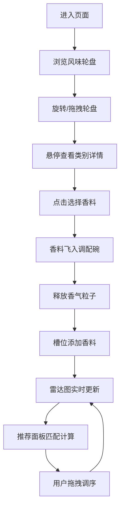

## 1. 产品概述
香料市集风味轮盘是一款交互式香料探索与调配工具，通过可视化的三层风味轮盘帮助用户探索香料属性，并自由组合调配虚拟混合香料，同时智能推荐相似风味组合。
- 目标用户：烹饪爱好者、调香师、食品研发人员、对香料文化感兴趣的普通用户
- 产品价值：降低香料搭配门槛，激发创意灵感，提供沉浸式的香料探索体验

## 2. 核心功能

### 2.1 功能模块
1. **风味轮盘模块**：三层交互式轮盘，支持旋转、悬停弹出、点击选择香料
2. **调配模块**：调配碗动画、香料槽位管理、拖拽排序、风味雷达图实时计算
3. **推荐模块**：余弦相似度算法匹配50种经典配方，按相似度排序展示

### 2.2 页面详情
| 页面名称 | 模块名称 | 功能描述 |
|-----------|-------------|---------------------|
| 主页面 | 风味轮盘 | 三层扇形结构，支持鼠标滚轮/拖拽旋转，悬停1秒弹出类别描述，点击选择香料 |
| 主页面 | 调配碗 | 半透明瓷碗，接收飞行香料，释放香气粒子动画 |
| 主页面 | 香料槽位 | 6个固定容量槽位，支持拖拽排序，实时更新风味雷达图 |
| 主页面 | 风味雷达图 | 5维度（辛辣度、甜度、清新度、温暖度、木质度），渐变填充，30fps流畅更新 |
| 主页面 | 推荐面板 | 余弦相似度匹配，前5个推荐配方卡片，悬停上浮效果 |

## 3. 核心流程
用户进入页面后看到居中的风味轮盘，通过旋转轮盘浏览不同香料类别与具体香料。点击感兴趣的香料后，香料会以弧形动画飞入右侧调配碗，同时释放香气粒子。已选香料按顺序排列在下方槽位，用户可拖拽调整顺序。风味雷达图实时更新显示当前混合香料的5维属性。右侧推荐面板根据当前配方匹配经典配方并展示。

## 4. 用户界面设计

### 4.1 设计风格
- **主色调**：暖色调，浅米色到奶咖色径向渐变背景
- **配色方案**：8个香料类别使用色相0°-315°均匀分布，饱和度70%，明度80%；选中态使用金色描边；按钮悬停时背景加深15%并缩放到1.05倍
- **圆角规范**：所有交互元素统一使用 border-radius: 8px
- **字体**：优雅衬线体用于标题（如 Playfair Display），无衬线体用于正文（如 Lato）
- **布局风格**：卡片式布局，居中展示，最大宽度1200px

### 4.2 页面设计概述
| 页面名称 | 模块名称 | UI元素 |
|-----------|-------------|-------------|
| 主页面 | 风味轮盘 | SVG三层扇形结构、类别色块、香料圆点、金色高亮圆环、弹出动画 |
| 主页面 | 调配碗 | 半透明瓷碗SVG、碗口30度倾角、随机香料颗粒纹理 |
| 主页面 | 香料槽位 | 6个50x60px矩形槽位、拖拽手柄、序号标识 |
| 主页面 | 风味雷达图 | SVG五边形雷达图、紫橙渐变填充、浅灰网格、每10分一圈 |
| 主页面 | 推荐面板 | 240x140px卡片、圆角正方形色块、相似度百分比、悬停上浮8px+阴影 |

### 4.3 响应式设计
- 桌面端优先设计，适配分辨率1280x900以上显示器
- 内容区域居中，最大宽度1200px
- 不支持移动端

## 5. 动画与交互规范
| 交互元素 | 动画效果 | 时长/参数 |
|---------|---------|-----------|
| 轮盘旋转 | 与鼠标距离成正比，惯性衰减0.92 | requestAnimationFrame驱动 |
| 类别悬停 | 扇区向外弹出15px，弹性缓动 | 0.3秒 cubic-bezier(0.34, 1.56, 0.64, 1) |
| 香料飞行 | 贝塞尔曲线弧形路径，控制点随机偏移 | 0.5秒 |
| 香气粒子 | 30个粒子上升消散，色相±20°，大小6px→0px | 1.5秒 |
| 按钮悬停 | 背景加深15%，缩放到1.05倍 | 0.2秒 ease |
| 推荐卡片悬停 | 上浮8px，增加阴影深度 | 0.2秒 ease |

## 6. 性能要求
- 风味雷达图更新帧率：≥30fps
- 推荐计算响应时间：≤100ms
- 页面加载（含资源）：≤2s
